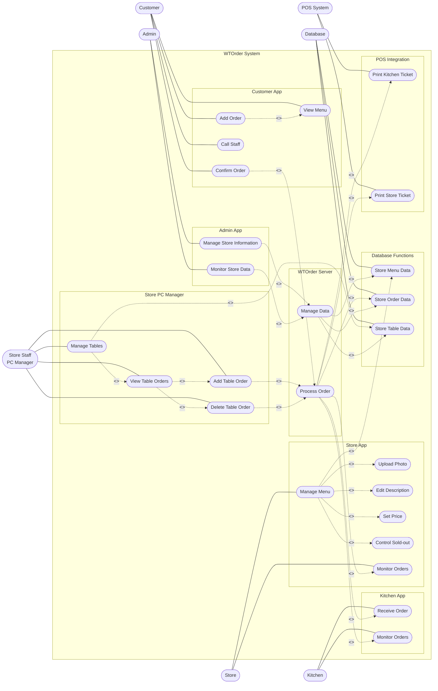
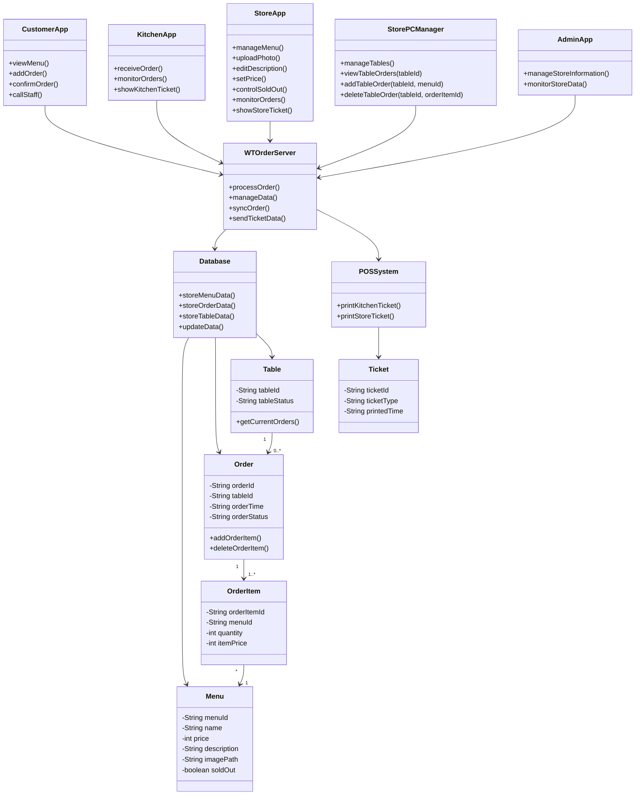

---

## [ Revision history ]

| Revision date | Version # | Description | Author |
|--------------|----------|------------|--------|
| 2026/04/24 | 1.00 | 초기 버전 | 이창민 |
| 2026/05/30 | 1.10 | App 분리, POS 연동, Store PC Manager, 테이블별 주문 관리 기능 반영 | 이창민 |

---

# = Contents =
1. Introduction  
2. Use case analysis  
3. Domain analysis  
4. User Interface prototype  
5. Glossary  
6. References  

---

# 1. Introduction

## 1) Executive Summary

최근 음식점과 카페, 소규모 매장에서는 주문 누락을 줄이고 직원의 업무 부담을 낮추기 위해 테이블 오더 시스템을 도입하는 경우가 증가하고 있다.  
하지만 기존 테이블 오더 시스템은 설치 비용, 유지 비용, POS 연동 비용, 장비 관리 비용이 부담될 수 있으며, 여러 장치가 서로 다른 데이터를 표시하면 주문 처리 과정에서 혼선이 발생할 수 있다.  
또한 고객용 태블릿, 주방 화면, 매장 관리 화면, 카운터 PC가 서로 독립적으로 동작하면 주문 정보가 실시간으로 일치하지 않는 문제가 생길 수 있다.

WTOrder System은 이러한 문제를 해결하기 위해 설계된 통합 무선 테이블 오더 시스템이다.  
수정된 WTOrder System은 기존의 Customer, Store, Kitchen, Admin 역할을 유지하면서도 실제 매장 운영 환경에 맞게 각 역할을 별도의 앱으로 분리한다.  
고객은 테이블에 설치된 **Customer App**을 사용하고, 주방은 **Kitchen App** 또는 주방 POS를 사용하며, 매장 직원은 **Store App**과 **Store PC Manager**를 함께 사용한다.  
관리자는 **Admin App**을 통해 매장 정보와 운영 데이터를 관리한다.

이번 Analysis 문서에서는 Conceptualization 단계에서 확장한 내용을 기반으로 Use Case, Domain Model, User Interface Prototype을 다시 분석한다.  
핵심 변경사항은 다음과 같다.

- Customer App, Kitchen App, Store App, Admin App을 각각 분리한다.
- Store PC Manager를 추가하여 카운터 PC에서 전체 테이블을 관리할 수 있도록 한다.
- 고객이 주문을 확정하면 Kitchen POS에 메뉴 전표가 올라오도록 한다.
- 고객이 주문을 확정하면 Store POS에도 메뉴 전표가 올라오도록 한다.
- Store PC Manager에서 테이블을 클릭하면 현재까지 들어온 주문 내역을 확인할 수 있도록 한다.
- Store PC Manager에서 특정 테이블에 메뉴를 추가하거나 주문 항목을 삭제할 수 있도록 한다.
- Store PC Manager의 기능 범위는 B안으로 제한하여 수량 변경, 결제 대기 상태 변경, 테이블 종료 기능은 포함하지 않는다.

본 시스템은 고객이 쉽게 주문할 수 있는 환경을 제공하는 동시에, 주방과 매장 직원이 주문 정보를 실시간으로 확인하고, POS 전표와 PC 테이블 관리 기능을 통해 매장 운영 효율을 높이는 것을 목표로 한다.

---

## 2) Business Goals

WTOrder System의 목적은 다음과 같다.

- 고객이 직원 호출 없이 테이블에서 직접 메뉴를 조회하고 주문할 수 있도록 한다.
- 고객 주문이 확정되면 Kitchen App과 Kitchen POS에 주문 정보가 빠르게 전달되도록 한다.
- 고객 주문이 확정되면 Store App과 Store POS에도 주문 정보가 반영되도록 한다.
- 매장 직원이 Store App을 통해 메뉴 사진, 설명, 가격, 품절 여부를 쉽게 관리할 수 있도록 한다.
- 매장 직원이 Store PC Manager에서 전체 테이블 상태를 확인하고 테이블별 주문 내역을 관리할 수 있도록 한다.
- 매장 직원이 PC에서 특정 테이블에 메뉴를 추가하거나 잘못 입력된 주문 항목을 삭제할 수 있도록 한다.
- 주문 누락, 전표 누락, 테이블별 주문 혼선을 줄여 매장 운영 효율성을 향상시킨다.
- 고령층 사용자도 쉽게 사용할 수 있도록 Customer App의 UI를 단순하고 직관적으로 구성한다.
- 소상공인이 부담 없이 사용할 수 있는 저비용 테이블 오더 시스템 구조를 제공한다.
- 관리자와 매장 측이 주문, 메뉴, 매장 데이터를 쉽게 확인할 수 있도록 한다.

---

## 3) Technical Goals

WTOrder System의 기술적 목표는 다음과 같다.

- Customer App, Kitchen App, Store App, Admin App, Store PC Manager를 역할별로 분리하여 설계한다.
- WTOrder Server를 중심으로 각 앱과 POS System, Database가 연결되는 구조를 구성한다.
- 주문 데이터, 메뉴 데이터, 테이블 데이터, 매장 데이터를 Database에 저장하고 관리한다.
- 고객 주문 확정 후 Kitchen App, Store App, Store PC Manager, POS System에 주문 정보가 동기화되도록 한다.
- Kitchen POS와 Store POS에 메뉴 전표가 출력 또는 표시될 수 있도록 POS 연동 구조를 설계한다.
- Store PC Manager에서 테이블별 주문 조회, 메뉴 추가, 주문 항목 삭제 기능을 제공한다.
- 메뉴 관리 기능에서 메뉴 추가, 수정, 삭제, 사진 업로드, 설명 수정, 가격 설정, 품절 처리를 제공한다.
- UI 화면은 사용자 역할에 따라 필요한 기능만 보여주도록 구성한다.
- 네트워크 오류 또는 데이터 동기화 지연이 발생할 수 있음을 고려하여 시스템을 분석한다.
- 추후 결제 기능, 주문 상태 변경 기능, 매출 통계 기능으로 확장 가능한 구조를 고려한다.

---

# 2. Use case analysis

## 2.1. Use Case Diagram

아래의 그림은 수정된 WTOrder System의 Use Case Diagram을 Mermaid 코드로 나타낸 것이다.  
이번 Diagram은 Customer App, Kitchen App, Store App, Store PC Manager, Admin App을 분리하고, POS System과 Database까지 포함하여 전체 시스템 흐름이 보이도록 다시 구성하였다.  
GitHub Markdown에서는 Mermaid가 지원되므로 아래 코드를 그대로 업로드하면 다이어그램 형태로 확인할 수 있다.



위 Use Case Diagram은 시스템을 역할별 앱 단위로 분리하여 표현하였다.  
Customer는 Customer App을 통해 메뉴 조회, 주문 추가, 주문 확정, 직원 호출을 수행한다.  
Kitchen은 Kitchen App을 통해 주문을 수신하고 주문 현황을 확인한다.  
Store는 Store App을 통해 메뉴 관리와 주문 모니터링을 수행하며, 메뉴 관리 기능은 사진 업로드, 설명 수정, 가격 설정, 품절 설정 기능으로 확장된다.  
Store PC Manager는 PC에서 전체 테이블을 관리하고, 특정 테이블의 주문 내역을 조회한 뒤 메뉴 추가 또는 주문 항목 삭제를 수행한다.  
POS System은 주문 확정 시 Kitchen POS와 Store POS에 전표를 출력하거나 표시한다.  
Database는 메뉴 데이터, 주문 데이터, 테이블 데이터를 저장하는 역할을 수행한다.
## 2.2. Use Case List

아래는 수정된 WTOrder System의 Use Case ID, Name, Actor를 나타낸 표이다.

| Use Case Name | Use Case ID | Actor |
|--------------|-------------|-------|
| View Menu | #1 | Customer |
| Add Order | #2 | Customer |
| Confirm Order | #3 | Customer |
| Call Staff | #4 | Customer |
| Receive Order | #5 | Kitchen |
| Print Kitchen Ticket | #6 | POS System |
| Manage Menu | #7 | Store |
| Upload Photo | #8 | Store |
| Edit Description | #9 | Store |
| Set Price | #10 | Store |
| Control Sold-out | #11 | Store |
| Monitor Orders | #12 | Store, Kitchen |
| Print Store Ticket | #13 | POS System |
| Manage Tables | #14 | Store PC Manager |
| View Table Orders | #15 | Store PC Manager |
| Add Table Order | #16 | Store PC Manager |
| Delete Table Order | #17 | Store PC Manager |
| Process Order | #18 | WTOrder Server |
| Manage Data | #19 | WTOrder Server |
| Store Menu Data | #20 | Database |
| Store Order Data | #21 | Database |
| Store Table Data | #22 | Database |
| Manage Store Information | #23 | Admin |
| Monitor Store Data | #24 | Admin |

---

## 2.3. Use Case Description

아래에서는 WTOrder System의 주요 Use Case에 대한 Description을 표 형식으로 나타낸다.

---

### 2.3.1. View Menu
**Use Case #1 : View Menu**

| Item | Description |
|------|-------------|
| Summary | 고객은 Customer App에서 메뉴 목록, 가격, 사진, 설명, 판매 상태를 확인할 수 있다. |
| Scope | WTOrder System |
| Level | User level |
| Primary Actor | Customer |
| Secondary Actors | WTOrder Server, Database |
| Preconditions | Customer App이 정상적으로 실행 중이고 메뉴 데이터가 Database에 저장되어 있어야 한다. |
| Trigger | 고객이 메뉴 화면에 접근했을 때 |
| Success Post Condition | 메뉴 정보가 Customer App 화면에 출력된다. |
| Failed Post Condition | 메뉴 데이터를 불러오지 못하거나 화면에 표시하지 못한다. |

#### MAIN SUCCESS SCENARIO

| Step | Action |
|------|--------|
| 1 | 고객이 Customer App에서 메뉴 화면에 접근한다. |
| 2 | Customer App이 WTOrder Server에 메뉴 데이터를 요청한다. |
| 3 | WTOrder Server가 Database에서 메뉴 데이터를 조회한다. |
| 4 | Database가 메뉴명, 가격, 사진, 설명, 판매 상태를 반환한다. |
| 5 | Customer App이 메뉴 정보를 카테고리별로 화면에 출력한다. |
| 6 | 고객이 원하는 메뉴를 확인한다. |

#### EXTENSION SCENARIOS

| Step | Branching Action |
|------|------------------|
| 4 | 4a. 메뉴 데이터 조회에 실패하면 Customer App은 오류 메시지를 출력한다. |
| 5 | 5a. 품절 메뉴는 주문 불가 상태로 표시한다. |

---

### 2.3.2. Add Order
**Use Case #2 : Add Order**

| Item | Description |
|------|-------------|
| Summary | 고객은 원하는 메뉴와 수량을 선택하여 주문 목록에 추가할 수 있다. |
| Scope | WTOrder System |
| Level | User level |
| Primary Actor | Customer |
| Secondary Actors | Customer App |
| Preconditions | 고객이 메뉴를 조회한 상태여야 하며, 선택한 메뉴가 품절 상태가 아니어야 한다. |
| Trigger | 고객이 주문 추가 버튼을 눌렀을 때 |
| Success Post Condition | 선택한 메뉴가 현재 주문 목록에 추가된다. |
| Failed Post Condition | 메뉴가 주문 목록에 추가되지 않는다. |

#### MAIN SUCCESS SCENARIO

| Step | Action |
|------|--------|
| 1 | 고객이 Customer App에서 메뉴를 선택한다. |
| 2 | Customer App이 메뉴 상세 정보를 출력한다. |
| 3 | 고객이 수량을 선택한다. |
| 4 | 고객이 주문 추가 버튼을 누른다. |
| 5 | Customer App이 선택한 메뉴와 수량을 주문 목록에 추가한다. |
| 6 | Customer App이 현재 주문 목록과 총 금액을 갱신한다. |

#### EXTENSION SCENARIOS

| Step | Branching Action |
|------|------------------|
| 1 | 1a. 선택한 메뉴가 품절 상태이면 주문 추가 버튼을 비활성화한다. |
| 3 | 3a. 수량이 0 이하이면 수량 선택 오류 메시지를 출력한다. |

---

### 2.3.3. Confirm Order
**Use Case #3 : Confirm Order**

| Item | Description |
|------|-------------|
| Summary | 고객은 주문 목록을 최종 확인하고 주문을 확정할 수 있다. |
| Scope | WTOrder System |
| Level | User level |
| Primary Actor | Customer |
| Secondary Actors | WTOrder Server, Database, Kitchen App, Store App, Store PC Manager, POS System |
| Preconditions | 주문 목록에 하나 이상의 메뉴가 있어야 한다. |
| Trigger | 고객이 주문 확정 버튼을 눌렀을 때 |
| Success Post Condition | 주문 데이터가 저장되고 주방, 매장, POS, Store PC Manager에 동기화된다. |
| Failed Post Condition | 주문 저장 또는 주문 전달에 실패한다. |

#### MAIN SUCCESS SCENARIO

| Step | Action |
|------|--------|
| 1 | 고객이 주문 목록에서 메뉴명, 수량, 총 금액을 확인한다. |
| 2 | 고객이 주문 확정 버튼을 누른다. |
| 3 | Customer App이 주문 데이터를 WTOrder Server로 전송한다. |
| 4 | WTOrder Server가 주문 데이터를 검증한다. |
| 5 | WTOrder Server가 주문 데이터를 Database에 저장한다. |
| 6 | WTOrder Server가 Kitchen App에 주문 정보를 전달한다. |
| 7 | WTOrder Server가 Store App과 Store PC Manager에 주문 정보를 동기화한다. |
| 8 | WTOrder Server가 POS System에 전표 데이터를 전달한다. |
| 9 | Customer App이 고객에게 주문 완료 메시지를 출력한다. |

#### EXTENSION SCENARIOS

| Step | Branching Action |
|------|------------------|
| 4 | 4a. 주문 데이터가 올바르지 않으면 주문 확정이 중단되고 오류 메시지를 출력한다. |
| 5 | 5a. Database 저장에 실패하면 주문 실패 메시지를 출력한다. |
| 8 | 8a. POS 전표 전달에 실패하면 Store App 또는 Store PC Manager에 전표 오류 알림을 표시한다. |

---

### 2.3.4. Call Staff
**Use Case #4 : Call Staff**

| Item | Description |
|------|-------------|
| Summary | 고객은 Customer App을 통해 매장 직원을 호출할 수 있다. |
| Scope | WTOrder System |
| Level | User level |
| Primary Actor | Customer |
| Secondary Actors | Store App, Store PC Manager |
| Preconditions | Customer App이 정상적으로 실행 중이어야 한다. |
| Trigger | 고객이 직원 호출 버튼을 눌렀을 때 |
| Success Post Condition | 직원 호출 요청이 Store App 또는 Store PC Manager에 전달된다. |
| Failed Post Condition | 호출 요청이 전달되지 않는다. |

#### MAIN SUCCESS SCENARIO

| Step | Action |
|------|--------|
| 1 | 고객이 Customer App에서 직원 호출 버튼을 누른다. |
| 2 | Customer App이 테이블 번호와 호출 요청을 WTOrder Server에 전송한다. |
| 3 | WTOrder Server가 호출 요청을 저장한다. |
| 4 | WTOrder Server가 Store App과 Store PC Manager에 호출 알림을 전달한다. |
| 5 | Customer App이 고객에게 호출 완료 메시지를 출력한다. |

---

### 2.3.5. Receive Order
**Use Case #5 : Receive Order**

| Item | Description |
|------|-------------|
| Summary | 주방은 Kitchen App을 통해 고객이 확정한 주문을 전달받아 확인할 수 있다. |
| Scope | WTOrder System |
| Level | User level |
| Primary Actor | Kitchen |
| Secondary Actors | WTOrder Server, Database, POS System |
| Preconditions | 고객 주문이 정상적으로 확정되어야 한다. |
| Trigger | WTOrder Server가 주문 정보를 Kitchen App으로 전달했을 때 |
| Success Post Condition | Kitchen App 화면에 주문 정보가 출력된다. |
| Failed Post Condition | 주문 정보가 Kitchen App에 전달되지 않는다. |

#### MAIN SUCCESS SCENARIO

| Step | Action |
|------|--------|
| 1 | 고객이 주문을 확정한다. |
| 2 | WTOrder Server가 주문 데이터를 Database에 저장한다. |
| 3 | WTOrder Server가 주문 정보를 Kitchen App으로 전달한다. |
| 4 | Kitchen App이 주문 번호, 테이블 번호, 메뉴, 수량, 접수 시간을 출력한다. |
| 5 | 주방 측이 주문 내용을 확인한다. |

---

### 2.3.6. Print Kitchen Ticket
**Use Case #6 : Print Kitchen Ticket**

| Item | Description |
|------|-------------|
| Summary | 고객 주문이 확정되면 Kitchen POS에 메뉴 전표가 출력되거나 표시된다. |
| Scope | WTOrder System |
| Level | System level |
| Primary Actor | POS System |
| Secondary Actors | WTOrder Server, Kitchen |
| Preconditions | 주문 데이터가 정상적으로 생성되어야 하며 POS System이 연결되어 있어야 한다. |
| Trigger | WTOrder Server가 POS System으로 주방 전표 데이터를 전송했을 때 |
| Success Post Condition | Kitchen POS에 주방용 메뉴 전표가 출력되거나 표시된다. |
| Failed Post Condition | Kitchen POS에 전표가 표시되지 않는다. |

#### MAIN SUCCESS SCENARIO

| Step | Action |
|------|--------|
| 1 | 고객이 주문을 확정한다. |
| 2 | WTOrder Server가 주문 데이터를 저장한다. |
| 3 | WTOrder Server가 POS System에 주방 전표 데이터를 전송한다. |
| 4 | POS System이 Kitchen POS에 메뉴 전표를 출력하거나 표시한다. |
| 5 | 주방 측이 전표를 확인한다. |

#### EXTENSION SCENARIOS

| Step | Branching Action |
|------|------------------|
| 3 | 3a. POS System 연결에 실패하면 WTOrder Server가 전표 전송 실패 상태를 기록한다. |
| 4 | 4a. 전표 출력 실패 시 Store App 또는 Store PC Manager에 오류 알림을 표시한다. |

---

### 2.3.7. Manage Menu
**Use Case #7 : Manage Menu**

| Item | Description |
|------|-------------|
| Summary | 매장 측은 Store App에서 메뉴를 추가, 수정, 삭제하고 메뉴 정보를 관리할 수 있다. |
| Scope | WTOrder System |
| Level | User level |
| Primary Actor | Store |
| Secondary Actors | WTOrder Server, Database |
| Preconditions | 매장 측이 Store App에 접근한 상태여야 한다. |
| Trigger | 매장 측이 메뉴 관리 기능을 실행했을 때 |
| Success Post Condition | 메뉴 정보가 정상적으로 저장되고 Customer App에 반영된다. |
| Failed Post Condition | 메뉴 정보 저장 또는 반영에 실패한다. |

#### MAIN SUCCESS SCENARIO

| Step | Action |
|------|--------|
| 1 | 매장 측이 Store App에서 메뉴 관리 화면에 접근한다. |
| 2 | Store App이 WTOrder Server에 기존 메뉴 데이터를 요청한다. |
| 3 | WTOrder Server가 Database에서 메뉴 데이터를 조회한다. |
| 4 | Store App이 기존 메뉴 목록을 출력한다. |
| 5 | 매장 측이 메뉴를 추가, 수정 또는 삭제한다. |
| 6 | Store App이 변경된 메뉴 정보를 WTOrder Server로 전송한다. |
| 7 | WTOrder Server가 변경된 메뉴 정보를 Database에 저장한다. |
| 8 | Customer App에 최신 메뉴 정보가 반영된다. |

#### EXTENSION SCENARIOS

| Step | Branching Action |
|------|------------------|
| 5 | 5a. 사진 업로드 기능을 선택한 경우 Upload Photo Use Case가 실행된다. |
| 5 | 5b. 설명 수정 기능을 선택한 경우 Edit Description Use Case가 실행된다. |
| 5 | 5c. 가격 설정 기능을 선택한 경우 Set Price Use Case가 실행된다. |
| 5 | 5d. 품절 설정 기능을 선택한 경우 Control Sold-out Use Case가 실행된다. |

---

### 2.3.8. Upload Photo
**Use Case #8 : Upload Photo**

| Item | Description |
|------|-------------|
| Summary | 매장 측은 Store App에서 특정 메뉴에 사용할 사진을 업로드할 수 있다. |
| Scope | WTOrder System |
| Level | User level |
| Primary Actor | Store |
| Secondary Actors | WTOrder Server, Database |
| Preconditions | 매장 측이 메뉴 관리 화면에 접근한 상태여야 한다. |
| Trigger | 매장 측이 사진 업로드 기능을 실행했을 때 |
| Success Post Condition | 메뉴 사진이 저장되고 Customer App 메뉴 화면에 반영된다. |
| Failed Post Condition | 사진 저장 또는 반영에 실패한다. |

#### MAIN SUCCESS SCENARIO

| Step | Action |
|------|--------|
| 1 | 매장 측이 사진을 등록할 메뉴를 선택한다. |
| 2 | 매장 측이 사진 업로드 기능을 실행한다. |
| 3 | Store App이 파일 선택 화면을 제공한다. |
| 4 | 매장 측이 사진 파일을 선택한다. |
| 5 | Store App이 사진 정보를 WTOrder Server로 전송한다. |
| 6 | WTOrder Server가 사진 정보를 Database에 저장한다. |
| 7 | Customer App 메뉴 화면에 사진이 반영된다. |

---

### 2.3.9. Edit Description
**Use Case #9 : Edit Description**

| Item | Description |
|------|-------------|
| Summary | 매장 측은 Store App에서 메뉴 설명을 수정할 수 있다. |
| Scope | WTOrder System |
| Level | User level |
| Primary Actor | Store |
| Secondary Actors | WTOrder Server, Database |
| Preconditions | 매장 측이 메뉴 관리 화면에 접근한 상태여야 한다. |
| Trigger | 매장 측이 설명 수정 기능을 실행했을 때 |
| Success Post Condition | 수정된 메뉴 설명이 저장되고 Customer App에 반영된다. |
| Failed Post Condition | 설명 저장 또는 반영에 실패한다. |

#### MAIN SUCCESS SCENARIO

| Step | Action |
|------|--------|
| 1 | 매장 측이 설명을 수정할 메뉴를 선택한다. |
| 2 | Store App이 기존 메뉴 설명을 출력한다. |
| 3 | 매장 측이 새로운 설명을 입력한다. |
| 4 | Store App이 수정된 설명을 WTOrder Server로 전송한다. |
| 5 | WTOrder Server가 수정된 설명을 Database에 저장한다. |
| 6 | Customer App 메뉴 화면에 수정된 설명이 반영된다. |

---

### 2.3.10. Set Price
**Use Case #10 : Set Price**

| Item | Description |
|------|-------------|
| Summary | 매장 측은 Store App에서 메뉴 가격을 설정하거나 변경할 수 있다. |
| Scope | WTOrder System |
| Level | User level |
| Primary Actor | Store |
| Secondary Actors | WTOrder Server, Database |
| Preconditions | 매장 측이 메뉴 관리 화면에 접근한 상태여야 한다. |
| Trigger | 매장 측이 가격 설정 기능을 실행했을 때 |
| Success Post Condition | 변경된 가격이 저장되고 Customer App에 반영된다. |
| Failed Post Condition | 가격 저장 또는 반영에 실패한다. |

#### MAIN SUCCESS SCENARIO

| Step | Action |
|------|--------|
| 1 | 매장 측이 가격을 변경할 메뉴를 선택한다. |
| 2 | Store App이 기존 가격 정보를 출력한다. |
| 3 | 매장 측이 새로운 가격을 입력한다. |
| 4 | Store App이 가격 형식을 검사한다. |
| 5 | Store App이 변경된 가격을 WTOrder Server로 전송한다. |
| 6 | WTOrder Server가 변경된 가격을 Database에 저장한다. |
| 7 | Customer App 메뉴 화면에 변경된 가격이 반영된다. |

#### EXTENSION SCENARIOS

| Step | Branching Action |
|------|------------------|
| 4 | 4a. 가격이 숫자 형식이 아니면 오류 메시지를 출력한다. |

---

### 2.3.11. Control Sold-out
**Use Case #11 : Control Sold-out**

| Item | Description |
|------|-------------|
| Summary | 매장 측은 특정 메뉴를 품절 상태 또는 판매 가능 상태로 변경할 수 있다. |
| Scope | WTOrder System |
| Level | User level |
| Primary Actor | Store |
| Secondary Actors | WTOrder Server, Database |
| Preconditions | 매장 측이 메뉴 관리 화면에 접근한 상태여야 한다. |
| Trigger | 매장 측이 품절 설정 기능을 실행했을 때 |
| Success Post Condition | 메뉴 판매 상태가 변경되고 Customer App에 반영된다. |
| Failed Post Condition | 판매 상태 변경 또는 반영에 실패한다. |

#### MAIN SUCCESS SCENARIO

| Step | Action |
|------|--------|
| 1 | 매장 측이 판매 상태를 변경할 메뉴를 선택한다. |
| 2 | Store App이 현재 메뉴 판매 상태를 출력한다. |
| 3 | 매장 측이 판매중 또는 품절 상태를 선택한다. |
| 4 | Store App이 변경된 판매 상태를 WTOrder Server로 전송한다. |
| 5 | WTOrder Server가 변경된 판매 상태를 Database에 저장한다. |
| 6 | Customer App 메뉴 화면에 변경된 판매 상태가 반영된다. |

---

### 2.3.12. Monitor Orders
**Use Case #12 : Monitor Orders**

| Item | Description |
|------|-------------|
| Summary | 매장 측과 주방 측은 현재 들어온 주문 목록과 주문 상태를 확인할 수 있다. |
| Scope | WTOrder System |
| Level | User level |
| Primary Actor | Store, Kitchen |
| Secondary Actors | WTOrder Server, Database |
| Preconditions | Store App 또는 Kitchen App이 정상적으로 실행 중이어야 한다. |
| Trigger | 매장 측 또는 주방 측이 주문 모니터링 기능을 실행했을 때 |
| Success Post Condition | 현재 주문 목록과 상태가 화면에 출력된다. |
| Failed Post Condition | 주문 데이터를 불러오지 못한다. |

#### MAIN SUCCESS SCENARIO

| Step | Action |
|------|--------|
| 1 | Store 또는 Kitchen이 주문 모니터링 화면에 접근한다. |
| 2 | Store App 또는 Kitchen App이 WTOrder Server에 주문 데이터를 요청한다. |
| 3 | WTOrder Server가 Database에서 현재 주문 데이터를 조회한다. |
| 4 | WTOrder Server가 주문 목록을 앱으로 전달한다. |
| 5 | 화면에 주문 번호, 테이블 번호, 주문 시간, 메뉴, 주문 상태가 출력된다. |
| 6 | Store 또는 Kitchen이 주문 진행 상황을 확인한다. |

---

### 2.3.13. Print Store Ticket
**Use Case #13 : Print Store Ticket**

| Item | Description |
|------|-------------|
| Summary | 고객 주문이 확정되면 Store POS에 매장 확인용 메뉴 전표가 출력되거나 표시된다. |
| Scope | WTOrder System |
| Level | System level |
| Primary Actor | POS System |
| Secondary Actors | WTOrder Server, Store |
| Preconditions | 주문 데이터가 정상적으로 생성되어야 하며 Store POS가 연결되어 있어야 한다. |
| Trigger | WTOrder Server가 POS System으로 매장 전표 데이터를 전송했을 때 |
| Success Post Condition | Store POS에 메뉴 전표가 출력되거나 표시된다. |
| Failed Post Condition | Store POS에 전표가 표시되지 않는다. |

#### MAIN SUCCESS SCENARIO

| Step | Action |
|------|--------|
| 1 | 고객이 주문을 확정한다. |
| 2 | WTOrder Server가 주문 데이터를 저장한다. |
| 3 | WTOrder Server가 POS System에 매장 전표 데이터를 전송한다. |
| 4 | POS System이 Store POS에 메뉴 전표를 출력하거나 표시한다. |
| 5 | 매장 측이 전표를 확인한다. |

---

### 2.3.14. Manage Tables
**Use Case #14 : Manage Tables**

| Item | Description |
|------|-------------|
| Summary | 매장 직원은 Store PC Manager에서 전체 테이블 상태를 확인하고 관리할 수 있다. |
| Scope | WTOrder System |
| Level | User level |
| Primary Actor | Store PC Manager |
| Secondary Actors | WTOrder Server, Database |
| Preconditions | Store PC Manager가 정상적으로 실행 중이어야 한다. |
| Trigger | 매장 직원이 테이블 관리 화면에 접근했을 때 |
| Success Post Condition | 전체 테이블 번호와 테이블별 주문 상태가 화면에 출력된다. |
| Failed Post Condition | 테이블 데이터를 불러오지 못한다. |

#### MAIN SUCCESS SCENARIO

| Step | Action |
|------|--------|
| 1 | 매장 직원이 Store PC Manager를 실행한다. |
| 2 | Store PC Manager가 WTOrder Server에 테이블 데이터를 요청한다. |
| 3 | WTOrder Server가 Database에서 테이블 정보를 조회한다. |
| 4 | Store PC Manager가 전체 테이블 번호와 상태를 화면에 출력한다. |
| 5 | 매장 직원이 관리할 테이블을 선택한다. |

---

### 2.3.15. View Table Orders
**Use Case #15 : View Table Orders**

| Item | Description |
|------|-------------|
| Summary | 매장 직원은 PC에서 특정 테이블을 클릭하여 현재까지 들어온 주문 내역을 확인할 수 있다. |
| Scope | WTOrder System |
| Level | User level |
| Primary Actor | Store PC Manager |
| Secondary Actors | WTOrder Server, Database |
| Preconditions | 테이블 관리 화면이 출력되어 있어야 한다. |
| Trigger | 매장 직원이 특정 테이블을 클릭했을 때 |
| Success Post Condition | 해당 테이블의 주문 목록이 화면에 출력된다. |
| Failed Post Condition | 테이블 주문 데이터를 불러오지 못한다. |

#### MAIN SUCCESS SCENARIO

| Step | Action |
|------|--------|
| 1 | 매장 직원이 Store PC Manager에서 특정 테이블을 클릭한다. |
| 2 | Store PC Manager가 WTOrder Server에 테이블 주문 데이터를 요청한다. |
| 3 | WTOrder Server가 Database에서 해당 테이블의 주문 데이터를 조회한다. |
| 4 | Store PC Manager가 메뉴명, 수량, 금액, 주문 시간을 화면에 출력한다. |
| 5 | 매장 직원이 테이블별 주문 내역을 확인한다. |

---

### 2.3.16. Add Table Order
**Use Case #16 : Add Table Order**

| Item | Description |
|------|-------------|
| Summary | 매장 직원은 Store PC Manager에서 특정 테이블에 메뉴를 추가할 수 있다. |
| Scope | WTOrder System |
| Level | User level |
| Primary Actor | Store PC Manager |
| Secondary Actors | WTOrder Server, Database, Kitchen App, Store App, POS System |
| Preconditions | 특정 테이블의 주문 내역 화면에 접근한 상태여야 한다. |
| Trigger | 매장 직원이 PC에서 메뉴 추가 기능을 실행했을 때 |
| Success Post Condition | 해당 테이블 주문에 메뉴가 추가되고 관련 화면과 POS에 동기화된다. |
| Failed Post Condition | 메뉴가 추가되지 않거나 동기화되지 않는다. |

#### MAIN SUCCESS SCENARIO

| Step | Action |
|------|--------|
| 1 | 매장 직원이 특정 테이블의 주문 내역을 확인한다. |
| 2 | 매장 직원이 메뉴 추가 버튼을 누른다. |
| 3 | Store PC Manager가 메뉴 목록을 출력한다. |
| 4 | 매장 직원이 추가할 메뉴를 선택한다. |
| 5 | Store PC Manager가 추가 주문 데이터를 WTOrder Server로 전송한다. |
| 6 | WTOrder Server가 Database에 주문 항목을 추가한다. |
| 7 | WTOrder Server가 Store App과 Kitchen App에 변경된 주문 정보를 동기화한다. |
| 8 | WTOrder Server가 POS System에 수정 전표 데이터를 전달한다. |
| 9 | Store PC Manager가 수정된 테이블 주문 내역을 출력한다. |

#### EXTENSION SCENARIOS

| Step | Branching Action |
|------|------------------|
| 4 | 4a. 선택한 메뉴가 품절 상태이면 추가할 수 없다는 메시지를 출력한다. |
| 6 | 6a. 저장에 실패하면 메뉴 추가 실패 메시지를 출력한다. |

---

### 2.3.17. Delete Table Order
**Use Case #17 : Delete Table Order**

| Item | Description |
|------|-------------|
| Summary | 매장 직원은 Store PC Manager에서 특정 테이블의 주문 항목을 삭제할 수 있다. |
| Scope | WTOrder System |
| Level | User level |
| Primary Actor | Store PC Manager |
| Secondary Actors | WTOrder Server, Database, Kitchen App, Store App, POS System |
| Preconditions | 특정 테이블의 주문 내역 화면에 접근한 상태여야 한다. |
| Trigger | 매장 직원이 PC에서 주문 항목 삭제 기능을 실행했을 때 |
| Success Post Condition | 해당 주문 항목이 삭제되고 관련 화면과 POS에 동기화된다. |
| Failed Post Condition | 주문 항목이 삭제되지 않거나 동기화되지 않는다. |

#### MAIN SUCCESS SCENARIO

| Step | Action |
|------|--------|
| 1 | 매장 직원이 특정 테이블의 주문 내역을 확인한다. |
| 2 | 매장 직원이 삭제할 주문 항목을 선택한다. |
| 3 | Store PC Manager가 삭제 확인 메시지를 출력한다. |
| 4 | 매장 직원이 삭제를 확정한다. |
| 5 | Store PC Manager가 삭제 요청을 WTOrder Server로 전송한다. |
| 6 | WTOrder Server가 Database에서 해당 주문 항목을 삭제하거나 삭제 상태로 변경한다. |
| 7 | WTOrder Server가 Store App과 Kitchen App에 변경된 주문 정보를 동기화한다. |
| 8 | WTOrder Server가 POS System에 수정 전표 데이터를 전달한다. |
| 9 | Store PC Manager가 수정된 테이블 주문 내역을 출력한다. |

---

### 2.3.18. Process Order
**Use Case #18 : Process Order**

| Item | Description |
|------|-------------|
| Summary | WTOrder Server는 고객 주문과 PC 주문 변경 요청을 처리하고 관련 구성요소에 전달한다. |
| Scope | WTOrder System |
| Level | System level |
| Primary Actor | WTOrder Server |
| Secondary Actors | Customer App, Store PC Manager, Kitchen App, Store App, POS System, Database |
| Preconditions | 서버가 정상적으로 실행 중이어야 한다. |
| Trigger | 고객 주문 확정 또는 PC 주문 추가/삭제 요청이 발생했을 때 |
| Success Post Condition | 주문 데이터가 저장되고 관련 앱과 POS에 동기화된다. |
| Failed Post Condition | 주문 데이터가 저장되지 않거나 동기화에 실패한다. |

#### MAIN SUCCESS SCENARIO

| Step | Action |
|------|--------|
| 1 | WTOrder Server가 주문 요청을 수신한다. |
| 2 | WTOrder Server가 주문 데이터의 유효성을 검사한다. |
| 3 | WTOrder Server가 주문 데이터를 Database에 저장 또는 수정한다. |
| 4 | WTOrder Server가 Kitchen App에 주문 정보를 전달한다. |
| 5 | WTOrder Server가 Store App과 Store PC Manager에 주문 정보를 동기화한다. |
| 6 | WTOrder Server가 POS System에 전표 데이터를 전달한다. |

---

### 2.3.19. Manage Data
**Use Case #19 : Manage Data**

| Item | Description |
|------|-------------|
| Summary | WTOrder Server는 메뉴, 주문, 테이블, 매장 데이터를 저장, 조회, 수정한다. |
| Scope | WTOrder System |
| Level | System level |
| Primary Actor | WTOrder Server |
| Secondary Actors | Database |
| Preconditions | Database가 정상적으로 연결되어 있어야 한다. |
| Trigger | 각 앱 또는 PC Manager에서 데이터 처리 요청이 발생했을 때 |
| Success Post Condition | 요청된 데이터가 정상적으로 저장, 조회, 수정된다. |
| Failed Post Condition | 데이터 처리에 실패한다. |

#### MAIN SUCCESS SCENARIO

| Step | Action |
|------|--------|
| 1 | WTOrder Server가 데이터 처리 요청을 수신한다. |
| 2 | WTOrder Server가 요청 종류를 확인한다. |
| 3 | WTOrder Server가 Database에 메뉴, 주문, 테이블, 매장 데이터 처리를 요청한다. |
| 4 | Database가 처리 결과를 반환한다. |
| 5 | WTOrder Server가 결과를 요청한 앱 또는 PC Manager에 전달한다. |

---

### 2.3.20. Store Menu Data
**Use Case #20 : Store Menu Data**

| Item | Description |
|------|-------------|
| Summary | Database는 메뉴명, 가격, 설명, 사진, 품절 상태 등 메뉴 데이터를 저장한다. |
| Scope | WTOrder System |
| Level | System level |
| Primary Actor | Database |
| Secondary Actors | WTOrder Server |
| Preconditions | Store App에서 메뉴 정보가 입력 또는 수정되어야 한다. |
| Trigger | WTOrder Server가 메뉴 데이터 저장을 요청했을 때 |
| Success Post Condition | 메뉴 데이터가 Database에 저장된다. |
| Failed Post Condition | 메뉴 데이터 저장에 실패한다. |

#### MAIN SUCCESS SCENARIO

| Step | Action |
|------|--------|
| 1 | Store App이 메뉴 정보를 WTOrder Server로 전송한다. |
| 2 | WTOrder Server가 Database에 메뉴 데이터 저장을 요청한다. |
| 3 | Database가 메뉴 데이터를 저장한다. |
| 4 | Database가 저장 결과를 WTOrder Server에 반환한다. |

---

### 2.3.21. Store Order Data
**Use Case #21 : Store Order Data**

| Item | Description |
|------|-------------|
| Summary | Database는 주문 번호, 테이블 번호, 메뉴, 수량, 주문 시간 등 주문 데이터를 저장한다. |
| Scope | WTOrder System |
| Level | System level |
| Primary Actor | Database |
| Secondary Actors | WTOrder Server |
| Preconditions | 고객 주문 확정 또는 Store PC Manager의 주문 추가 요청이 발생해야 한다. |
| Trigger | WTOrder Server가 주문 데이터 저장을 요청했을 때 |
| Success Post Condition | 주문 데이터가 Database에 저장된다. |
| Failed Post Condition | 주문 데이터 저장에 실패한다. |

#### MAIN SUCCESS SCENARIO

| Step | Action |
|------|--------|
| 1 | WTOrder Server가 주문 데이터를 수신한다. |
| 2 | WTOrder Server가 Database에 주문 데이터 저장을 요청한다. |
| 3 | Database가 주문 번호, 테이블 번호, 주문 항목, 수량, 시간을 저장한다. |
| 4 | Database가 저장 결과를 WTOrder Server에 반환한다. |

---

### 2.3.22. Store Table Data
**Use Case #22 : Store Table Data**

| Item | Description |
|------|-------------|
| Summary | Database는 테이블 번호, 테이블 상태, 테이블별 주문 목록을 저장한다. |
| Scope | WTOrder System |
| Level | System level |
| Primary Actor | Database |
| Secondary Actors | WTOrder Server, Store PC Manager |
| Preconditions | Store PC Manager에서 테이블 데이터 조회 또는 주문 변경이 발생해야 한다. |
| Trigger | WTOrder Server가 테이블 데이터 저장 또는 조회를 요청했을 때 |
| Success Post Condition | 테이블 데이터가 저장되거나 조회된다. |
| Failed Post Condition | 테이블 데이터 처리에 실패한다. |

#### MAIN SUCCESS SCENARIO

| Step | Action |
|------|--------|
| 1 | Store PC Manager가 테이블 데이터를 요청한다. |
| 2 | WTOrder Server가 Database에 테이블 데이터 조회를 요청한다. |
| 3 | Database가 테이블 번호, 상태, 주문 목록을 반환한다. |
| 4 | Store PC Manager가 테이블 현황을 화면에 출력한다. |

---

### 2.3.23. Manage Store Information
**Use Case #23 : Manage Store Information**

| Item | Description |
|------|-------------|
| Summary | 관리자는 Admin App에서 등록된 매장의 기본 정보를 관리할 수 있다. |
| Scope | WTOrder System |
| Level | User level |
| Primary Actor | Admin |
| Secondary Actors | WTOrder Server, Database |
| Preconditions | 관리자 권한으로 Admin App에 접근한 상태여야 한다. |
| Trigger | 관리자가 매장 정보 관리 기능을 실행했을 때 |
| Success Post Condition | 매장 정보가 정상적으로 저장된다. |
| Failed Post Condition | 매장 정보 저장 또는 수정에 실패한다. |

#### MAIN SUCCESS SCENARIO

| Step | Action |
|------|--------|
| 1 | 관리자가 Admin App에서 매장 정보 관리 화면에 접근한다. |
| 2 | Admin App이 WTOrder Server에 매장 정보를 요청한다. |
| 3 | WTOrder Server가 Database에서 매장 정보를 조회한다. |
| 4 | Admin App이 매장명, 주소, 전화번호, 영업시간 등을 출력한다. |
| 5 | 관리자가 매장 정보를 추가하거나 수정한다. |
| 6 | WTOrder Server가 변경된 매장 정보를 Database에 저장한다. |

---

### 2.3.24. Monitor Store Data
**Use Case #24 : Monitor Store Data**

| Item | Description |
|------|-------------|
| Summary | 관리자는 Admin App에서 매장별 운영 데이터와 주문 현황을 통합적으로 확인할 수 있다. |
| Scope | WTOrder System |
| Level | User level |
| Primary Actor | Admin |
| Secondary Actors | WTOrder Server, Database |
| Preconditions | 관리자 권한으로 Admin App에 접근한 상태여야 한다. |
| Trigger | 관리자가 매장 데이터 모니터링 기능을 실행했을 때 |
| Success Post Condition | 매장별 주문 현황, 테이블 상태, 운영 데이터가 화면에 출력된다. |
| Failed Post Condition | 매장 데이터를 불러오지 못한다. |

#### MAIN SUCCESS SCENARIO

| Step | Action |
|------|--------|
| 1 | 관리자가 Admin App에서 매장 데이터 모니터링 화면에 접근한다. |
| 2 | Admin App이 WTOrder Server에 매장 운영 데이터를 요청한다. |
| 3 | WTOrder Server가 Database에서 주문, 메뉴, 테이블, 매장 데이터를 조회한다. |
| 4 | Admin App이 매장별 운영 현황을 화면에 출력한다. |
| 5 | 관리자가 전체 매장 데이터를 확인한다. |

---

# 3. Domain analysis

수정된 WTOrder System의 Domain Analysis는 기존 메뉴, 주문, 매장 정보 중심의 구조에서 확장하여 App, Server, POS, Table, Ticket 개념을 포함한다.  
각 역할은 별도의 앱 또는 관리 화면을 통해 시스템에 접근하며, WTOrder Server는 모든 데이터 흐름을 중간에서 처리한다.

## 3.1. Domain Diagram



---

## 3.2. Domain Class Description

| Domain Class | Description |
|-------------|-------------|
| CustomerApp | 고객 테이블 태블릿에서 실행되는 앱이다. 메뉴 조회, 주문 추가, 주문 확정, 직원 호출 기능을 제공한다. |
| KitchenApp | 주방 태블릿에서 실행되는 앱이다. 고객 주문을 수신하고 주문 목록 또는 주방 전표를 확인한다. |
| StoreApp | 매장 직원이 사용하는 태블릿 앱이다. 메뉴 관리와 주문 모니터링, Store POS 전표 확인 기능을 제공한다. |
| StorePCManager | 카운터 PC에서 실행되는 관리 프로그램이다. 전체 테이블 상태 확인, 테이블별 주문 조회, 메뉴 추가, 주문 항목 삭제 기능을 제공한다. |
| AdminApp | 관리자가 사용하는 앱이다. 매장 정보 관리와 전체 매장 운영 데이터 모니터링 기능을 제공한다. |
| WTOrderServer | 각 앱, PC Manager, POS, Database 사이의 데이터 흐름을 처리하는 중심 시스템이다. |
| Database | 메뉴 데이터, 주문 데이터, 테이블 데이터, 매장 정보를 저장한다. |
| POSSystem | Kitchen POS와 Store POS에 메뉴 전표를 출력하거나 표시하는 시스템이다. |
| Table | 매장의 각 테이블을 의미하며, 테이블 번호와 현재 주문 상태를 가진다. |
| Menu | 음식명, 가격, 설명, 사진 경로, 품절 여부를 포함하는 메뉴 정보이다. |
| Order | 특정 테이블에서 발생한 주문 정보이다. |
| OrderItem | 하나의 주문에 포함되는 개별 메뉴 항목이다. |
| Ticket | POS에 출력되거나 표시되는 전표 정보이다. Kitchen Ticket과 Store Ticket으로 구분된다. |

---

# 4. User Interface prototype

WTOrder System은 Customer App, Kitchen App, Store App, Store PC Manager, Admin App으로 UI를 분리한다.  
각 앱은 사용하는 사람과 사용 환경이 다르기 때문에 화면 구성도 다르게 설계한다.  
Customer App은 고객이 쉽게 사용할 수 있도록 큰 버튼과 단순한 메뉴 중심 화면을 제공한다.  
Kitchen App은 주문 전표와 주문 목록을 빠르게 확인할 수 있도록 구성한다.  
Store App은 메뉴 관리와 주문 모니터링을 중심으로 구성한다.  
Store PC Manager는 전체 테이블을 한눈에 볼 수 있는 테이블 관리 화면을 제공한다.  
Admin App은 매장 정보와 운영 데이터를 관리하는 화면을 제공한다.

---

## 4.1. Customer App Interface

### 4.1.1. Menu Screen

```text
┌──────────────────────────────────────────────┐
│ WTOrder Customer App              Table 7     │
├──────────────────────────────────────────────┤
│ [전체] [메인] [사이드] [음료] [추천]          │
├──────────────┬──────────────┬───────────────┤
│ 메뉴 사진     │ 메뉴 사진     │ 메뉴 사진      │
│ 불고기 덮밥   │ 김치찌개      │ 치킨 가라아게  │
│ 8,500원       │ 7,500원      │ 6,000원        │
│ [주문 추가]   │ [품절]        │ [주문 추가]    │
├──────────────┴──────────────┴───────────────┤
│ [주문 내역 보기]              [직원 호출]     │
└──────────────────────────────────────────────┘
```

고객은 테이블 태블릿에서 메뉴 목록을 확인할 수 있다.  
메뉴 화면은 사진, 메뉴명, 가격, 품절 여부를 한눈에 확인할 수 있도록 카드 형태로 구성한다.  
품절 메뉴는 주문 추가 버튼을 비활성화하여 고객이 주문하지 못하도록 한다.

### 4.1.2. Add Order Screen

```text
┌──────────────────────────────────────────────┐
│ 메뉴 상세                                     │
├──────────────────────────────────────────────┤
│ [메뉴 사진]                                  │
│ 불고기 덮밥                                  │
│ 달콤한 불고기와 밥이 함께 제공되는 메뉴       │
│ 가격 : 8,500원                               │
│ 수량 : [-]  1  [+]                           │
├──────────────────────────────────────────────┤
│ [뒤로가기]                    [주문 목록 추가] │
└──────────────────────────────────────────────┘
```

고객은 메뉴 상세 화면에서 수량을 선택하고 주문 목록에 추가할 수 있다.  
메뉴 사진과 설명을 크게 보여주어 사용자가 선택한 메뉴를 정확히 확인할 수 있도록 한다.

### 4.1.3. Confirm Order Screen

```text
┌──────────────────────────────────────────────┐
│ 주문 확인                                     │
├──────────────────────────────────────────────┤
│ 테이블 번호 : 7                               │
│ 불고기 덮밥 x 2                 17,000원      │
│ 치킨 가라아게 x 1                6,000원      │
├──────────────────────────────────────────────┤
│ 총 금액 : 23,000원                            │
├──────────────────────────────────────────────┤
│ [이전]                         [주문 확정]    │
└──────────────────────────────────────────────┘
```

고객은 주문 목록에 담은 메뉴를 최종적으로 확인하고 주문을 확정할 수 있다.  
주문 확정 시 주문 데이터는 WTOrder Server로 전송되고, Kitchen App, Store App, Store PC Manager, POS System에 동기화된다.

### 4.1.4. Call Staff Screen

```text
┌──────────────────────────────────────────────┐
│ 직원 호출                                     │
├──────────────────────────────────────────────┤
│ 직원 호출이 필요하시면 아래 버튼을 눌러주세요. │
│                                              │
│              [직원 호출하기]                  │
│                                              │
│ 요청은 매장 직원 화면으로 전달됩니다.          │
├──────────────────────────────────────────────┤
│ [메뉴 화면으로 돌아가기]                       │
└──────────────────────────────────────────────┘
```

고객은 직원 호출 기능을 통해 매장 직원을 쉽게 부를 수 있다.  
직원 호출 요청은 Store App과 Store PC Manager에 전달된다.

---

## 4.2. Kitchen App Interface

### 4.2.1. Kitchen Order Ticket Screen

```text
┌──────────────────────────────────────────────┐
│ Kitchen App - New Order Ticket                │
├──────────────────────────────────────────────┤
│ 주문번호 : O-1024                             │
│ 테이블 : 7                                    │
│ 주문시간 : 18:42                              │
├──────────────────────────────────────────────┤
│ 불고기 덮밥 x 2                               │
│ 치킨 가라아게 x 1                             │
│ 콜라 x 2                                      │
├──────────────────────────────────────────────┤
│ [확인]                                       │
└──────────────────────────────────────────────┘
```

Kitchen App은 고객 주문을 전표 형태로 보여준다.  
주방은 테이블 번호, 메뉴명, 수량을 빠르게 확인할 수 있다.

### 4.2.2. Kitchen Order List Screen

```text
┌──────────────────────────────────────────────┐
│ Kitchen App - Order List                      │
├──────────┬──────────┬──────────┬────────────┤
│ 주문번호  │ 테이블    │ 시간      │ 상태        │
├──────────┼──────────┼──────────┼────────────┤
│ O-1024   │ 7        │ 18:42    │ 접수        │
│ O-1025   │ 3        │ 18:44    │ 접수        │
│ O-1026   │ 5        │ 18:45    │ 접수        │
└──────────┴──────────┴──────────┴────────────┘
```

Kitchen App은 현재 들어온 주문 목록을 시간 순서대로 표시한다.  
본 Analysis 단계에서는 조리 시작, 조리 완료 기능은 포함하지 않고 주문 확인 중심으로 구성한다.

### 4.2.3. Kitchen POS Ticket Screen

```text
┌──────────────────────────────────────────────┐
│ Kitchen POS Ticket                            │
├──────────────────────────────────────────────┤
│ [주방 전표]                                   │
│ 테이블 7                                      │
│ 불고기 덮밥 x 2                               │
│ 치킨 가라아게 x 1                             │
│ 콜라 x 2                                      │
└──────────────────────────────────────────────┘
```

Kitchen POS Ticket Screen은 POS System과 연동되어 출력 또는 표시되는 주방용 전표 화면이다.  
고객이 주문을 확정하면 POS System이 Kitchen POS에 메뉴 전표를 올린다.

---

## 4.3. Store App Interface

### 4.3.1. Manage Menu Screen

```text
┌──────────────────────────────────────────────┐
│ Store App - 메뉴 관리                         │
├──────────┬──────────┬──────────┬────────────┤
│ 메뉴명    │ 가격      │ 상태      │ 관리        │
├──────────┼──────────┼──────────┼────────────┤
│ 불고기덮밥│ 8,500    │ 판매중    │ [수정]      │
│ 김치찌개  │ 7,500    │ 품절      │ [수정]      │
│ 콜라      │ 2,000    │ 판매중    │ [수정]      │
├──────────┴──────────┴──────────┴────────────┤
│ [메뉴 추가]                                  │
└──────────────────────────────────────────────┘
```

Store App은 메뉴 추가, 수정, 삭제 기능을 제공한다.  
매장 직원은 메뉴 목록에서 특정 메뉴를 선택하여 상세 정보를 수정할 수 있다.

### 4.3.2. Menu Detail Edit Screen

```text
┌──────────────────────────────────────────────┐
│ Store App - 메뉴 상세 수정                    │
├──────────────────────────────────────────────┤
│ 메뉴명 : [불고기 덮밥]                        │
│ 가격   : [8500]                               │
│ 설명   : [달콤한 불고기 덮밥]                 │
│ 사진   : [사진 업로드]                        │
│ 상태   : [판매중] [품절]                      │
├──────────────────────────────────────────────┤
│ [삭제]                         [저장]         │
└──────────────────────────────────────────────┘
```

Menu Detail Edit Screen에서는 가격 변경, 설명 수정, 사진 업로드, 품절 처리를 한 화면에서 수행할 수 있도록 구성한다.  
이 화면은 기존 Manage Menu 기능의 하위 기능을 통합하여 매장 직원의 조작 부담을 줄인다.

### 4.3.3. Monitor Orders Screen

```text
┌──────────────────────────────────────────────┐
│ Store App - 주문 현황                         │
├──────────┬──────────┬──────────┬────────────┤
│ 주문번호  │ 테이블    │ 시간      │ 상태        │
├──────────┼──────────┼──────────┼────────────┤
│ O-1024   │ 7        │ 18:42    │ 접수        │
│ O-1025   │ 3        │ 18:44    │ 접수        │
└──────────┴──────────┴──────────┴────────────┘
```

Store App은 현재 들어온 주문 목록을 확인할 수 있다.  
매장 직원은 주문 번호, 테이블 번호, 주문 시간을 통해 매장 운영 흐름을 파악한다.

### 4.3.4. Store POS Ticket Screen

```text
┌──────────────────────────────────────────────┐
│ Store POS Ticket                              │
├──────────────────────────────────────────────┤
│ [매장 확인 전표]                              │
│ 테이블 7                                      │
│ 불고기 덮밥 x 2                               │
│ 치킨 가라아게 x 1                             │
│ 콜라 x 2                                      │
└──────────────────────────────────────────────┘
```

Store POS Ticket Screen은 고객 주문이 확정되었을 때 매장 측 POS에 출력 또는 표시되는 전표 화면이다.  
매장 직원은 해당 전표를 통해 테이블별 주문 내용을 확인할 수 있다.

---

## 4.4. Store PC Manager Interface

### 4.4.1. Table Management Screen

```text
┌────────────────────────────────────────────────────────────┐
│ Store PC Manager - Table Management                         │
├────────────┬────────────┬────────────┬────────────┬────────┤
│ Table 1    │ Table 2    │ Table 3    │ Table 4    │ Table5 │
│ 빈 테이블   │ 주문 있음   │ 주문 있음   │ 빈 테이블   │ 주문 있음 │
├────────────┼────────────┼────────────┼────────────┼────────┤
│ Table 6    │ Table 7    │ Table 8    │ Table 9    │ Table10│
│ 빈 테이블   │ 주문 있음   │ 빈 테이블   │ 주문 있음   │ 빈 테이블 │
└────────────┴────────────┴────────────┴────────────┴────────┘
```

Store PC Manager는 카운터 PC에서 전체 테이블 상태를 한눈에 볼 수 있도록 한다.  
테이블은 빈 테이블, 주문 있음 등 간단한 상태로 표시한다.  
직원이 특정 테이블을 클릭하면 해당 테이블의 주문 내역 화면으로 이동한다.

### 4.4.2. Table Order Detail Screen

```text
┌──────────────────────────────────────────────┐
│ Table 7 - Order Detail                        │
├──────────────────────────────────────────────┤
│ 현재 주문 목록                                │
│ 1. 불고기 덮밥 x 2              17,000원      │
│ 2. 치킨 가라아게 x 1             6,000원      │
│ 3. 콜라 x 2                      4,000원      │
├──────────────────────────────────────────────┤
│ 총 금액 : 27,000원                            │
├──────────────────────────────────────────────┤
│ [메뉴 추가]       [선택 항목 삭제]     [뒤로] │
└──────────────────────────────────────────────┘
```

Table Order Detail Screen은 특정 테이블의 현재 주문 목록을 보여준다.  
매장 직원은 이 화면에서 메뉴 추가 또는 선택 항목 삭제 기능을 실행할 수 있다.

### 4.4.3. Add Table Order Screen

```text
┌──────────────────────────────────────────────┐
│ Table 7 - 메뉴 추가                           │
├──────────────────────────────────────────────┤
│ [검색창]                                      │
├──────────────┬──────────────┬───────────────┤
│ 불고기 덮밥   │ 김치찌개      │ 콜라          │
│ 8,500원       │ 7,500원      │ 2,000원       │
│ [추가]        │ [추가]       │ [추가]        │
└──────────────┴──────────────┴───────────────┘
```

매장 직원은 고객이 직접 요청한 추가 주문을 PC에서 특정 테이블에 추가할 수 있다.  
추가된 메뉴는 WTOrder Server를 통해 Database에 저장되고 Kitchen App, Store App, POS System에 동기화된다.

### 4.4.4. Delete Order Item Screen

```text
┌──────────────────────────────────────────────┐
│ Table 7 - 주문 항목 삭제                      │
├──────────────────────────────────────────────┤
│ 삭제할 항목을 선택하세요.                     │
│ [ ] 불고기 덮밥 x 2                           │
│ [ ] 치킨 가라아게 x 1                         │
│ [ ] 콜라 x 2                                  │
├──────────────────────────────────────────────┤
│ [취소]                         [삭제 확정]    │
└──────────────────────────────────────────────┘
```

매장 직원은 잘못 입력된 주문 항목을 선택하여 삭제할 수 있다.  
삭제 요청은 WTOrder Server로 전달되며, 변경된 주문 내용은 관련 앱과 POS에 동기화된다.

---

## 4.5. Admin App Interface

### 4.5.1. Manage Store Info Screen

```text
┌──────────────────────────────────────────────┐
│ Admin App - 매장 정보 관리                    │
├──────────────────────────────────────────────┤
│ 매장명 : [WTOrder Restaurant]                 │
│ 주소   : [Daegu, Korea]                       │
│ 전화번호 : [010-0000-0000]                    │
│ 영업시간 : [10:00 - 22:00]                    │
├──────────────────────────────────────────────┤
│ [저장]                                       │
└──────────────────────────────────────────────┘
```

관리자는 등록된 매장의 기본 정보를 관리할 수 있다.  
매장명, 주소, 전화번호, 영업시간 등을 입력하고 수정할 수 있도록 구성한다.

### 4.5.2. Monitor Store Data Screen

```text
┌──────────────────────────────────────────────┐
│ Admin App - Store Data Monitor                │
├──────────┬──────────┬──────────┬────────────┤
│ 매장명    │ 주문 수   │ 운영 상태 │ 비고        │
├──────────┼──────────┼──────────┼────────────┤
│ A매장     │ 128      │ 운영중    │ 정상        │
│ B매장     │ 95       │ 운영중    │ 정상        │
└──────────┴──────────┴──────────┴────────────┘
```

관리자는 여러 매장의 운영 데이터를 통합적으로 확인할 수 있다.  
이 화면은 매장별 주문 수, 운영 상태, 주요 관리 정보를 확인하는 데 사용한다.

---

# 5. Glossary

| Terms | Description |
|------|-------------|
| WTOrder System | Customer App, Kitchen App, Store App, Admin App, Store PC Manager, POS System을 연결하여 주문과 매장 데이터를 관리하는 통합 테이블 오더 시스템 |
| Customer App | 고객 테이블 태블릿에서 실행되는 앱으로 메뉴 조회, 주문 추가, 주문 확정, 직원 호출 기능을 제공한다. |
| Kitchen App | 주방 태블릿에서 실행되는 앱으로 고객 주문 수신과 주문 목록 확인 기능을 제공한다. |
| Store App | 매장 태블릿에서 실행되는 앱으로 메뉴 관리와 주문 모니터링 기능을 제공한다. |
| Admin App | 관리자가 사용하는 앱으로 매장 정보 관리와 매장 데이터 모니터링 기능을 제공한다. |
| Store PC Manager | 카운터 PC에서 실행되는 관리 프로그램으로 전체 테이블 관리, 테이블별 주문 조회, 메뉴 추가, 주문 항목 삭제 기능을 제공한다. |
| POS System | 주문 데이터를 Kitchen POS와 Store POS에 전표 형태로 출력하거나 표시하는 시스템이다. |
| Kitchen POS | 주방에서 주문 전표를 확인하는 POS 화면 또는 출력 장치이다. |
| Store POS | 매장 측에서 주문 전표를 확인하는 POS 화면 또는 출력 장치이다. |
| Kitchen Ticket | 주방 POS에 표시되는 조리용 메뉴 전표이다. |
| Store Ticket | 매장 POS에 표시되는 매장 확인용 메뉴 전표이다. |
| Customer | 매장에서 메뉴를 조회하고 주문하는 사용자이다. |
| Store | 매장 메뉴와 주문 상태, 테이블 상태를 관리하는 역할이다. |
| Kitchen | 고객 주문을 전달받아 조리 준비를 수행하는 역할이다. |
| Admin | 전체 시스템 및 매장 데이터를 관리하는 역할이다. |
| Order | 고객이 선택한 메뉴와 수량, 테이블 번호를 포함하는 주문 정보이다. |
| OrderItem | 하나의 주문에 포함되는 개별 메뉴 항목이다. |
| Menu | 음식명, 가격, 설명, 사진, 품절 상태 등을 포함하는 정보이다. |
| Table | 매장 내 좌석 또는 테이블을 의미하며, 테이블 번호와 현재 주문 상태를 가진다. |
| Table Order | 특정 테이블에서 현재까지 들어온 주문 목록이다. |
| Sold-out | 메뉴가 일시적으로 판매 불가능한 상태이다. |
| Database | 메뉴, 주문, 테이블, 매장 정보를 저장하는 저장소이다. |
| GUI | 그래픽 사용자 인터페이스이다. |
| Order Sync | 주문 정보가 Customer App, Kitchen App, Store App, Store PC Manager, POS System에 동일하게 반영되는 과정이다. |
| Ticket | POS에 출력되거나 표시되는 주문 전표이다. |
| Extend | 기본 Use Case에 조건적으로 추가되는 기능 관계이다. |

---

# 6. References

- UML Use Case Diagram Guide  
- https://www.visual-paradigm.com/solution/usecase/usecase/

- UML Communication Diagram Guide  
- https://www.visual-paradigm.com/guide/uml-unified-modeling-language/what-is-communication-diagram/

- Table Order System 관련 사례 자료  

- Open Source Software Design Lecture Notes  

- WTOrder Conceptualization Document  
