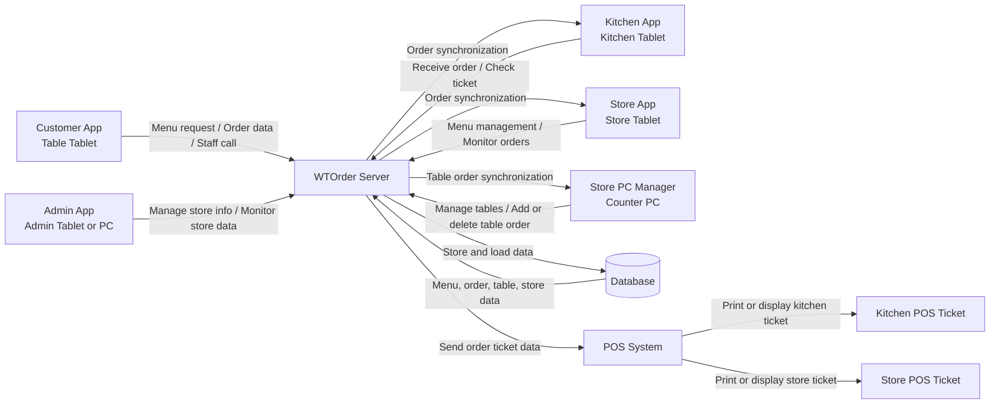

# 1. Conceptualization

Wireless Table Order (WT Order)

Student No  
22413565  

Name  
이창민  

E-Mail  
pect5511@naver.com  

[ Revision history ]

| Revision date | Version # | Description | Author |
|--------------|-----------|-------------|--------|
| 2026.03.23 | 1.00 | First draft | 이창민 |
| 2026.05.30 | 1.10 | App separation, POS integration, Store PC Manager, table order management added | 이창민 |

= Contents =

1. Business purpose ..................................................................................

2. System context diagram .......................................................................

3. Use case list .........................................................................................

4. Concept of operation ............................................................................ 

5. Problem statement ................................................................................

6. Glossary .................................................................................................

7. References .................................................................................................

---

# 1. Business purpose

WTOrder는 음식점에서 사용되는 테이블 오더 시스템의 개념을 기반으로, 고객용 태블릿, 주방용 태블릿, 매장용 태블릿, 관리자용 앱, 카운터 PC 관리 프로그램을 서로 연동하여 주문과 매장 운영을 통합적으로 관리하는 무선 주문 시스템이다. 기존의 테이블 오더 시스템이 고객의 주문 입력과 주방 전달에만 초점을 두는 경우가 많았다면, WTOrder는 고객 주문, 주방 전표, 매장 전표, 메뉴 관리, 테이블별 주문 관리까지 하나의 흐름으로 연결하는 것을 목표로 한다.

기존 테이블 오더 시스템은 고객이 직접 메뉴를 확인하고 주문할 수 있도록 하여 주문 과정을 자동화하고, 주문 누락을 줄이며, 매장 직원의 업무 부담을 줄이는 장점이 있다. 하지만 초기 설치 비용, 유지 비용, 장비 연동 비용, 지속적인 수수료가 발생할 수 있고, 화면 구성이 복잡할 경우 고령층이나 디지털 기기에 익숙하지 않은 사용자가 이용하기 어렵다는 문제가 있다. 또한 주방 POS, 매장 POS, 카운터 PC, 테이블 태블릿이 분리되어 운영되면 주문 정보가 여러 장치에서 다르게 보이는 데이터 불일치 문제가 발생할 수 있다.

이에 WTOrder는 저비용 환경에서도 구축 가능한 구조를 기반으로 하되, 시스템의 구성 요소를 역할별로 명확하게 분리한다. 고객은 Customer App이 설치된 테이블 태블릿을 사용하여 메뉴를 조회하고 주문을 확정한다. 주방은 Kitchen App 또는 주방 POS를 통해 주문 전표를 확인한다. 매장 측은 Store App을 통해 메뉴, 가격, 설명, 사진, 품절 상태를 관리하고 주문 현황을 확인한다. 관리자는 Admin App을 통해 매장 정보를 관리하고 운영 데이터를 확인한다. 추가로 Store PC Manager를 두어 카운터 PC에서 전체 테이블 상태를 확인하고, 특정 테이블을 클릭하여 현재까지 들어온 주문 내역을 조회하거나 메뉴를 추가 또는 삭제할 수 있도록 한다.

특히 이번 수정된 WTOrder System에서는 POS 연동 기능을 핵심 요소로 포함한다. 고객이 Customer App에서 주문을 확정하면 주문 정보는 WTOrder Server를 통해 Database에 저장되고, Kitchen App과 Store App에 동기화된다. 동시에 POS System으로 주문 정보가 전달되어 Kitchen POS에는 주방 조리를 위한 메뉴 전표가 올라오고, Store POS에는 매장 확인용 메뉴 전표가 올라온다. 이를 통해 주방은 주문을 빠르게 확인할 수 있고, 매장 직원은 카운터와 매장 운영 화면에서 주문 흐름을 동시에 확인할 수 있다.

또한 Store PC Manager는 매장 운영 효율성을 높이기 위한 보조 관리 기능을 제공한다. 매장 직원은 PC 화면에서 전체 테이블의 상태를 확인할 수 있으며, 특정 테이블을 클릭하면 해당 테이블에서 현재까지 발생한 주문 목록을 확인할 수 있다. 고객이 직원에게 직접 요청한 추가 주문이나 잘못 들어간 주문 항목이 있는 경우, 직원은 PC에서 메뉴를 추가하거나 삭제할 수 있다. 단, 본 단계에서는 기능 범위를 단순화하기 위해 수량 변경, 결제 대기 상태 변경, 테이블 종료 기능은 포함하지 않는다. 이로써 WTOrder는 고객용 주문 시스템을 넘어, 주방, 매장, 카운터, 관리자가 함께 사용하는 통합 주문 관리 시스템으로 확장된다.

이를 통해 WTOrder는 기존 테이블 오더 시스템 대비 경제성, 접근성, 확장성, 운영 효율성을 동시에 개선한 대안 시스템으로서의 가치를 제공하고자 한다.

---

# 2. System context diagram

아래의 그림은 수정된 WTOrder System의 System Context Diagram을 나타낸 것이다.  
기존의 Customer, Store, Kitchen, Admin 중심 구조에서 확장하여 Customer App, Kitchen App, Store App, Admin App, Store PC Manager, POS System, Database가 WTOrder Server를 중심으로 연결되는 구조로 설계하였다.

System Context Diagram에서 Customer App은 테이블에 설치된 고객용 태블릿 앱이다. 고객이 메뉴를 조회하거나 주문을 확정하면 해당 데이터가 WTOrder Server로 전달된다. WTOrder Server는 주문 데이터를 Database에 저장하고, Kitchen App, Store App, Store PC Manager에 주문 정보를 동기화한다. 또한 POS System으로 주문 전표 데이터를 보내 Kitchen POS와 Store POS에 메뉴 전표가 표시되도록 한다.

Kitchen App은 주방에서 주문을 확인하는 앱이며, POS System과 연동되어 메뉴 전표를 확인할 수 있다. Store App은 매장 측 태블릿 앱으로 메뉴 관리와 주문 모니터링을 담당한다. Store PC Manager는 매장 카운터 PC에서 실행되며, 전체 테이블 상태와 테이블별 주문을 관리한다. Admin App은 매장 정보와 운영 데이터를 관리하는 상위 관리 기능을 담당한다.

---

# 3. Use case list

1) View Menu

Actor  
Customer App / Customer  

Description  
고객이 Customer App에서 메뉴 목록을 조회하고 메뉴 사진, 설명, 가격, 품절 여부를 확인한다.

2) Add Order

Actor  
Customer App / Customer  

Description  
고객이 원하는 메뉴를 선택하고 수량을 지정하여 주문 목록에 추가한다.

3) Confirm Order

Actor  
Customer App / Customer  

Description  
고객이 주문 목록을 최종 확인하고 주문을 확정한다.

4) Call Staff

Actor  
Customer App / Customer  

Description  
고객이 직원 호출 버튼을 눌러 매장 직원에게 요청을 전달한다.

5) Receive Order

Actor  
Kitchen App / Kitchen  

Description  
주방이 WTOrder Server로부터 고객 주문을 전달받아 확인한다.

6) Print Kitchen Ticket

Actor  
POS System / Kitchen POS  

Description  
고객 주문이 확정되면 POS System이 주방 POS에 메뉴 전표를 출력하거나 표시한다.

7) Manage Menu

Actor  
Store App / Store  

Description  
매장 측이 Store App에서 메뉴를 추가, 수정, 삭제한다.

8) Upload Photo

Actor  
Store App / Store  

Description  
매장 측이 메뉴 사진을 등록하거나 수정한다.

9) Edit Description

Actor  
Store App / Store  

Description  
매장 측이 메뉴 설명을 작성하거나 수정한다.

10) Set Price

Actor  
Store App / Store  

Description  
매장 측이 메뉴 가격을 설정하거나 변경한다.

11) Control Sold-out

Actor  
Store App / Store  

Description  
매장 측이 특정 메뉴의 품절 여부를 설정하거나 해제한다.

12) Monitor Orders

Actor  
Store App / Store, Kitchen App / Kitchen  

Description  
매장 측과 주방 측이 현재 접수된 주문 목록과 주문 상태를 확인한다.

13) Print Store Ticket

Actor  
POS System / Store POS  

Description  
고객 주문이 확정되면 POS System이 매장 POS에 메뉴 전표를 출력하거나 표시한다.

14) Manage Tables

Actor  
Store PC Manager / Store  

Description  
매장 직원이 PC 화면에서 전체 테이블 상태를 조회하고 관리한다.

15) View Table Orders

Actor  
Store PC Manager / Store  

Description  
매장 직원이 특정 테이블을 클릭하여 현재까지 들어온 주문 내역을 확인한다.

16) Add Table Order

Actor  
Store PC Manager / Store  

Description  
매장 직원이 고객 요청에 따라 PC에서 특정 테이블에 메뉴를 추가한다.

17) Delete Table Order

Actor  
Store PC Manager / Store  

Description  
매장 직원이 잘못 입력된 주문 항목을 PC에서 삭제한다.

18) Process Order

Actor  
WTOrder Server  

Description  
서버가 고객 주문을 검증하고 저장한 뒤 주방, 매장, POS, Store PC Manager에 전달한다.

19) Manage Data

Actor  
WTOrder Server  

Description  
서버가 메뉴, 주문, 테이블, 매장 데이터를 데이터베이스와 연동하여 저장, 조회, 수정한다.

20) Store Menu Data

Actor  
Database  

Description  
메뉴명, 가격, 설명, 사진, 품절 상태 등 메뉴 관련 정보를 저장한다.

21) Store Order Data

Actor  
Database  

Description  
주문 번호, 테이블 번호, 주문 항목, 수량, 주문 상태 등 주문 데이터를 저장한다.

22) Store Table Data

Actor  
Database  

Description  
테이블 번호, 테이블 상태, 테이블별 주문 목록 등 테이블 관리 데이터를 저장한다.

23) Manage Store Information

Actor  
Admin App / Admin  

Description  
관리자가 매장명, 위치, 운영 시간, 연락처 등 매장 기본 정보를 관리한다.

24) Monitor Store Data

Actor  
Admin App / Admin  

Description  
관리자가 매장별 주문 현황, 운영 상태, 주문 데이터를 통합적으로 확인한다.

---

# 4. Concept of operation

1) View Menu

Purpose  
고객이 주문 가능한 메뉴 정보를 Customer App에서 확인할 수 있도록 한다.

Approach  
고객이 Customer App을 실행하면 앱은 WTOrder Server에 메뉴 데이터를 요청한다. 서버는 Database에서 메뉴명, 가격, 사진, 설명, 품절 상태를 조회하여 Customer App으로 전달한다. Customer App은 전달받은 메뉴 정보를 카테고리별로 화면에 출력한다.

Dynamics  
고객이 테이블 태블릿에서 메뉴 화면에 접근할 경우

Goals  
고객용 메뉴 조회 기능을 구현한다.

2) Add Order

Purpose  
고객이 원하는 메뉴를 주문 목록에 추가할 수 있도록 한다.

Approach  
고객이 Customer App에서 메뉴를 선택하고 수량을 지정하면 앱은 해당 메뉴 정보를 임시 주문 목록에 추가한다. 이 단계에서는 주문이 최종 저장되지 않고 고객 화면의 주문 목록에만 반영된다.

Dynamics  
고객이 메뉴를 선택하고 주문 추가 버튼을 누를 경우

Goals  
메뉴 선택 및 주문 목록 추가 기능을 구현한다.

3) Confirm Order

Purpose  
고객이 선택한 메뉴를 최종 주문으로 확정할 수 있도록 한다.

Approach  
고객이 주문 목록 화면에서 메뉴명, 수량, 금액, 총 금액을 확인한 뒤 주문 확정 버튼을 누른다. Customer App은 주문 데이터를 WTOrder Server로 전송하고, 서버는 주문을 검증한 뒤 Database에 저장한다. 저장된 주문은 Kitchen App, Store App, Store PC Manager, POS System에 전달된다.

Dynamics  
고객이 주문 목록을 확인하고 주문을 완료할 경우

Goals  
주문 확정 및 주문 데이터 전송 기능을 구현한다.

4) Call Staff

Purpose  
고객이 직원에게 추가 요청을 전달할 수 있도록 한다.

Approach  
고객이 Customer App에서 직원 호출 버튼을 누르면 테이블 번호와 호출 요청이 WTOrder Server로 전송된다. 서버는 호출 정보를 저장하고 Store App 또는 Store PC Manager에 호출 알림을 전달한다.

Dynamics  
고객이 도움이 필요하여 직원 호출 버튼을 누를 경우

Goals  
직원 호출 및 매장 알림 기능을 구현한다.

5) Receive Order

Purpose  
주방이 고객 주문 정보를 실시간으로 전달받을 수 있도록 한다.

Approach  
고객 주문이 확정되면 WTOrder Server는 주문 번호, 테이블 번호, 메뉴명, 수량, 요청사항 등을 Kitchen App으로 전송한다. Kitchen App은 주문 목록 또는 주문 전표 형태로 주문 정보를 화면에 표시한다.

Dynamics  
새로운 주문이 확정되어 주방으로 전달될 경우

Goals  
주방 주문 수신 기능을 구현한다.

6) Print Kitchen Ticket

Purpose  
고객 주문이 확정되면 Kitchen POS에 메뉴 전표가 올라오도록 한다.

Approach  
WTOrder Server는 주문 데이터를 POS System으로 전달한다. POS System은 주방에서 확인할 수 있는 메뉴 전표를 Kitchen POS에 출력하거나 화면에 표시한다. 메뉴 전표에는 테이블 번호, 주문 시간, 메뉴명, 수량이 포함된다.

Dynamics  
고객 주문이 확정되어 POS 전표 출력이 필요한 경우

Goals  
주방 POS 전표 출력 기능을 구현한다.

7) Manage Menu

Purpose  
매장 측이 메뉴를 추가, 수정, 삭제할 수 있도록 한다.

Approach  
매장 직원은 Store App에서 메뉴 관리 화면에 접근한다. 기존 메뉴 목록을 확인한 뒤 메뉴를 추가하거나 기존 메뉴 정보를 수정 또는 삭제한다. 변경된 메뉴 데이터는 WTOrder Server를 통해 Database에 저장되고 Customer App에도 반영된다.

Dynamics  
매장 측이 메뉴 구성을 변경할 경우

Goals  
메뉴 관리 기능을 구현한다.

8) Upload Photo

Purpose  
매장 측이 메뉴 사진을 등록하거나 변경할 수 있도록 한다.

Approach  
매장 직원은 Store App에서 특정 메뉴를 선택한 뒤 사진 업로드 기능을 실행한다. 선택된 이미지 파일은 서버로 전달되고 메뉴 데이터와 연결되어 저장된다. 저장된 사진은 고객 메뉴 화면에 표시된다.

Dynamics  
매장 측이 메뉴 이미지를 등록 또는 수정할 경우

Goals  
메뉴 사진 등록 기능을 구현한다.

9) Edit Description

Purpose  
매장 측이 메뉴 설명을 작성하거나 수정할 수 있도록 한다.

Approach  
매장 직원은 Store App에서 설명을 수정할 메뉴를 선택한다. 기존 설명을 확인한 뒤 새로운 설명을 입력하고 저장한다. 서버는 변경된 설명을 Database에 반영하고 Customer App에 최신 메뉴 설명이 표시되도록 한다.

Dynamics  
매장 측이 메뉴 설명을 변경할 경우

Goals  
메뉴 설명 관리 기능을 구현한다.

10) Set Price

Purpose  
매장 측이 메뉴 가격을 설정하거나 수정할 수 있도록 한다.

Approach  
매장 직원은 Store App에서 가격을 변경할 메뉴를 선택하고 새로운 가격을 입력한다. 시스템은 가격 형식을 확인한 뒤 Database에 저장한다. 변경된 가격은 Customer App의 메뉴 화면에 반영된다.

Dynamics  
매장 측이 메뉴 가격을 변경할 경우

Goals  
가격 설정 기능을 구현한다.

11) Control Sold-out

Purpose  
매장 측이 메뉴 품절 여부를 설정하여 주문 불가 상태를 반영할 수 있도록 한다.

Approach  
매장 직원은 Store App에서 특정 메뉴를 선택하고 판매중 또는 품절 상태를 지정한다. WTOrder Server는 변경된 품절 상태를 Database에 저장하고 Customer App에 반영한다. 품절 메뉴는 고객이 주문할 수 없도록 표시된다.

Dynamics  
재고 부족 또는 운영상의 이유로 특정 메뉴를 판매할 수 없을 경우

Goals  
품절 관리 기능을 구현한다.

12) Monitor Orders

Purpose  
매장 측과 주방 측이 현재 주문 현황을 확인할 수 있도록 한다.

Approach  
Store App과 Kitchen App은 WTOrder Server에 주문 목록을 요청한다. 서버는 Database에서 현재 주문 데이터를 조회하여 각 앱에 전달한다. 사용자는 주문 번호, 테이블 번호, 주문 시간, 메뉴명, 주문 상태를 확인할 수 있다.

Dynamics  
매장 또는 주방이 운영 중 주문 흐름을 확인할 경우

Goals  
주문 현황 모니터링 기능을 구현한다.

13) Print Store Ticket

Purpose  
고객 주문이 확정되면 Store POS에도 메뉴 전표가 올라오도록 한다.

Approach  
WTOrder Server는 주문 데이터를 POS System으로 전달하고, POS System은 Store POS에 매장 확인용 메뉴 전표를 출력하거나 표시한다. 매장 직원은 해당 전표를 통해 고객 주문과 테이블 정보를 확인할 수 있다.

Dynamics  
고객 주문이 확정되어 매장 측에서도 전표 확인이 필요한 경우

Goals  
매장 POS 전표 출력 기능을 구현한다.

14) Manage Tables

Purpose  
매장 직원이 Store PC Manager에서 전체 테이블 상태를 확인할 수 있도록 한다.

Approach  
Store PC Manager는 WTOrder Server에 전체 테이블 데이터를 요청한다. 서버는 Database에서 테이블 번호, 테이블 상태, 현재 주문 여부를 조회하여 PC 화면에 표시한다. 직원은 테이블 목록을 통해 매장 전체 상황을 확인할 수 있다.

Dynamics  
직원이 카운터 PC에서 전체 테이블을 관리하려는 경우

Goals  
테이블 관리 기능을 구현한다.

15) View Table Orders

Purpose  
매장 직원이 특정 테이블의 현재 주문 내역을 확인할 수 있도록 한다.

Approach  
직원이 Store PC Manager에서 특정 테이블을 클릭하면 PC Manager는 해당 테이블의 주문 데이터를 서버에 요청한다. 서버는 Database에서 해당 테이블의 주문 목록을 조회하여 PC 화면에 출력한다.

Dynamics  
직원이 특정 테이블의 주문 상태를 확인하려는 경우

Goals  
테이블별 주문 조회 기능을 구현한다.

16) Add Table Order

Purpose  
매장 직원이 고객 요청에 따라 PC에서 특정 테이블에 메뉴를 추가할 수 있도록 한다.

Approach  
직원이 Store PC Manager에서 테이블을 선택한 후 메뉴 추가 기능을 실행한다. 추가할 메뉴를 선택하면 서버는 해당 테이블의 기존 주문에 새 주문 항목을 추가하고 Database를 갱신한다. 변경된 주문 정보는 Store App, Kitchen App, POS System에 동기화된다.

Dynamics  
고객이 직원에게 직접 추가 주문을 요청하거나 직원이 주문을 보정해야 하는 경우

Goals  
PC 기반 테이블 주문 추가 기능을 구현한다.

17) Delete Table Order

Purpose  
매장 직원이 잘못 입력된 주문 항목을 PC에서 삭제할 수 있도록 한다.

Approach  
직원이 Store PC Manager에서 특정 테이블의 주문 내역을 확인하고 삭제할 주문 항목을 선택한다. 삭제 요청은 WTOrder Server로 전달되며, 서버는 Database에서 해당 주문 항목을 삭제하거나 삭제 상태로 변경한다. 변경 내용은 Store App, Kitchen App, POS System에 동기화된다.

Dynamics  
잘못된 주문 항목을 정정해야 하는 경우

Goals  
PC 기반 테이블 주문 삭제 기능을 구현한다.

18) Process Order

Purpose  
WTOrder Server가 고객 주문을 정상적으로 처리하고 관련 구성 요소에 전달할 수 있도록 한다.

Approach  
고객 주문이 접수되면 서버는 주문 데이터의 유효성을 검사하고 Database에 저장한다. 이후 Kitchen App, Store App, Store PC Manager, POS System에 주문 정보를 동기화한다.

Dynamics  
고객 주문이 발생하거나 PC에서 주문이 추가 또는 삭제될 경우

Goals  
주문 처리 및 주문 동기화 기능을 구현한다.

19) Manage Data

Purpose  
시스템이 메뉴, 주문, 테이블, 매장 데이터를 저장 및 조회할 수 있도록 한다.

Approach  
WTOrder Server는 각 앱에서 요청하는 데이터 처리 작업을 Database와 연동하여 수행한다. 메뉴 데이터, 주문 데이터, 테이블 데이터, 매장 정보는 각각 필요한 시점에 저장, 조회, 수정된다.

Dynamics  
시스템 전반에서 데이터 처리가 필요한 경우

Goals  
통합 데이터 관리 기능을 구현한다.

20) Store Menu Data

Purpose  
메뉴 정보를 안정적으로 저장할 수 있도록 한다.

Approach  
Store App에서 입력한 메뉴명, 가격, 설명, 사진, 품절 상태를 Database에 저장한다. 저장된 메뉴 데이터는 Customer App에서 조회할 수 있다.

Dynamics  
메뉴 정보가 등록 또는 수정될 경우

Goals  
메뉴 데이터 저장 기능을 구현한다.

21) Store Order Data

Purpose  
주문 정보를 저장하여 이후 처리와 조회가 가능하도록 한다.

Approach  
고객 주문이 확정되거나 Store PC Manager에서 주문이 추가되면 주문 번호, 테이블 번호, 주문 항목, 수량, 주문 시간 등의 정보를 Database에 저장한다.

Dynamics  
주문이 새로 발생하거나 주문 항목이 추가될 경우

Goals  
주문 데이터 저장 기능을 구현한다.

22) Store Table Data

Purpose  
테이블별 주문 상태와 테이블 정보를 저장할 수 있도록 한다.

Approach  
Store PC Manager에서 사용하는 테이블 번호, 테이블 상태, 테이블별 주문 목록을 Database에 저장한다. 테이블 데이터는 Store PC Manager 화면에서 전체 테이블 현황을 표시하는 데 사용된다.

Dynamics  
테이블별 주문이 발생하거나 주문 내용이 변경될 경우

Goals  
테이블 데이터 저장 및 조회 기능을 구현한다.

23) Manage Store Information

Purpose  
관리자가 매장의 기본 정보 및 운영 정보를 관리할 수 있도록 한다.

Approach  
관리자는 Admin App에서 매장명, 위치, 연락처, 운영 시간 등의 정보를 입력하거나 수정한다. WTOrder Server는 변경된 매장 정보를 Database에 저장한다.

Dynamics  
매장 정보의 등록 또는 수정이 필요한 경우

Goals  
매장 정보 관리 기능을 구현한다.

24) Monitor Store Data

Purpose  
관리자가 여러 매장의 운영 데이터를 통합적으로 확인할 수 있도록 한다.

Approach  
관리자는 Admin App에서 매장별 주문 현황, 운영 상태, 메뉴 데이터, 테이블 운영 현황 등을 조회한다. WTOrder Server는 Database에서 필요한 데이터를 불러와 Admin App에 표시한다.

Dynamics  
관리자가 전체 매장 운영 상황을 모니터링하려는 경우

Goals  
매장 운영 데이터 조회 및 모니터링 기능을 구현한다.

---

# 5. Problem statement

Overview)

WTOrder System은 고객용 태블릿, 주방용 태블릿, 매장용 태블릿, 관리자 앱, Store PC Manager, POS System이 서로 연동되는 통합 테이블 오더 기반 주문 관리 시스템이다. 고객은 테이블에 설치된 Customer App을 통해 메뉴를 조회하고 주문을 생성한다. 주문 정보는 WTOrder Server를 통해 Database에 저장되며, Kitchen App, Store App, Store PC Manager, POS System에 동기화된다. 주방은 Kitchen App과 Kitchen POS 전표를 통해 주문을 확인하고, 매장은 Store App과 Store POS 전표를 통해 주문 현황을 확인한다. Store PC Manager는 매장 직원이 전체 테이블을 관리하고, 테이블별 주문을 조회하거나 메뉴를 추가 또는 삭제할 수 있도록 한다. 관리자는 Admin App을 통해 매장 정보와 운영 데이터를 통합적으로 관리한다.

WTOrder System을 개발함에 있어 다음과 같은 문제점과 기술적 어려움을 고려해야 한다.

① 주문 처리 지연 문제  
동시에 많은 고객이 주문할 경우 WTOrder Server에 많은 요청이 집중될 수 있다.  
주문 처리 속도가 느려지면 고객 화면의 응답이 지연되고, 주방과 매장 POS에 전표가 늦게 올라올 수 있다.  
이는 고객 경험 저하와 매장 운영 효율 감소로 이어질 수 있다.

② 데이터 일관성 문제  
Customer App, Kitchen App, Store App, Store PC Manager, POS System이 동일한 주문 데이터를 공유하기 때문에 데이터 불일치가 발생할 가능성이 있다.  
예를 들어 Customer App에서는 주문이 완료되었지만 Kitchen App 또는 Store POS에는 전표가 표시되지 않는 문제가 발생할 수 있다.  
또한 Store PC Manager에서 주문 항목을 삭제했는데 Kitchen App에 반영되지 않으면 잘못된 조리가 발생할 수 있다.

③ POS 연동 문제  
WTOrder System은 Kitchen POS와 Store POS에 메뉴 전표를 올려야 한다.  
POS 연동이 실패하면 주방 전표 누락, 매장 전표 누락, 중복 전표 출력 문제가 발생할 수 있다.  
따라서 주문 데이터가 POS System에 정상적으로 전달되었는지 확인하는 과정이 필요하다.

④ 테이블 관리 동기화 문제  
Store PC Manager는 테이블별 주문을 조회하고 메뉴를 추가 또는 삭제할 수 있다.  
이때 PC에서 수정한 주문 정보가 Store App, Kitchen App, POS System에 빠르게 반영되지 않으면 직원과 주방 사이에 혼선이 생길 수 있다.  
특히 주문 삭제가 늦게 반영되면 이미 취소된 메뉴가 조리될 수 있다.

⑤ 다중 디바이스 관리 문제  
WTOrder는 여러 태블릿과 PC가 동시에 접속하는 구조이다.  
각 디바이스가 같은 데이터를 동시에 수정하거나 조회할 수 있으므로, 시스템은 동시 요청 처리와 데이터 충돌 방지 방법을 고려해야 한다.

⑥ 네트워크 의존성 문제  
Customer App, Kitchen App, Store App, Store PC Manager, POS System은 네트워크를 통해 서버와 통신한다.  
매장 내부 Wi-Fi 또는 네트워크 연결이 불안정할 경우 주문 전송, 전표 출력, 테이블 정보 갱신이 지연될 수 있다.  
따라서 네트워크 장애 발생 시 재전송 또는 오류 알림 기능이 필요하다.

⑦ 사용자 인터페이스(UI) 접근성 문제  
고객, 매장 직원, 주방 직원, 관리자는 서로 다른 목적과 환경에서 시스템을 사용한다.  
Customer App은 고령 사용자도 쉽게 사용할 수 있도록 큰 버튼과 단순한 화면이 필요하다.  
Kitchen App은 빠르게 주문을 확인할 수 있도록 주문 전표 중심의 화면이 필요하다.  
Store PC Manager는 여러 테이블을 한눈에 볼 수 있도록 가독성 높은 테이블 관리 화면이 필요하다.

⑧ 보안 및 접근 권한 문제  
고객은 주문 기능만 사용할 수 있어야 하고, 매장 직원은 메뉴 관리와 테이블 관리를 수행할 수 있어야 하며, 관리자는 매장 정보와 전체 데이터를 확인할 수 있어야 한다.  
역할에 따른 접근 권한이 제대로 분리되지 않으면 고객이 관리 기능에 접근하거나, 일반 직원이 관리자 기능을 수행하는 문제가 발생할 수 있다.

---

# 6. Glossary

WTOrder System  
본 문서에서 설계된 핵심 시스템으로, Customer App, Kitchen App, Store App, Admin App, Store PC Manager, POS System을 연결하여 주문 처리 및 매장 운영 데이터를 통합적으로 관리하는 테이블 오더 기반 주문 관리 시스템을 의미한다.

Customer App  
고객 테이블에 설치된 태블릿 앱으로, 메뉴 조회, 주문 추가, 주문 확정, 직원 호출 기능을 제공한다.

Kitchen App  
주방에서 사용하는 태블릿 앱으로, 고객 주문을 수신하고 주문 목록 또는 전표 형태로 확인하는 기능을 제공한다.

Store App  
매장 직원이 사용하는 태블릿 앱으로, 메뉴 관리, 사진 업로드, 설명 수정, 가격 설정, 품절 처리, 주문 모니터링 기능을 제공한다.

Admin App  
관리자가 사용하는 앱으로, 매장 정보 관리 및 여러 매장의 운영 데이터 모니터링 기능을 제공한다.

Store PC Manager  
매장 카운터 PC에서 사용하는 관리 프로그램으로, 전체 테이블 상태를 확인하고 특정 테이블의 주문 내역 조회, 메뉴 추가, 메뉴 삭제 기능을 수행한다.

POS System  
주문 데이터를 메뉴 전표 형태로 출력하거나 화면에 표시하는 포스 시스템이다. WTOrder Server로부터 주문 정보를 받아 Kitchen POS와 Store POS에 전표를 전달한다.

Kitchen POS  
주방에서 사용하는 POS 화면 또는 출력 장치로, 조리를 위한 메뉴 전표를 표시한다.

Store POS  
매장 측에서 사용하는 POS 화면 또는 출력 장치로, 매장 확인용 메뉴 전표를 표시한다.

Kitchen Ticket  
고객 주문이 주방 POS에 출력되거나 표시되는 메뉴 전표이다. 테이블 번호, 주문 시간, 메뉴명, 수량 등의 정보를 포함한다.

Store Ticket  
고객 주문이 매장 POS에 출력되거나 표시되는 메뉴 전표이다. 매장 직원이 주문 확인을 위해 사용한다.

Customer  
WTOrder System을 사용하는 최종 사용자로, Customer App을 통해 메뉴를 조회하고 주문을 생성하며 직원 호출 기능을 수행한다.

Kitchen  
고객의 주문을 전달받아 조리를 수행하는 주방 역할을 의미한다.

Store  
개별 매장을 운영하는 역할로, 메뉴 등록 및 수정, 가격 설정, 품절 관리, 주문 현황 확인, 테이블 관리 기능을 수행한다.

Admin  
여러 매장의 정보를 통합적으로 관리하는 상위 관리자 역할로, 매장 정보 관리 및 전체 운영 데이터 모니터링을 수행한다.

Database  
시스템에서 사용하는 모든 데이터를 저장하고 관리하는 저장소로, 메뉴 정보, 주문 정보, 테이블 정보, 매장 정보를 저장하고 조회 및 업데이트를 지원한다.

Menu  
고객이 선택할 수 있는 음식 또는 상품의 목록으로, 이름, 가격, 설명, 이미지, 품절 상태 등의 속성을 포함한다.

Order  
고객이 선택한 메뉴와 수량을 포함한 주문 요청 데이터로, 시스템을 통해 처리되어 주방, 매장, POS에 전달된다.

Table  
매장의 각 좌석 또는 테이블을 의미하며, 테이블 번호, 현재 주문 상태, 주문 내역 등의 정보를 가진다.

Table Order  
특정 테이블에서 현재까지 발생한 주문 목록을 의미한다.

Process Order  
고객의 주문이 생성된 이후 데이터 검증, 저장, Kitchen App 전달, Store App 전달, POS 전표 출력, Store PC Manager 동기화까지 이어지는 주문 처리 과정을 의미한다.

Sold-out  
특정 메뉴가 재고 부족 또는 운영상의 이유로 더 이상 주문할 수 없는 상태를 의미한다.

Order Sync  
주문 정보가 Customer App, Kitchen App, Store App, Store PC Manager, POS System 사이에서 동일하게 반영되도록 동기화되는 과정을 의미한다.

Table Management  
Store PC Manager에서 전체 테이블 상태를 확인하고, 테이블별 주문을 조회하거나 메뉴를 추가 또는 삭제하는 기능을 의미한다.

---

# 7. References

- Open Source Software Design Lecture Notes  
- UML Use Case Diagram Guide  
- UML System Context Diagram Guide  
- Table Order System related service examples  
- POS integration concept references  
