---

## [ Revision history ]

| Revision date | Version # | Description | Author |
|--------------|----------|------------|--------|
| 2026/05/30 | 1.00 | 초기 버전 | 이창민 |

---

# = Contents =
1. Introduction  
2. Class diagram  
3. Sequence diagram  
4. State machine diagram  
5. Implementation requirements  
6. Glossary  
7. References  

---

# 1. Introduction

## 1) Summary

WTOrder System은 음식점, 카페, 소규모 매장에서 사용할 수 있는 테이블 오더 시스템이다.  
기존 테이블 오더 시스템은 설치 비용, 유지 비용, 사용 수수료가 부담될 수 있고, 화면 구성이 복잡하면 고령층이나 디지털 기기에 익숙하지 않은 사용자가 이용하기 어렵다.  
WTOrder System은 이러한 문제를 해결하기 위해 고객이 테이블에서 직접 메뉴를 확인하고 주문할 수 있도록 하며, 매장과 주방은 주문 정보를 빠르게 확인하고 처리할 수 있도록 설계한다.

본 문서는 Analysis 단계에서 정의한 Use Case, Domain Analysis, User Interface prototype을 기반으로 작성한 Design 문서이다.  
이 문서에서는 시스템을 실제 구현하기 위해 필요한 Class Diagram, Sequence Diagram, State Machine Diagram, Implementation Requirements를 정리한다.  
고객(Customer), 매장(Store), 주방(Kitchen), 관리자(Admin)의 역할을 기준으로 기능을 나누고, 각 기능이 어떤 클래스와 메소드로 동작하는지 구체적으로 설계한다.

WTOrder System의 핵심 목표는 저비용 구조, 직관적인 화면 구성, 빠른 주문 전달, 효율적인 메뉴 관리, 안정적인 주문 데이터 저장이다.  
고객은 메뉴 확인, 주문 추가, 주문 확정, 직원 호출 기능을 사용할 수 있다.  
매장 측은 메뉴 관리, 사진 업로드, 설명 수정, 가격 설정, 품절 설정, 주문 모니터링 기능을 사용할 수 있다.  
주방은 고객이 확정한 주문을 전달받아 확인할 수 있으며, 관리자는 매장 기본 정보를 관리할 수 있다.

## 2) Important Points of Design

- 사용자의 역할에 따라 사용할 수 있는 기능을 구분해야 한다.
- 고객 화면은 메뉴 확인과 주문 과정이 단순하게 이어지도록 구성해야 한다.
- 매장 측은 메뉴 사진, 설명, 가격, 품절 상태를 한 화면에서 쉽게 수정할 수 있어야 한다.
- 고객이 주문을 확정하면 주문 데이터가 저장되고 주방 화면으로 전달되어야 한다.
- 주방과 매장 측은 현재 주문 상태를 확인할 수 있어야 한다.
- 관리자(Admin)는 매장명, 주소, 영업시간 등 매장 기본 정보를 수정할 수 있어야 한다.
- 메뉴, 주문, 매장 정보는 Database를 통해 저장하고 조회할 수 있도록 설계한다.
- Class 간 정보 전달은 명확하게 하되, 각 클래스의 역할이 과도하게 섞이지 않도록 한다.

---

# 2. Class diagram

아래의 그림은 WTOrder System의 Class Diagram을 Mermaid 코드로 표현한 것이다.  
GitHub Markdown에서는 Mermaid를 지원하므로 아래 코드를 그대로 README 또는 md 파일에 올리면 Diagram 형태로 확인할 수 있다.

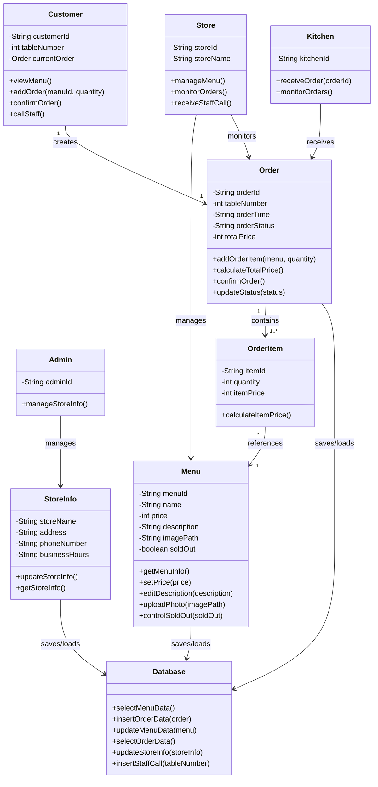

아래의 표는 위의 Class Diagram에서 표현한 Class들의 설명이다.

| Class Name | Explanation |
|------------|-------------|
| Customer | 고객 역할을 나타내는 클래스이다. 고객은 메뉴 조회, 주문 추가, 주문 확정, 직원 호출 기능을 수행한다. `viewMenu()`는 메뉴 목록을 불러와 화면에 출력하는 메소드이다. `addOrder(menuId, quantity)`는 선택한 메뉴와 수량을 현재 주문 목록에 추가한다. `confirmOrder()`는 주문 목록을 최종 확정하고 주문 데이터를 저장하도록 요청한다. `callStaff()`는 직원 호출 요청을 생성한다. |
| Store | 매장 측 역할을 나타내는 클래스이다. 매장 측은 메뉴를 관리하고 주문 현황을 확인한다. `manageMenu()`는 메뉴 추가, 수정, 삭제 및 상세 관리 기능을 실행한다. `monitorOrders()`는 현재 들어온 주문 목록과 상태를 확인한다. `receiveStaffCall()`은 고객의 직원 호출 요청을 확인한다. |
| Kitchen | 주방 역할을 나타내는 클래스이다. 고객이 주문을 확정하면 주방은 주문 정보를 전달받아 확인한다. `receiveOrder(orderId)`는 주문 번호를 기준으로 주문 정보를 수신한다. `monitorOrders()`는 주방 화면에서 주문 목록을 확인하는 메소드이다. |
| Admin | 관리자 역할을 나타내는 클래스이다. Admin은 매장 정보를 관리한다. `manageStoreInfo()`는 매장명, 주소, 전화번호, 영업시간 등의 정보를 추가하거나 수정하는 기능을 실행한다. |
| Menu | 메뉴 정보를 저장하는 클래스이다. 메뉴명, 가격, 설명, 사진 경로, 품절 여부를 가진다. `setPrice(price)`는 메뉴 가격을 변경한다. `editDescription(description)`은 메뉴 설명을 수정한다. `uploadPhoto(imagePath)`는 메뉴 사진을 등록한다. `controlSoldOut(soldOut)`은 메뉴의 판매 가능 상태를 변경한다. |
| Order | 고객 주문 정보를 저장하는 클래스이다. 주문 번호, 테이블 번호, 주문 시간, 주문 상태, 총 금액을 가진다. `addOrderItem(menu, quantity)`는 주문 항목을 추가한다. `calculateTotalPrice()`는 총 주문 금액을 계산한다. `confirmOrder()`는 주문을 확정한다. `updateStatus(status)`는 주문 상태를 변경한다. |
| OrderItem | 하나의 주문 안에 포함되는 개별 메뉴 항목을 나타내는 클래스이다. 수량과 항목별 금액을 저장한다. `calculateItemPrice()`는 메뉴 가격과 수량을 이용하여 항목 금액을 계산한다. |
| StoreInfo | 매장 기본 정보를 저장하는 클래스이다. 매장명, 주소, 전화번호, 영업시간을 가진다. `updateStoreInfo()`는 매장 정보를 수정하고, `getStoreInfo()`는 저장된 매장 정보를 반환한다. |
| Database | 시스템의 데이터를 저장하고 불러오는 클래스이다. 메뉴 데이터, 주문 데이터, 매장 정보, 직원 호출 요청을 저장한다. 실제 구현에서는 SQLite 또는 MySQL과 연결되는 역할을 한다. |

---

# 3. Sequence diagram

아래에 나오는 그림들은 Analysis 단계에서 정의한 Use Case를 기반으로 WTOrder System의 기능 흐름을 Sequence Diagram으로 표현한 것이다.

## 3.1. View Menu

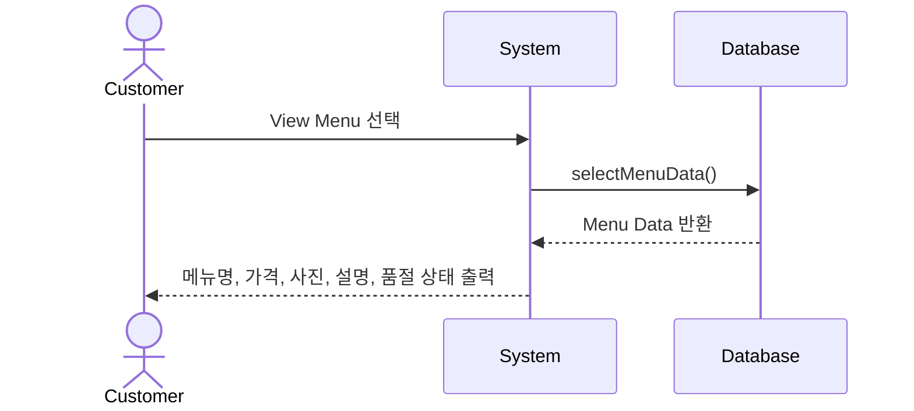

위의 그림은 고객이 메뉴 화면에 접근했을 때 수행되는 Sequence Diagram이다.  
고객이 메뉴 화면을 선택하면 System은 Database에 저장된 메뉴 데이터를 요청한다.  
Database는 메뉴명, 가격, 사진, 설명, 품절 상태를 반환하고, System은 해당 정보를 고객 화면에 출력한다.  
이 기능은 고객이 주문을 시작하기 전에 메뉴 정보를 확인하는 가장 기본적인 기능이다.

## 3.2. Add Order

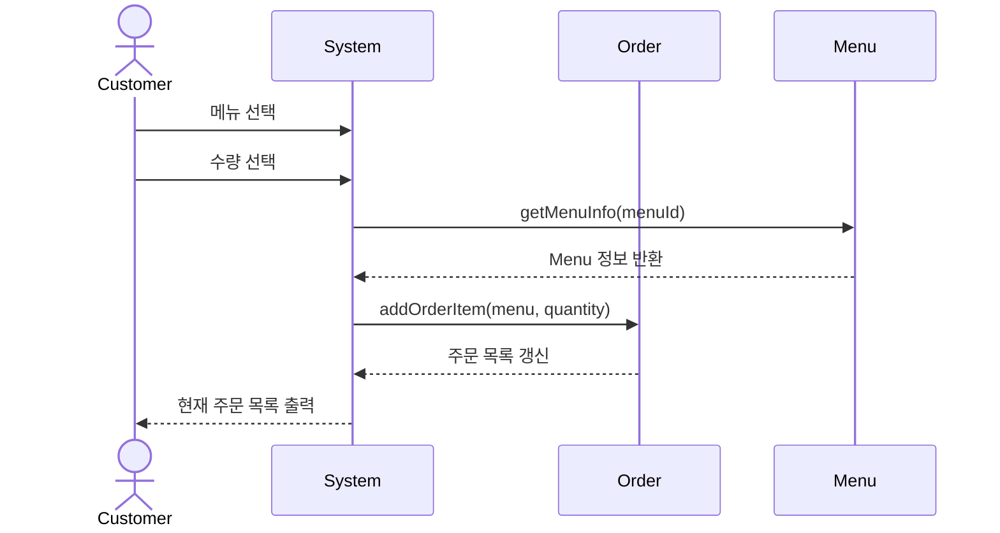

위의 그림은 고객이 메뉴를 주문 목록에 추가하는 기능을 표현한 Sequence Diagram이다.  
고객은 메뉴 화면에서 원하는 메뉴를 선택하고 수량을 지정한다.  
System은 선택된 메뉴 정보를 Menu 클래스에서 확인하고, Order 클래스의 `addOrderItem()` 메소드를 통해 현재 주문 목록에 메뉴를 추가한다.  
그 후 갱신된 주문 목록을 고객 화면에 다시 출력한다.

## 3.3. Confirm Order

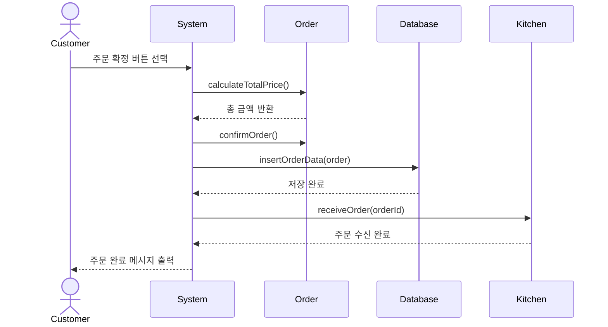

위의 그림은 고객이 주문 목록을 최종 확인하고 주문을 확정할 때의 Sequence Diagram이다.  
고객이 주문 확정 버튼을 누르면 System은 Order 클래스에서 총 금액을 계산한다.  
그 다음 주문 상태를 확정 상태로 변경하고 Database에 주문 데이터를 저장한다.  
저장이 완료되면 주문 번호를 기준으로 주방 화면에 주문 정보를 전달한다.  
마지막으로 고객 화면에는 주문 완료 메시지를 출력한다.

## 3.4. Call Staff

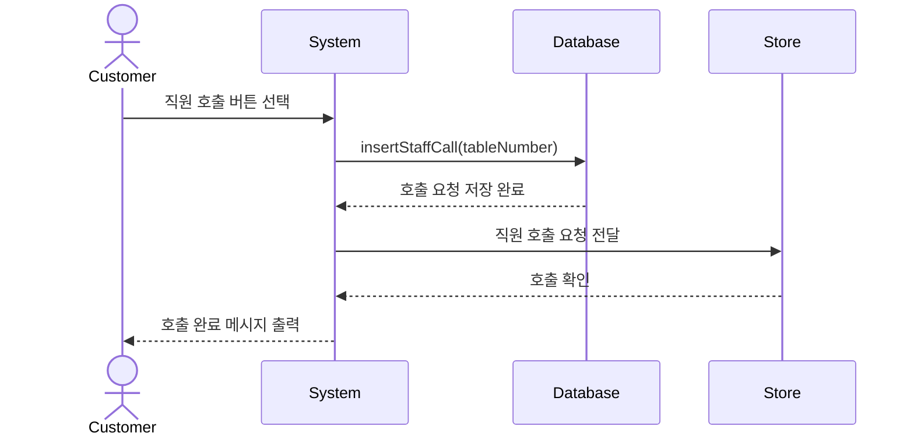

위의 그림은 고객이 직원 호출 기능을 사용할 때의 Sequence Diagram이다.  
고객이 직원 호출 버튼을 누르면 System은 테이블 번호를 기준으로 호출 요청을 생성한다.  
호출 요청은 Database에 저장되고, 매장 측 화면으로 전달된다.  
매장 측에서 호출 요청을 확인하면 고객 화면에는 호출 완료 메시지가 출력된다.

## 3.5. Manage Menu

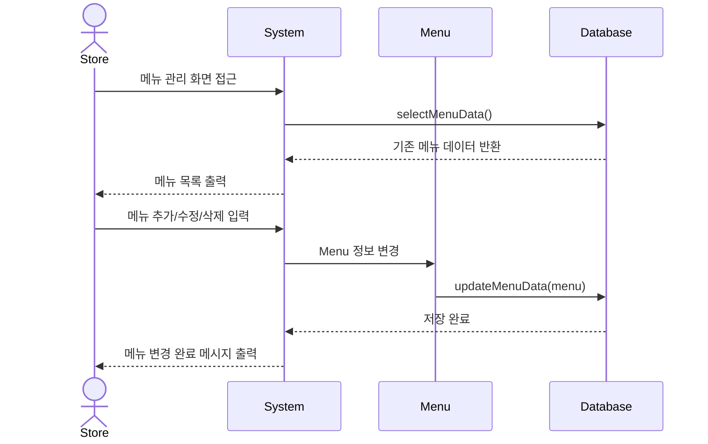

위의 그림은 매장 측이 메뉴를 관리하는 기능에 대한 Sequence Diagram이다.  
매장 측이 메뉴 관리 화면에 접근하면 System은 Database에서 기존 메뉴 데이터를 불러온다.  
매장 측은 메뉴를 추가, 수정, 삭제할 수 있으며, 변경된 정보는 Menu 클래스를 통해 Database에 저장된다.  
저장이 완료되면 메뉴 변경 완료 메시지가 출력된다.

## 3.6. Upload Photo

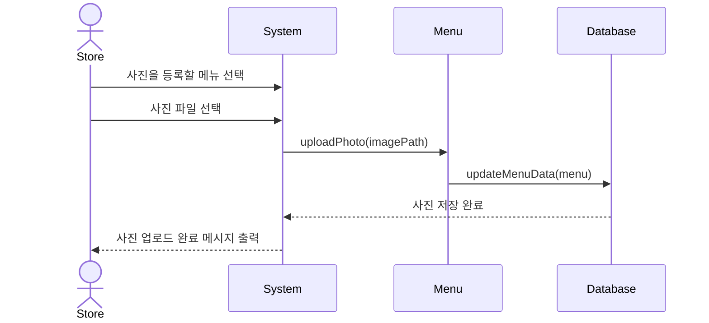

위의 그림은 매장 측이 메뉴 사진을 업로드하는 기능을 표현한 Sequence Diagram이다.  
매장 측은 메뉴 관리 화면에서 특정 메뉴를 선택하고 사진 파일을 선택한다.  
System은 선택된 이미지 경로를 Menu 클래스의 `uploadPhoto()` 메소드로 전달한다.  
Menu 클래스는 변경된 사진 정보를 Database에 저장하고, 저장이 완료되면 업로드 완료 메시지를 출력한다.

## 3.7. Edit Description

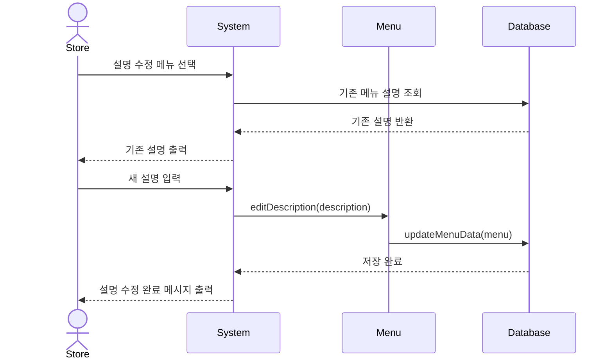

위의 그림은 메뉴 설명 수정 기능의 Sequence Diagram이다.  
매장 측이 설명을 수정할 메뉴를 선택하면 기존 설명이 화면에 출력된다.  
매장 측이 새로운 설명을 입력하고 저장하면 Menu 클래스의 `editDescription()` 메소드가 실행된다.  
변경된 설명은 Database에 저장되고 고객 메뉴 화면에도 반영된다.

## 3.8. Set Price

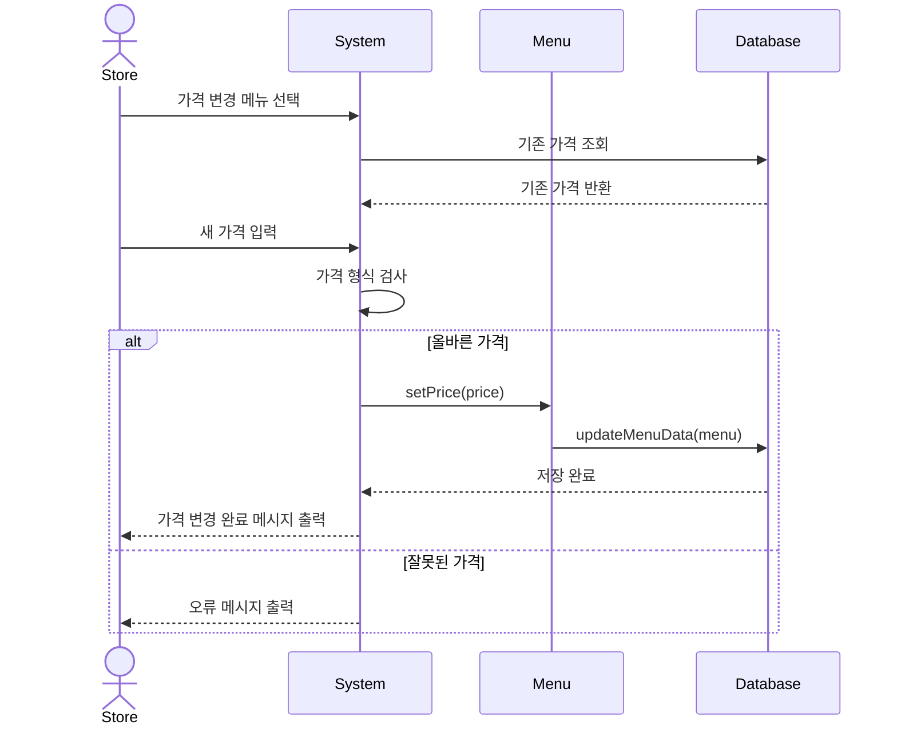

위의 그림은 메뉴 가격을 변경하는 Sequence Diagram이다.  
매장 측이 가격을 변경할 메뉴를 선택하면 System은 기존 가격 정보를 불러온다.  
새로운 가격이 입력되면 숫자 형식과 유효 범위를 검사한다.  
올바른 가격이면 Menu 클래스의 `setPrice()` 메소드를 실행하여 Database에 저장하고, 잘못된 값이면 오류 메시지를 출력한다.

## 3.9. Control Sold-out

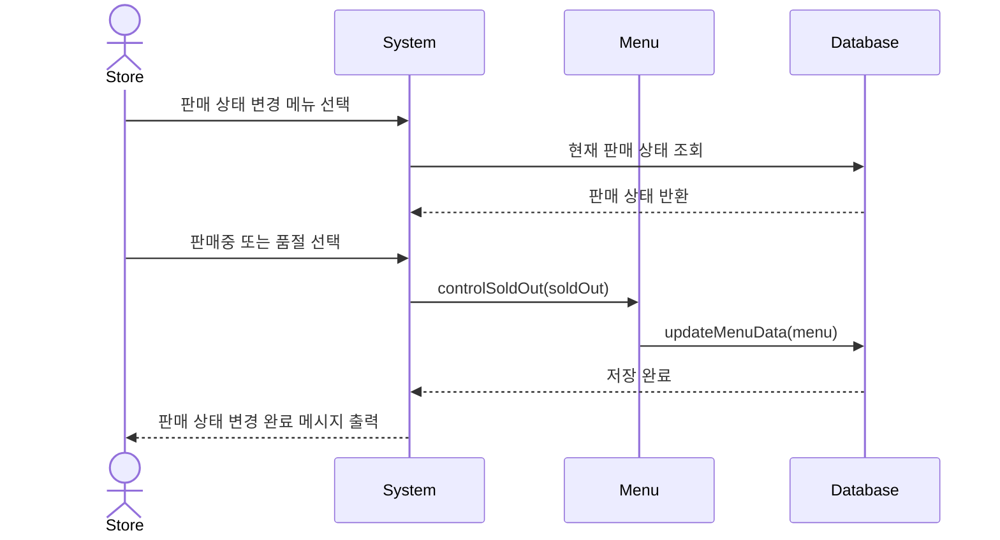

위의 그림은 품절 설정 기능의 Sequence Diagram이다.  
매장 측은 특정 메뉴를 선택한 뒤 판매중 또는 품절 상태를 선택한다.  
System은 선택된 상태를 Menu 클래스에 전달하고, Menu 클래스는 변경된 판매 상태를 Database에 저장한다.  
이 정보는 고객 메뉴 화면에 반영되어 고객이 품절 메뉴를 주문하지 않도록 한다.

## 3.10. Monitor Orders

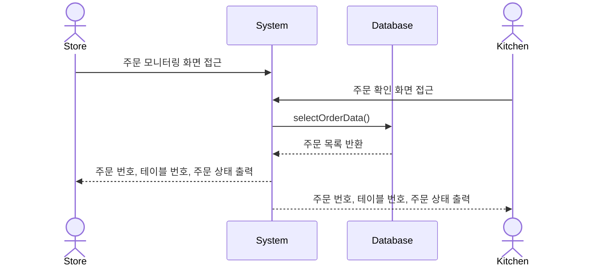

위의 그림은 매장 측과 주방이 현재 주문 목록을 확인하는 Sequence Diagram이다.  
Store와 Kitchen은 주문 모니터링 화면에서 현재 들어온 주문 데이터를 확인한다.  
System은 Database에서 주문 목록을 조회하고, 주문 번호, 테이블 번호, 주문 상태를 화면에 출력한다.

## 3.11. Manage Store Info

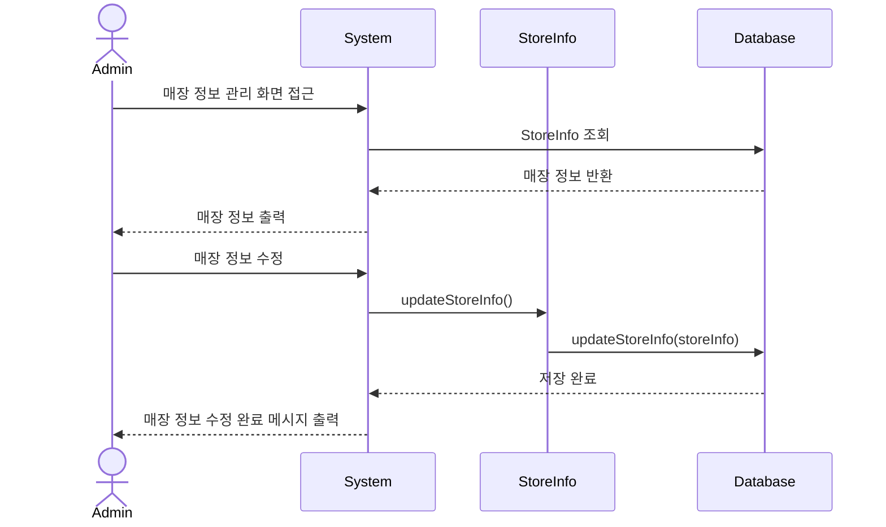

위의 그림은 관리자가 매장 정보를 관리하는 기능의 Sequence Diagram이다.  
관리자는 매장 정보 관리 화면에서 매장명, 주소, 전화번호, 영업시간 등을 확인하고 수정할 수 있다.  
수정된 정보는 StoreInfo 클래스를 통해 Database에 저장된다.

---

# 4. State machine diagram

아래의 그림은 WTOrder System의 State Machine Diagram을 Mermaid 코드로 표현한 것이다.  
고객, 매장, 주방, 관리자 역할에 따라 시스템 상태가 다르게 전이된다.

## 4.1. Customer State Machine Diagram

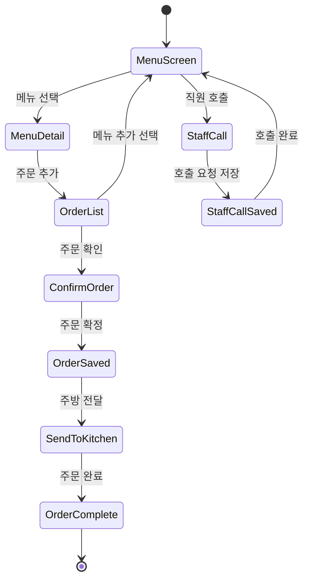

고객은 메뉴 화면에서 메뉴를 확인한 후 메뉴 상세 화면으로 이동한다.  
선택한 메뉴를 주문 목록에 추가하면 주문 목록 화면으로 이동하고, 추가 주문이 필요하면 다시 메뉴 화면으로 돌아간다.  
주문 목록을 최종 확인한 뒤 주문을 확정하면 주문 데이터가 저장되고 주방으로 전달된다.  
또한 고객은 메뉴 화면에서 직원 호출 기능을 사용할 수 있으며, 호출 요청이 저장되면 다시 메뉴 화면으로 돌아간다.

## 4.2. Store State Machine Diagram

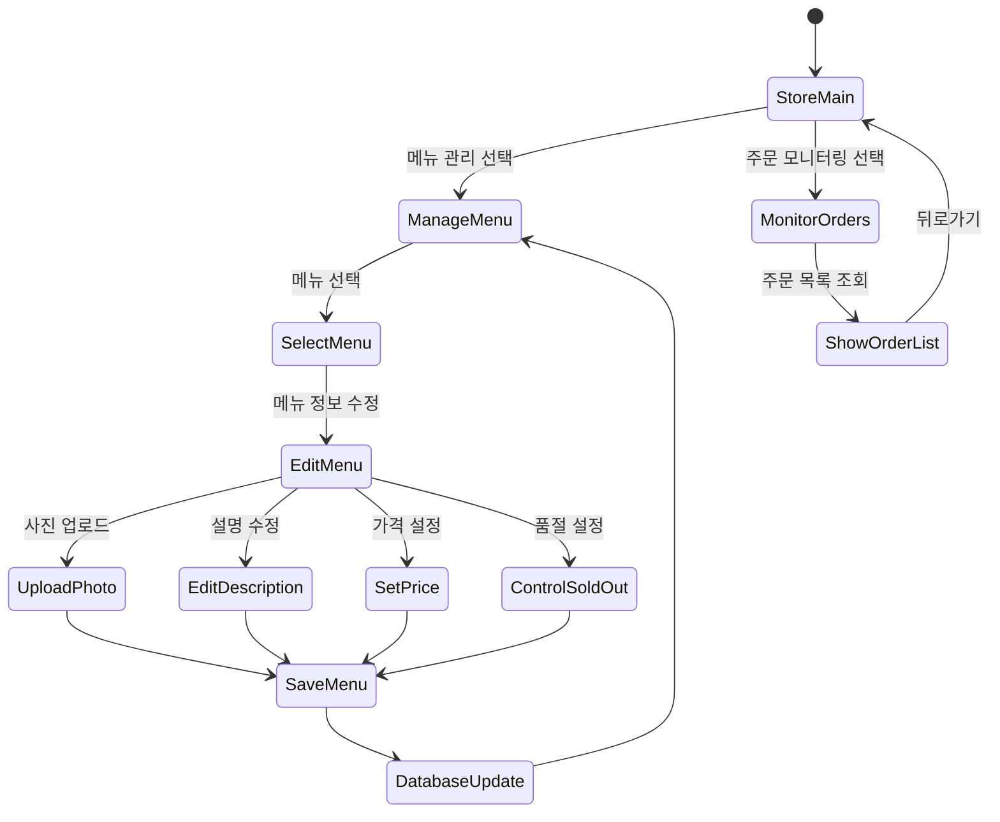

매장 측은 StoreMain 상태에서 메뉴 관리 또는 주문 모니터링 기능을 선택할 수 있다.  
메뉴 관리 상태에서는 메뉴를 선택한 뒤 사진 업로드, 설명 수정, 가격 설정, 품절 설정을 수행할 수 있다.  
각 수정 기능이 완료되면 변경 사항을 저장하고 Database를 갱신한다.  
주문 모니터링을 선택하면 현재 주문 목록을 확인하고 다시 StoreMain으로 돌아갈 수 있다.

## 4.3. Kitchen State Machine Diagram

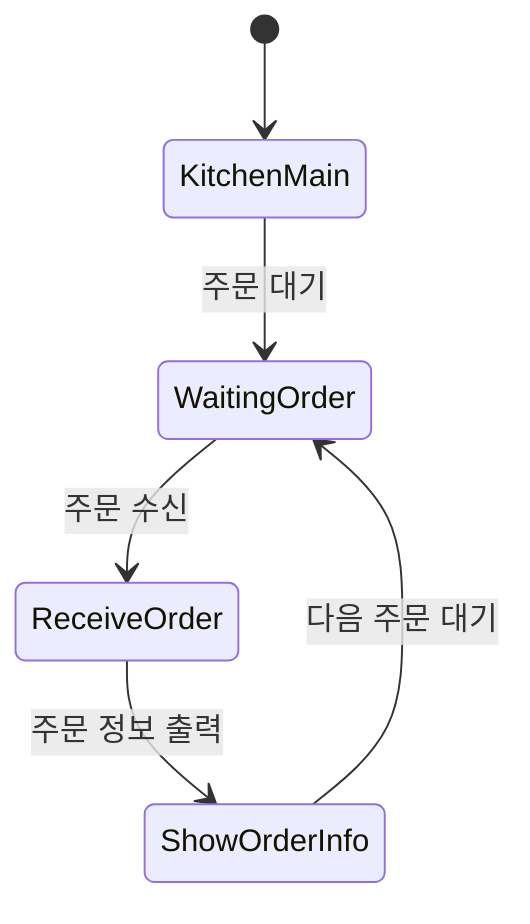

주방은 주문 대기 상태에서 고객 주문이 들어오기를 기다린다.  
고객이 주문을 확정하면 주문 정보를 수신하고 주문 번호, 테이블 번호, 메뉴, 수량 등을 화면에 출력한다.  
주문 정보를 확인한 뒤에는 다시 다음 주문을 기다리는 상태로 돌아간다.

## 4.4. Admin State Machine Diagram

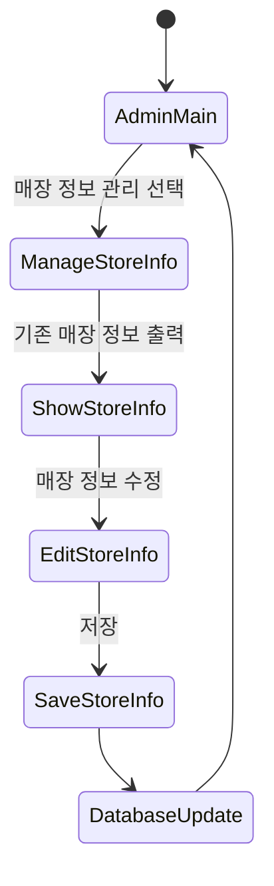

관리자는 매장 정보 관리 화면에서 기존 매장 정보를 확인한다.  
매장명, 주소, 전화번호, 영업시간 등을 수정한 후 저장하면 Database가 갱신되고 다시 관리자 메인 화면으로 돌아간다.

아래는 위의 State Machine Diagram에 나온 각 State에 대한 설명이다.

| State | Explanation |
|------|-------------|
| MenuScreen | 고객이 메뉴 목록을 확인하는 상태이다. |
| MenuDetail | 고객이 특정 메뉴의 상세 정보와 수량을 선택하는 상태이다. |
| OrderList | 고객이 현재 주문 목록을 확인하는 상태이다. |
| ConfirmOrder | 고객이 주문을 최종 확정하기 전 확인하는 상태이다. |
| OrderSaved | 주문 데이터가 Database에 저장된 상태이다. |
| SendToKitchen | 저장된 주문이 주방 화면으로 전달되는 상태이다. |
| OrderComplete | 고객 주문이 완료된 상태이다. |
| StaffCall | 고객이 직원 호출을 요청한 상태이다. |
| StoreMain | 매장 측이 사용할 기능을 선택하는 기본 상태이다. |
| ManageMenu | 매장 측이 메뉴 목록을 관리하는 상태이다. |
| SelectMenu | 수정할 메뉴를 선택하는 상태이다. |
| EditMenu | 메뉴의 세부 정보를 수정하는 상태이다. |
| UploadPhoto | 메뉴 사진을 업로드하는 상태이다. |
| EditDescription | 메뉴 설명을 수정하는 상태이다. |
| SetPrice | 메뉴 가격을 변경하는 상태이다. |
| ControlSoldOut | 메뉴를 판매중 또는 품절 상태로 변경하는 상태이다. |
| MonitorOrders | 매장 측이 주문 목록을 확인하는 상태이다. |
| KitchenMain | 주방 화면의 기본 상태이다. |
| WaitingOrder | 주방이 새로운 주문을 기다리는 상태이다. |
| ReceiveOrder | 주방이 고객 주문을 수신한 상태이다. |
| ShowOrderInfo | 주방 화면에 주문 정보가 출력된 상태이다. |
| AdminMain | 관리자 화면의 기본 상태이다. |
| ManageStoreInfo | 관리자가 매장 정보를 관리하는 상태이다. |
| EditStoreInfo | 매장 정보를 수정하는 상태이다. |
| DatabaseUpdate | 변경된 데이터가 Database에 반영되는 상태이다. |

---

# 5. Implementation requirements

WTOrder System을 구현하기 위해 필요한 요구사항은 아래와 같다.

## 5.1. Hardware Requirements

| Item | Requirement |
|------|-------------|
| CPU | Intel Pentium IV 이상 |
| RAM | 1GB 이상 |
| Storage | HDD 또는 SSD 10GB 이상의 여유 공간 |
| Display | 태블릿 또는 PC 화면 |
| Network | 매장 내부 LAN 또는 Wi-Fi 환경 |

## 5.2. Software Requirements

| Item | Requirement |
|------|-------------|
| Operating System | Windows 10 이상 또는 Android 기반 태블릿 환경 |
| Implementation Language | Java |
| IDE | Android Studio 또는 IntelliJ IDEA |
| Database | SQLite 또는 MySQL |
| UI Environment | Android XML Layout 또는 Java GUI |
| Version Control | Git, GitHub |

## 5.3. Nonfunctional Requirements

| Item | Requirement |
|------|-------------|
| Usability | 고령층 사용자도 쉽게 사용할 수 있도록 버튼과 글씨를 크게 구성한다. |
| Reliability | 주문 확정 후 주문 데이터가 누락되지 않도록 Database에 저장한다. |
| Maintainability | 메뉴, 주문, 매장 정보 관련 클래스를 분리하여 유지보수가 쉽도록 한다. |
| Performance | 고객 주문 확정 후 주방 전달까지 빠르게 처리되어야 한다. |
| Extensibility | 결제 기능, 주문 상태 변경 기능, 매출 통계 기능 등을 추후 확장할 수 있도록 설계한다. |
| Security | 관리자와 매장 측 기능은 일반 고객이 접근하지 못하도록 역할을 구분한다. |

---

# 6. Glossary

| Terms | Description |
|------|-------------|
| Class Diagram | 객체지향 시스템에서 클래스의 구조, 속성, 메소드, 관계를 표현하는 다이어그램이다. |
| Sequence Diagram | 객체 또는 사용자 간 메시지 전달 순서를 시간 흐름에 따라 표현하는 다이어그램이다. |
| State Machine Diagram | 시스템 또는 객체가 가질 수 있는 상태와 상태 전이를 표현하는 다이어그램이다. |
| Customer | 매장에서 메뉴를 조회하고 주문을 수행하는 사용자이다. |
| Store | 메뉴 정보와 주문 상태를 관리하는 매장 측 사용자이다. |
| Kitchen | 고객의 주문을 전달받아 확인하는 주방 측 사용자이다. |
| Admin | 매장 기본 정보와 시스템 데이터를 관리하는 관리자이다. |
| Menu | 음식명, 가격, 설명, 사진, 품절 여부를 포함하는 메뉴 정보이다. |
| Order | 고객이 선택한 메뉴와 수량, 주문 시간, 주문 상태를 포함하는 주문 정보이다. |
| OrderItem | 하나의 주문에 포함되는 개별 메뉴 항목이다. |
| StoreInfo | 매장명, 주소, 전화번호, 영업시간 등 매장 기본 정보이다. |
| Sold-out | 메뉴가 일시적으로 판매 불가능한 상태이다. |
| Database | 메뉴, 주문, 매장 정보, 직원 호출 요청 등을 저장하는 저장소이다. |
| GUI | 사용자가 화면의 버튼, 목록, 입력창을 통해 시스템을 조작할 수 있는 그래픽 사용자 인터페이스이다. |
| Method | 클래스 내부에서 특정 동작을 수행하는 함수이다. |
| Attribute | 클래스 내부에서 데이터 값을 저장하는 변수이다. |
| Role-based System | 사용자의 역할에 따라 접근 가능한 기능을 다르게 제공하는 시스템이다. |
| Mermaid | GitHub Markdown에서 다이어그램을 코드 형태로 작성하고 렌더링할 수 있는 문법이다. |

---

# 7. References

- WTOrder System Analysis Document
- Open Source Software Design Lecture Notes
- UML Class Diagram Guide
- UML Sequence Diagram Guide
- UML State Machine Diagram Guide
- Visual Paradigm UML Guide
