# 3. Design

**Project Name:** WTOrder System  
**Student No.:**  
**Name:**  
**E-mail:**  

---

## [ Revision history ]

| Revision date | Version # | Description | Author |
|---|---:|---|---|
| 2026.05.28 | 1.0.0 | First Draft |  |

---

## = Contents =

1. [Introduction](#1-introduction)  
2. [Class Diagram](#2-class-diagram)  
3. [Sequence Diagram](#3-sequence-diagram)  
4. [State Machine Diagram](#4-state-machine-diagram)  
5. [Implementation Requirements](#5-implementation-requirements)  
6. [Glossary](#6-glossary)  
7. [References](#7-references)  

---

# 1. Introduction

## 1) Summary

WTOrder System은 음식점에서 고객이 태블릿 또는 웹 화면을 통해 메뉴를 확인하고 주문할 수 있도록 돕는 무선 테이블 주문 시스템이다. 기존의 테이블 주문 서비스는 편리하지만, 매장 입장에서는 초기 도입 비용이나 유지 비용, 수수료 부담이 발생할 수 있다. 특히 소규모 음식점이나 개인 매장은 고정 비용을 줄이면서도 주문 과정을 효율화할 수 있는 시스템이 필요하다.

WTOrder System은 고객, 매장, 주방, 관리자 인터페이스를 분리하여 각 사용자에게 필요한 기능만 제공한다. 고객은 메뉴 조회, 주문 추가, 주문 확인, 직원 호출 기능을 사용할 수 있다. 매장 측은 메뉴 가격 변경, 품절 처리, 사진 업로드, 메뉴 설명 수정 등 메뉴 관리 기능과 주문 모니터링 기능을 사용할 수 있다. 주방 측은 접수된 주문을 확인할 수 있으며, 관리자는 매장 정보와 전체 데이터를 관리할 수 있다.

이 문서는 WTOrder System을 개발하기 위한 세 번째 단계인 Design 문서이다. 실제 구현에 필요한 클래스 구조, 기능 수행 순서, 상태 변화, 구현 요구사항을 정리하여 시스템의 전체 구조를 명확히 하는 것을 목적으로 한다.

## 2) Important Points of Design

- 고객, 매장, 주방, 관리자 권한에 따라 접근 가능한 기능을 구분해야 한다.
- 메뉴 정보와 주문 정보는 여러 화면에서 공유되므로 데이터 관리 구조가 명확해야 한다.
- 매장 측 메뉴 관리는 가격 변경, 품절 처리, 사진 업로드, 설명 수정을 한 화면에서 처리할 수 있어야 한다.
- 고객 인터페이스는 복잡하지 않고 직관적으로 구성되어야 한다.
- 주방 인터페이스는 주문 내용을 빠르게 확인할 수 있도록 단순하게 구성되어야 한다.
- 관리자 인터페이스는 매장 정보와 주문/메뉴 데이터를 관리할 수 있어야 한다.

---

# 2. Class Diagram

아래의 코드는 WTOrder System의 Class Diagram을 GitHub Markdown에서 바로 확인할 수 있도록 Mermaid 형식으로 작성한 것이다.

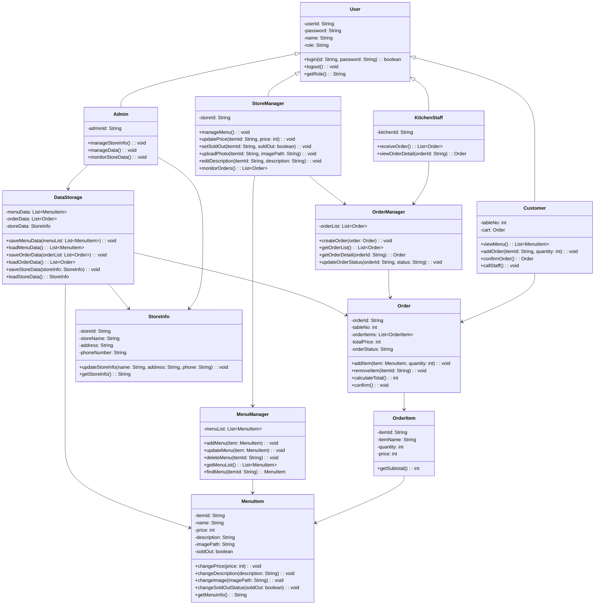

## Class Description

| Class Name | Explanation |
|---|---|
| User | 시스템에 접근하는 사용자의 공통 정보를 저장하는 클래스이다. 고객, 매장, 주방, 관리자는 User를 상속받아 각자의 기능을 수행한다. |
| Customer | 고객 화면에서 메뉴 조회, 주문 추가, 주문 확인, 직원 호출 기능을 수행하는 클래스이다. |
| StoreManager | 매장 측 사용자가 메뉴 관리와 주문 모니터링을 수행하기 위한 클래스이다. |
| KitchenStaff | 주방 측 사용자가 고객 주문을 확인하기 위한 클래스이다. 조리 시작과 조리 완료 기능은 포함하지 않는다. |
| Admin | 관리자 권한으로 매장 정보 관리, 데이터 관리, 매장 데이터 모니터링을 수행하는 클래스이다. |
| MenuItem | 메뉴 하나의 정보를 저장하는 클래스이다. 메뉴명, 가격, 설명, 이미지 경로, 품절 여부를 가진다. |
| MenuManager | 메뉴 추가, 수정, 삭제, 조회 기능을 담당하는 클래스이다. |
| Order | 고객이 선택한 메뉴와 총 주문 금액, 주문 상태를 저장하는 클래스이다. |
| OrderItem | 주문 안에 포함되는 개별 메뉴 항목을 표현하는 클래스이다. |
| OrderManager | 생성된 주문 목록을 저장하고, 매장 및 주방 화면에 주문 정보를 제공하는 클래스이다. |
| StoreInfo | 매장명, 주소, 전화번호 등 매장 기본 정보를 저장하는 클래스이다. |
| DataStorage | 메뉴 데이터, 주문 데이터, 매장 정보를 저장하고 불러오는 클래스이다. |

---

# 3. Sequence Diagram

## 1) Customer - View Menu

고객이 테이블 화면에서 메뉴를 조회하는 과정이다. 고객 화면은 MenuManager에 메뉴 목록을 요청하고, MenuManager는 DataStorage에서 저장된 메뉴 데이터를 불러온 뒤 고객 화면에 출력한다.

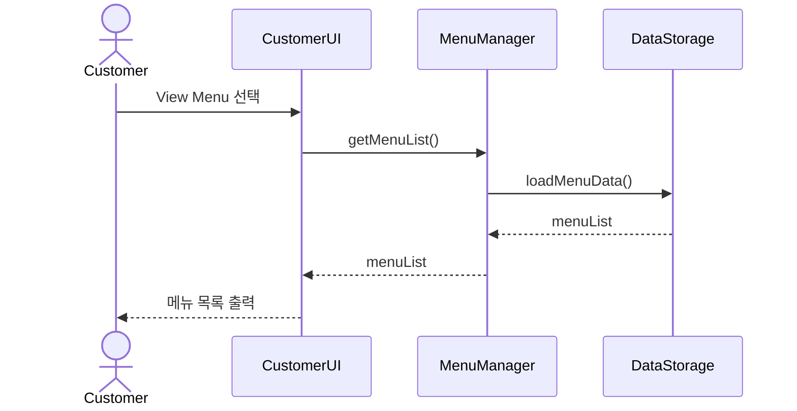

## 2) Customer - Add Order

고객이 메뉴를 선택하고 수량을 입력하여 주문 목록에 추가하는 과정이다. 메뉴가 품절 상태이면 오류 메시지를 출력하고, 품절이 아니면 주문 목록에 추가한다.

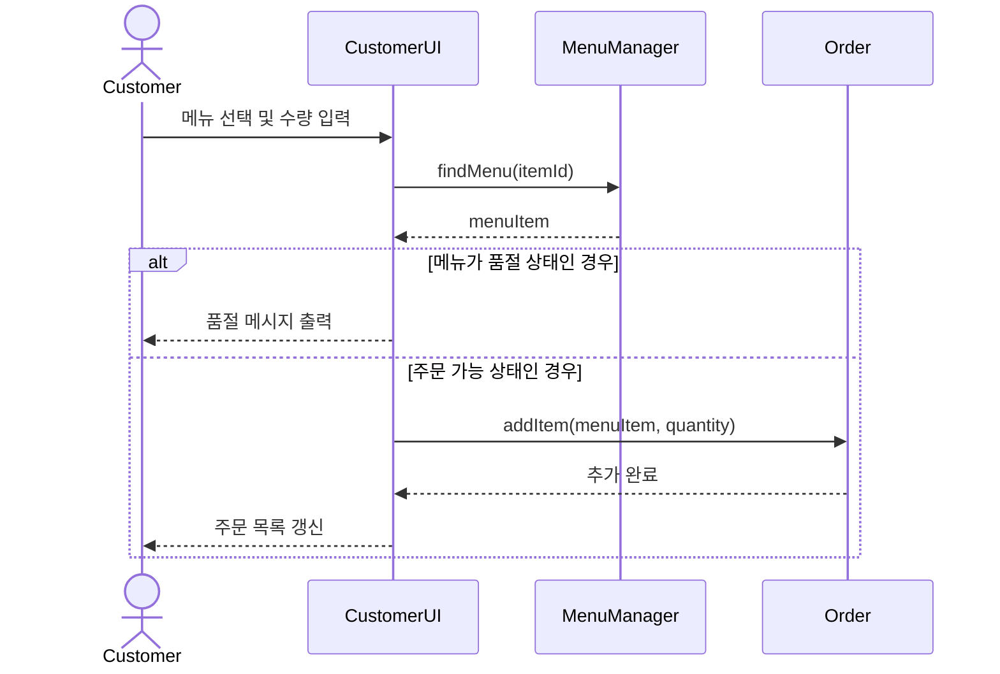

## 3) Customer - Confirm Order

고객이 주문 목록을 최종 확인하고 주문을 확정하는 과정이다. 주문이 확정되면 OrderManager에 주문이 저장되고, 주방과 매장 화면에서 해당 주문을 확인할 수 있다.

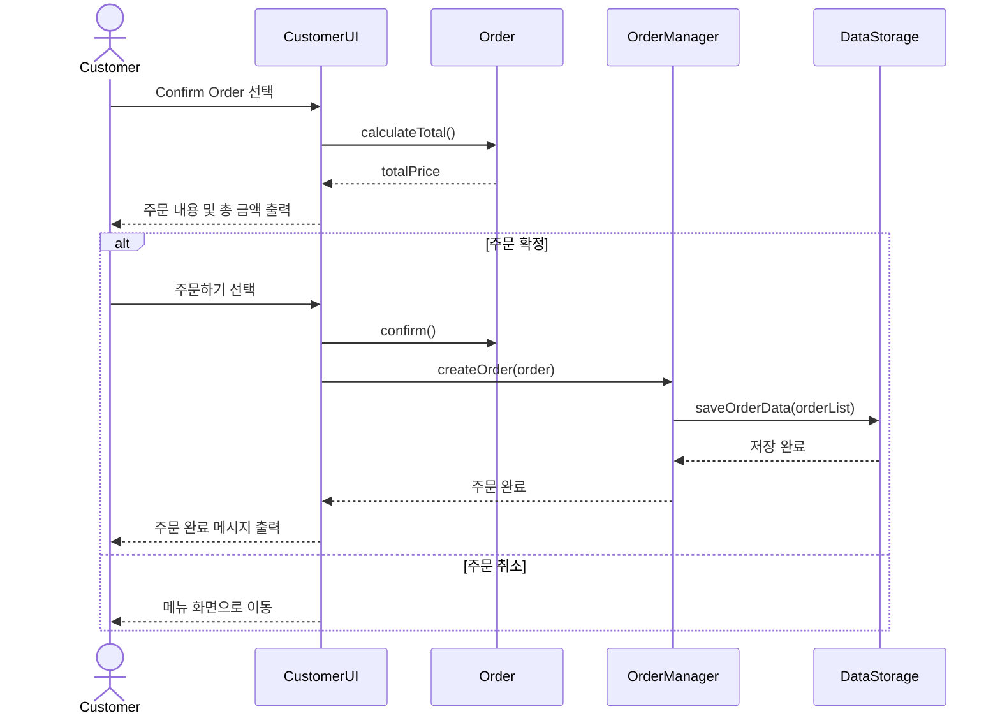

## 4) Customer - Call Staff

고객이 직원 호출 버튼을 누르면 매장 측 화면에 호출 요청이 전달된다.

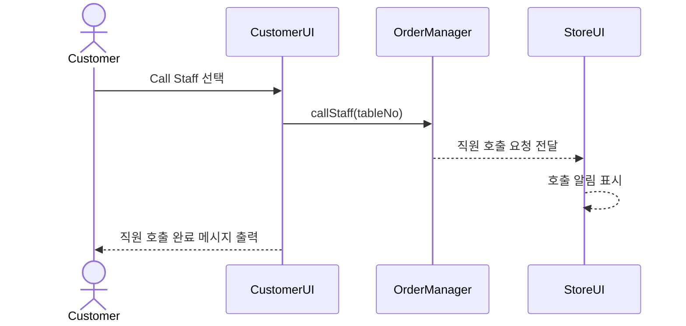

## 5) StoreManager - Manage Menu

매장 측 사용자가 메뉴별로 가격 변경, 품절 처리, 사진 업로드, 메뉴 설명 수정을 한 화면에서 처리하는 과정이다.

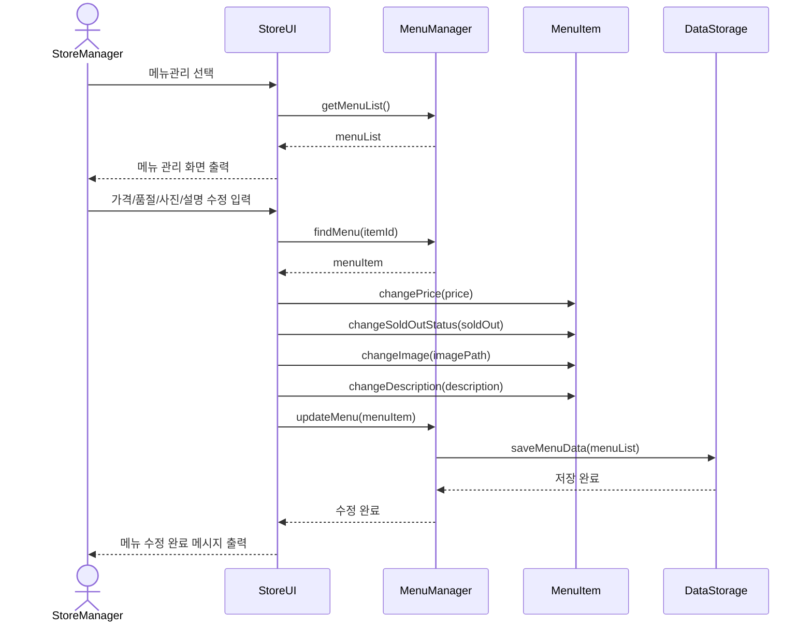

## 6) StoreManager - Monitor Orders

매장 측 사용자가 현재 접수된 주문 목록을 확인하는 과정이다.

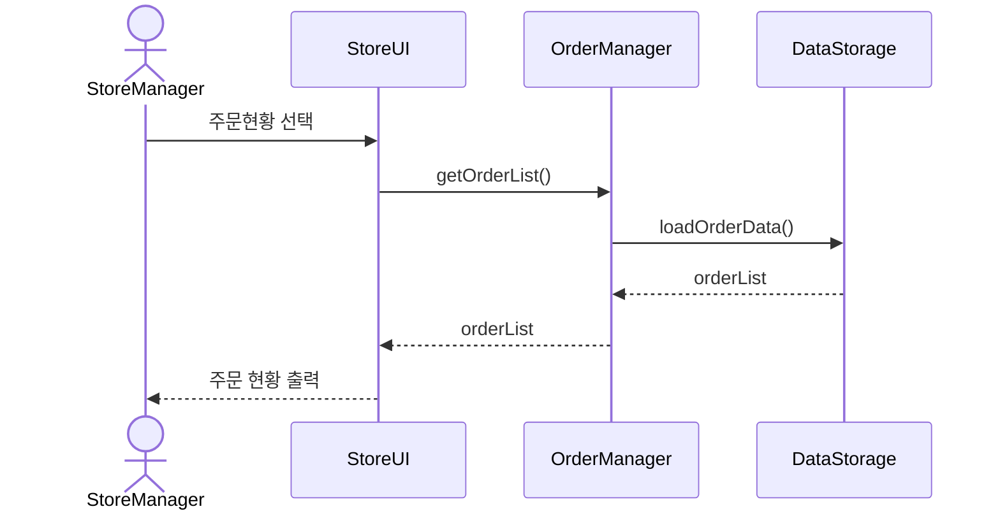

## 7) KitchenStaff - Receive Order

주방 측 사용자가 고객의 주문을 확인하는 과정이다. 본 시스템에서는 조리 시작, 조리 완료 기능은 제외하고 주문 확인 기능만 제공한다.

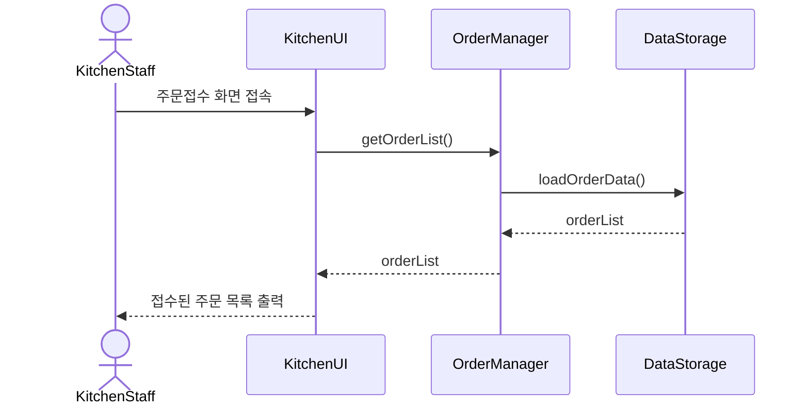

## 8) Admin - Manage Store Information

관리자가 매장 정보를 수정하는 과정이다.

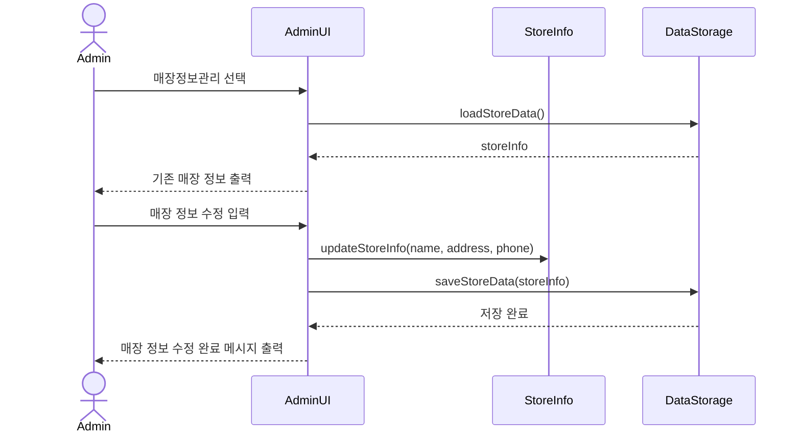

## 9) Admin - Manage Data

관리자가 메뉴 데이터, 주문 데이터, 매장 데이터를 관리하는 과정이다.

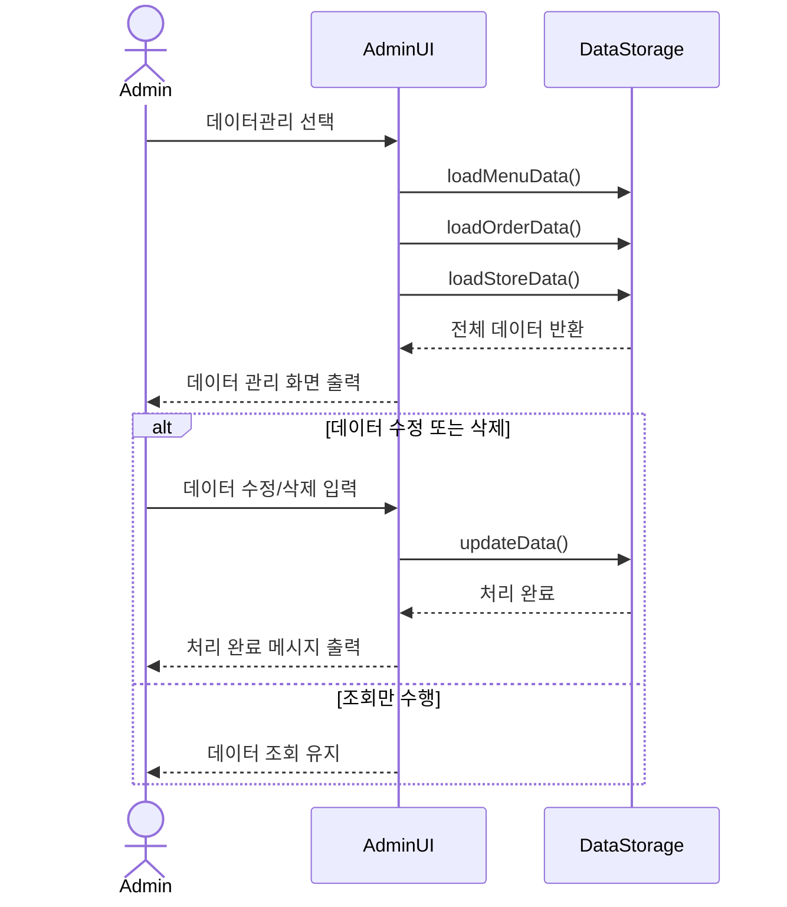

---

# 4. State Machine Diagram

아래의 코드는 WTOrder System의 전체 상태 변화를 표현한 State Machine Diagram이다.

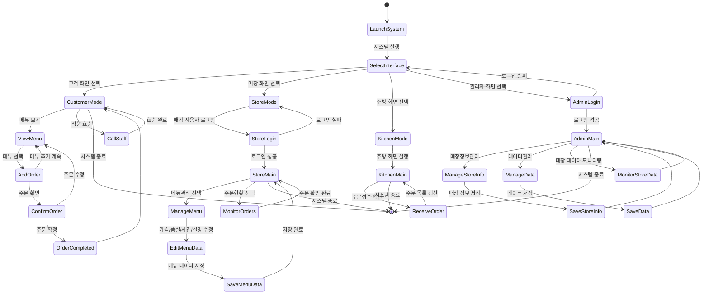

## State Description

| Status | Explanation |
|---|---|
| LaunchSystem | WTOrder System이 실행된 초기 상태이다. |
| SelectInterface | 고객, 매장, 주방, 관리자 화면 중 하나를 선택하는 상태이다. |
| CustomerMode | 고객이 메뉴 조회, 주문 추가, 주문 확인, 직원 호출 기능을 사용할 수 있는 상태이다. |
| ViewMenu | 고객이 메뉴 목록을 확인하는 상태이다. |
| AddOrder | 고객이 메뉴와 수량을 선택하여 주문 목록에 추가하는 상태이다. |
| ConfirmOrder | 고객이 주문 내용을 최종 확인하는 상태이다. |
| OrderCompleted | 주문이 확정되어 주문 데이터에 저장된 상태이다. |
| CallStaff | 고객이 직원 호출을 요청한 상태이다. |
| StoreLogin | 매장 측 사용자가 로그인을 시도하는 상태이다. |
| StoreMain | 매장 측 사용자가 메뉴 관리와 주문 모니터링 기능을 선택할 수 있는 상태이다. |
| ManageMenu | 매장 측 사용자가 메뉴 정보를 관리하는 상태이다. |
| EditMenuData | 가격 변경, 품절 처리, 사진 업로드, 메뉴 설명 수정을 수행하는 상태이다. |
| SaveMenuData | 수정된 메뉴 데이터를 저장하는 상태이다. |
| MonitorOrders | 매장 측 사용자가 현재 주문 현황을 확인하는 상태이다. |
| KitchenMain | 주방 측 사용자가 주문 접수 화면을 볼 수 있는 상태이다. |
| ReceiveOrder | 주방 측 사용자가 접수된 주문 목록을 확인하는 상태이다. |
| AdminLogin | 관리자가 로그인을 시도하는 상태이다. |
| AdminMain | 관리자가 매장 정보 관리, 데이터 관리, 매장 데이터 모니터링을 선택할 수 있는 상태이다. |
| ManageStoreInfo | 관리자가 매장 정보를 수정하는 상태이다. |
| ManageData | 관리자가 메뉴, 주문, 매장 데이터를 관리하는 상태이다. |
| MonitorStoreData | 관리자가 매장 데이터를 조회하고 확인하는 상태이다. |

---

# 5. Implementation Requirements

WTOrder System을 구현하기 위해 필요한 요구사항은 아래와 같다.

## 1) H/W Platform Requirements

| Item | Requirement |
|---|---|
| CPU | Intel Pentium IV 이상 또는 동급 성능의 CPU |
| RAM | 1GB 이상 |
| HDD / SSD | 10GB 이상의 여유 공간 |
| Network | 로컬 실행 시 필수 아님. 서버 연동 시 네트워크 필요 |
| Device | 태블릿, PC 또는 웹 브라우저 실행 가능 기기 |

## 2) S/W Platform Requirements

| Item | Requirement |
|---|---|
| Operating System | Windows 7 이상 또는 Android / Linux 환경 |
| Implementation Language | Java 또는 JavaScript 기반 웹 구현 가능 |
| UI Framework | Android Studio, Java Swing, HTML/CSS/JavaScript 중 선택 가능 |
| Data Storage | Local File, SQLite, Firebase 또는 MySQL 중 선택 가능 |
| Diagram Format | Mermaid 또는 PlantUML |

## 3) Nonfunctional Requirements

| Requirement | Description |
|---|---|
| Usability | 고객과 매장 직원이 쉽게 사용할 수 있도록 화면 구성이 단순해야 한다. |
| Reliability | 주문 데이터와 메뉴 데이터가 손실되지 않도록 저장 기능을 제공해야 한다. |
| Maintainability | 메뉴 관리, 주문 관리, 데이터 저장 기능은 서로 분리하여 수정이 쉽도록 해야 한다. |
| Accessibility | 고령자나 디지털 기기에 익숙하지 않은 사용자도 사용할 수 있도록 버튼과 글자를 명확하게 표시해야 한다. |
| Performance | 메뉴 조회와 주문 확인은 짧은 시간 안에 처리되어야 한다. |
| Security | 관리자와 매장 측 기능은 일반 고객이 접근하지 못하도록 권한을 분리해야 한다. |

---

# 6. Glossary

| Terms | Description |
|---|---|
| Class Diagram | 객체지향 시스템 설계에서 클래스의 속성, 메소드, 관계를 표현하는 다이어그램이다. |
| Sequence Diagram | 객체 또는 기능 간 메시지 흐름을 시간 순서에 따라 표현하는 다이어그램이다. |
| State Machine Diagram | 시스템이 실행되면서 가질 수 있는 상태와 상태 전이를 표현하는 다이어그램이다. |
| Attribute | 클래스 내부에 선언되는 데이터 값으로, 객체의 상태를 표현한다. |
| Method | 클래스 내부에 정의되는 기능으로, 객체가 수행할 동작을 표현한다. |
| Actor | 시스템과 상호작용하는 외부 사용자 또는 역할을 의미한다. |
| Customer | WTOrder System에서 메뉴를 보고 주문하는 사용자이다. |
| StoreManager | 매장 측에서 메뉴와 주문을 관리하는 사용자이다. |
| KitchenStaff | 주방에서 접수된 주문을 확인하는 사용자이다. |
| Admin | 매장 정보와 시스템 데이터를 관리하는 사용자이다. |
| MenuItem | 하나의 메뉴 정보를 나타내는 객체이다. |
| Order | 고객이 선택한 메뉴 목록과 주문 정보를 저장하는 객체이다. |
| DataStorage | 메뉴, 주문, 매장 데이터를 저장하고 불러오는 역할을 하는 저장소이다. |
| Sold-out | 특정 메뉴가 품절되어 고객이 주문할 수 없는 상태이다. |

---

# 7. References

- Course Material: Structural Modeling II
- Course Material: Behavior Modeling I, II, III
- UML Class Diagram Reference
- UML Sequence Diagram Reference
- UML State Machine Diagram Reference
- T-Order style table ordering service concept
