---

## [ Revision history ]

| Revision date | Version # | Description | Author |
|--------------|----------|------------|--------|
| 2026/05/30 | 1.00 | 초기 버전 | 이창민 |
| 2026/05/30 | 1.10 | Customer App, Kitchen App, Store App, Admin App 분리, Store PC Manager 추가, POS 연동, 테이블 주문 관리 기능 반영 | 이창민 |

---

# = Contents =
1. Introduction  
2. Class diagram  
3. Sequence diagram  
4. State machine diagram  
5. Implementation requirements  
6. Glossary  
7. References  

---

# 1. Introduction

## 1) Summary

WTOrder System은 음식점, 카페, 소규모 매장에서 사용할 수 있는 무선 테이블 오더 기반 통합 주문 관리 시스템이다.  
본 Design 문서는 Conceptualization 단계와 Analysis 단계에서 수정한 내용을 바탕으로, 실제 구현에 필요한 클래스 구조, 객체 간 메시지 흐름, 상태 전이, 구현 환경 요구사항을 정리한다.

기존 WTOrder System은 Customer, Store, Kitchen, Admin 역할을 기준으로 메뉴 조회, 주문 추가, 주문 확정, 직원 호출, 메뉴 관리, 주문 모니터링, 매장 정보 관리 기능을 제공하는 구조였다.  
수정된 WTOrder System은 실제 매장 운영 환경에 더 가깝게 확장하여 **Customer App, Kitchen App, Store App, Admin App**을 각각 독립적인 앱으로 분리하고, 추가로 **Store PC Manager**를 구성한다.  
각 앱은 서로 다른 사용자 역할과 사용 환경을 가지며, WTOrder Server를 중심으로 Database와 POS System에 연결된다.

Customer App은 고객 테이블 태블릿에서 실행되며 메뉴 조회, 주문 추가, 주문 확정, 직원 호출 기능을 제공한다.  
Kitchen App은 주방 태블릿 또는 주방 화면에서 실행되며 고객 주문 수신과 주문 확인 기능을 제공한다.  
Store App은 매장 직원용 태블릿 앱으로 메뉴 관리, 사진 업로드, 설명 수정, 가격 설정, 품절 처리, 주문 모니터링 기능을 제공한다.  
Admin App은 관리자용 앱으로 매장 정보 관리와 매장 운영 데이터 확인 기능을 제공한다.  
Store PC Manager는 매장 카운터 PC에서 실행되며, 전체 테이블 상태 확인, 테이블별 주문 조회, PC에서 메뉴 추가, PC에서 주문 항목 삭제 기능을 제공한다.

또한 수정된 WTOrder System에서는 POS 연동을 중요한 설계 요소로 포함한다.  
고객이 Customer App에서 주문을 확정하면 주문 데이터는 WTOrder Server로 전달되고, Database에 저장된다.  
이후 Kitchen App과 Store App, Store PC Manager에 주문 정보가 동기화되며, POS System을 통해 Kitchen POS와 Store POS에 메뉴 전표가 출력되거나 표시된다.  
이를 통해 주방과 매장 직원은 주문 정보를 빠르게 확인할 수 있고, 테이블별 주문 관리와 POS 전표 확인을 하나의 흐름으로 처리할 수 있다.

Store PC Manager의 기능 범위는 B안으로 설정한다.  
즉, 매장 직원은 PC에서 전체 테이블을 확인하고, 특정 테이블의 현재 주문 내역을 조회하며, 메뉴를 추가하거나 주문 항목을 삭제할 수 있다.  
다만 수량 변경, 결제 대기 상태 변경, 테이블 종료 기능은 본 설계 단계에서 제외한다.  
이 범위 설정을 통해 시스템의 복잡도를 낮추면서도 매장 운영에 필요한 핵심 기능을 제공할 수 있다.

## 2) Important Points of Design

- Customer App, Kitchen App, Store App, Admin App을 역할별로 분리하여 각 사용자에게 필요한 기능만 제공한다.
- Store PC Manager를 별도로 두어 카운터 PC에서 테이블별 주문을 관리할 수 있도록 한다.
- Customer App에서 주문을 확정하면 Kitchen App, Store App, Store PC Manager, POS System에 주문 정보가 동기화되어야 한다.
- Kitchen POS에는 주방 조리 확인용 메뉴 전표가 올라와야 한다.
- Store POS에는 매장 확인용 메뉴 전표가 올라와야 한다.
- Store App의 메뉴 관리 기능은 메뉴 추가, 수정, 삭제, 사진 업로드, 설명 수정, 가격 설정, 품절 설정을 포함한다.
- Store PC Manager는 테이블별 주문 조회, 메뉴 추가, 주문 항목 삭제 기능을 제공한다.
- WTOrder Server는 각 앱, PC Manager, POS System, Database 사이의 데이터 흐름을 관리하는 중심 역할을 수행한다.
- Database는 메뉴 데이터, 주문 데이터, 테이블 데이터, 매장 정보를 저장한다.
- 다중 디바이스 구조이므로 주문 동기화와 데이터 일관성이 중요하다.
- 고객용 화면은 고령층도 쉽게 사용할 수 있도록 단순하고 직관적으로 설계한다.
- 주방 화면은 주문 번호, 테이블 번호, 메뉴명, 수량을 빠르게 확인할 수 있도록 전표 중심으로 설계한다.
- 매장 PC 화면은 전체 테이블 상태를 한눈에 볼 수 있도록 구성한다.
- 향후 결제 기능, 주문 상태 변경, 매출 통계 기능을 추가할 수 있도록 확장 가능한 구조로 설계한다.

---

# 2. Class diagram

아래의 그림은 수정된 WTOrder System의 Class Diagram을 나타낸 것이다.

## 2.1. Class Description

| Class Name | Attributes | Methods | Explanation |
|------------|------------|---------|-------------|
| CustomerApp | appId, tableNumber, currentOrder | viewMenu(), selectMenu(), addOrder(), showOrderList(), confirmOrder(), callStaff() | 고객 테이블 태블릿에서 실행되는 앱 클래스이다. 고객은 메뉴를 조회하고, 메뉴를 주문 목록에 추가하며, 주문을 확정하고 직원을 호출할 수 있다. |
| KitchenApp | appId, kitchenId | receiveOrder(), showKitchenTicket(), monitorOrders() | 주방 태블릿 또는 주방 화면에서 실행되는 앱 클래스이다. 고객 주문을 수신하고, 주문 전표를 확인하며, 현재 주문 목록을 모니터링한다. |
| StoreApp | appId, storeId | manageMenu(), addMenu(), editMenu(), deleteMenu(), uploadPhoto(), editDescription(), setPrice(), controlSoldOut(), monitorOrders(), showStoreTicket() | 매장 직원용 태블릿 앱 클래스이다. 메뉴 관리와 주문 모니터링 기능을 담당한다. 기존 Store 기능을 유지하면서 POS 전표 확인 기능도 포함한다. |
| StorePCManager | managerId, storeId | manageTables(), viewTableOrders(), addTableOrder(), deleteTableOrder() | 매장 카운터 PC에서 실행되는 관리 프로그램 클래스이다. 전체 테이블을 확인하고, 테이블별 주문을 조회하며, 메뉴 추가와 주문 항목 삭제를 수행한다. |
| AdminApp | adminId | manageStoreInformation(), monitorStoreData() | 관리자가 사용하는 앱 클래스이다. 매장 정보를 관리하고 전체 매장 데이터를 확인한다. |
| WTOrderServer | serverId | processOrder(), processTableOrderChange(), manageData(), syncOrder(), sendTicketData(), notifyStaffCall() | 시스템의 중심 서버 클래스이다. 앱과 PC Manager, POS System, Database 사이의 데이터 흐름을 처리한다. 주문 저장, 주문 동기화, 전표 데이터 전달을 담당한다. |
| POSSystem | posId | printKitchenTicket(), printStoreTicket(), sendModifiedTicket() | POS 연동 클래스이다. 주문 데이터를 받아 Kitchen POS와 Store POS에 전표를 출력하거나 표시한다. PC에서 주문이 추가 또는 삭제된 경우 수정 전표를 전달한다. |
| Database | - | storeMenuData(), storeOrderData(), storeTableData(), storeStoreInfo(), selectMenuData(), selectOrderData(), selectTableData(), updateData() | 메뉴, 주문, 테이블, 매장 정보를 저장하고 조회하는 데이터 저장소 클래스이다. |
| Table | tableId, tableNumber, tableStatus | getCurrentOrders(), addOrder(), deleteOrderItem(), updateTableStatus() | 매장의 각 테이블을 나타내는 클래스이다. 테이블 번호와 현재 주문 상태를 관리한다. |
| Menu | menuId, name, price, description, imagePath, soldOut | getMenuInfo(), setPrice(), editDescription(), uploadPhoto(), controlSoldOut() | 메뉴 정보를 저장하는 클래스이다. 가격, 설명, 사진, 품절 여부를 포함한다. |
| Order | orderId, tableId, orderTime, orderStatus, totalPrice | addOrderItem(), deleteOrderItem(), calculateTotalPrice(), confirmOrder(), updateStatus() | 특정 테이블에서 발생한 주문을 나타내는 클래스이다. 여러 OrderItem을 포함한다. |
| OrderItem | orderItemId, menuId, menuName, quantity, itemPrice | calculateItemPrice() | 하나의 주문에 포함되는 개별 메뉴 항목을 나타낸다. |
| Ticket | ticketId, ticketType, tableId, printedTime | createKitchenTicket(), createStoreTicket() | POS에 출력 또는 표시되는 전표 정보를 나타낸다. Kitchen Ticket과 Store Ticket으로 구분된다. |
| StoreInfo | storeId, storeName, address, phoneNumber, businessHours | updateStoreInfo(), getStoreInfo() | 매장 기본 정보를 저장하고 수정하는 클래스이다. |

---

# 3. Sequence diagram

아래의 그림들은 수정된 WTOrder System의 주요 기능 흐름을 Sequence Diagram으로 표현한 것이다.  
Sequence Diagram은 Analysis 단계에서 정의한 Use Case를 기반으로 작성하였다.

---

## 3.1. View Menu

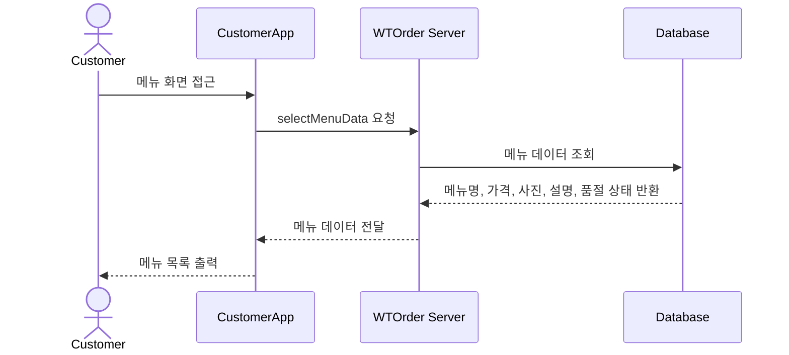
```mermaid
sequenceDiagram
    actor Customer
    participant CustomerApp
    participant Server as WTOrder Server
    participant DB as Database

    Customer->>CustomerApp: 메뉴 화면 접근
    CustomerApp->>Server: selectMenuData 요청
    Server->>DB: 메뉴 데이터 조회
    DB-->>Server: 메뉴명, 가격, 사진, 설명, 품절 상태 반환
    Server-->>CustomerApp: 메뉴 데이터 전달
    CustomerApp-->>Customer: 메뉴 목록 출력
```

위의 그림은 고객이 Customer App에서 메뉴를 조회하는 흐름을 나타낸다.  
고객이 메뉴 화면에 접근하면 Customer App은 WTOrder Server에 메뉴 데이터를 요청한다.  
Server는 Database에서 메뉴 정보를 조회하고, Customer App은 메뉴명, 가격, 사진, 설명, 품절 상태를 고객 화면에 출력한다.  
품절 메뉴는 주문 불가 상태로 표시된다.

---

## 3.2. Add Order

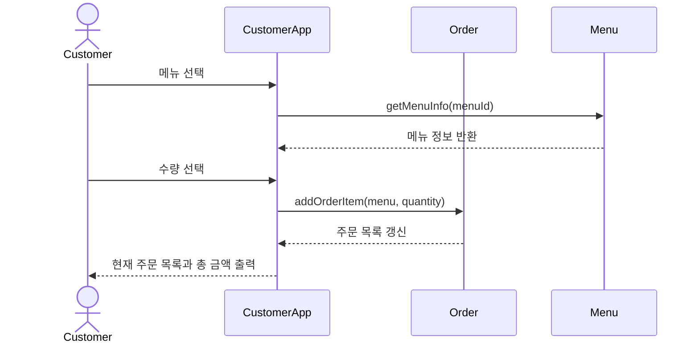
```mermaid
sequenceDiagram
    actor Customer
    participant CustomerApp
    participant Order
    participant Menu

    Customer->>CustomerApp: 메뉴 선택
    CustomerApp->>Menu: getMenuInfo(menuId)
    Menu-->>CustomerApp: 메뉴 정보 반환
    Customer->>CustomerApp: 수량 선택
    CustomerApp->>Order: addOrderItem(menu, quantity)
    Order-->>CustomerApp: 주문 목록 갱신
    CustomerApp-->>Customer: 현재 주문 목록과 총 금액 출력
```

위의 그림은 고객이 선택한 메뉴를 주문 목록에 추가하는 흐름이다.  
Customer App은 선택한 메뉴 정보를 확인하고, Order 클래스에 주문 항목을 추가한다.  
이 단계에서는 주문이 아직 최종 저장되지 않고 Customer App의 현재 주문 목록에만 반영된다.

---

## 3.3. Confirm Order and POS Ticket

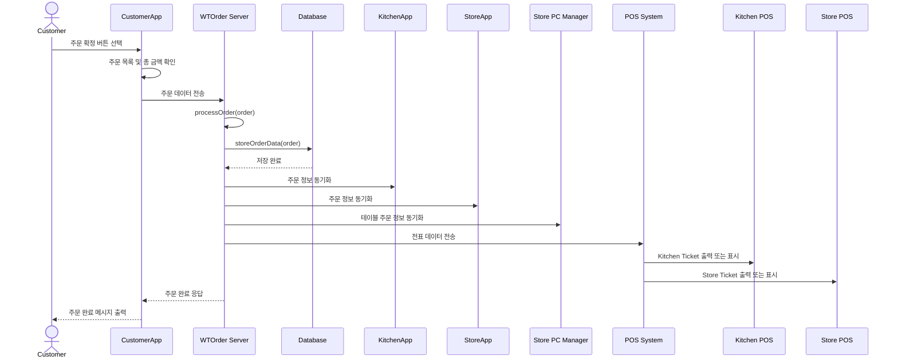
```mermaid
sequenceDiagram
    actor Customer
    participant CustomerApp
    participant Server as WTOrder Server
    participant DB as Database
    participant KitchenApp
    participant StoreApp
    participant StorePC as Store PC Manager
    participant POS as POS System
    participant KitchenPOS as Kitchen POS
    participant StorePOS as Store POS

    Customer->>CustomerApp: 주문 확정 버튼 선택
    CustomerApp->>CustomerApp: 주문 목록 및 총 금액 확인
    CustomerApp->>Server: 주문 데이터 전송
    Server->>Server: processOrder(order)
    Server->>DB: storeOrderData(order)
    DB-->>Server: 저장 완료
    Server->>KitchenApp: 주문 정보 동기화
    Server->>StoreApp: 주문 정보 동기화
    Server->>StorePC: 테이블 주문 정보 동기화
    Server->>POS: 전표 데이터 전송
    POS->>KitchenPOS: Kitchen Ticket 출력 또는 표시
    POS->>StorePOS: Store Ticket 출력 또는 표시
    Server-->>CustomerApp: 주문 완료 응답
    CustomerApp-->>Customer: 주문 완료 메시지 출력
```

위의 그림은 고객이 주문을 확정했을 때의 핵심 흐름이다.  
Customer App은 주문 데이터를 WTOrder Server로 전달한다.  
Server는 주문 데이터를 검증하고 Database에 저장한 뒤 Kitchen App, Store App, Store PC Manager에 주문 정보를 동기화한다.  
동시에 POS System에 전표 데이터를 전달하여 Kitchen POS와 Store POS에 메뉴 전표가 출력되거나 표시되도록 한다.

---

## 3.4. Call Staff

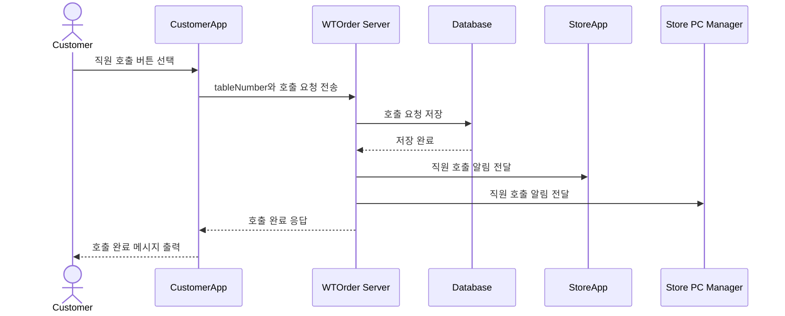
```mermaid
sequenceDiagram
    actor Customer
    participant CustomerApp
    participant Server as WTOrder Server
    participant DB as Database
    participant StoreApp
    participant StorePC as Store PC Manager

    Customer->>CustomerApp: 직원 호출 버튼 선택
    CustomerApp->>Server: tableNumber와 호출 요청 전송
    Server->>DB: 호출 요청 저장
    DB-->>Server: 저장 완료
    Server->>StoreApp: 직원 호출 알림 전달
    Server->>StorePC: 직원 호출 알림 전달
    Server-->>CustomerApp: 호출 완료 응답
    CustomerApp-->>Customer: 호출 완료 메시지 출력
```

위의 그림은 고객이 직원 호출을 요청했을 때의 흐름이다.  
직원 호출 요청은 WTOrder Server를 거쳐 Store App과 Store PC Manager에 전달된다.  
이를 통해 태블릿을 확인하는 직원과 카운터 PC를 보는 직원 모두 호출 요청을 확인할 수 있다.

---

## 3.5. Manage Menu

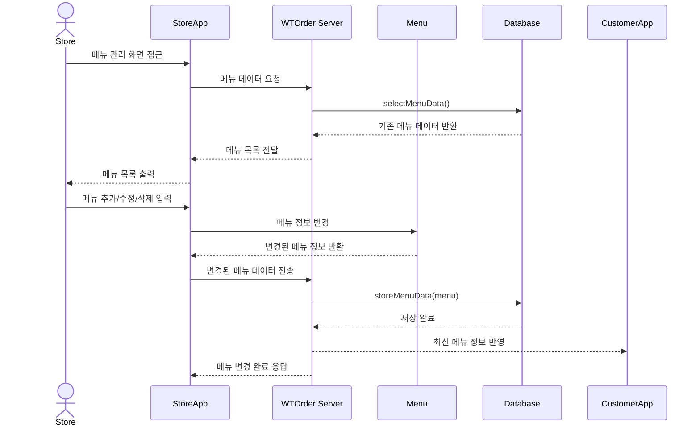
```mermaid
sequenceDiagram
    actor Store
    participant StoreApp
    participant Server as WTOrder Server
    participant Menu
    participant DB as Database
    participant CustomerApp

    Store->>StoreApp: 메뉴 관리 화면 접근
    StoreApp->>Server: 메뉴 데이터 요청
    Server->>DB: selectMenuData()
    DB-->>Server: 기존 메뉴 데이터 반환
    Server-->>StoreApp: 메뉴 목록 전달
    StoreApp-->>Store: 메뉴 목록 출력
    Store->>StoreApp: 메뉴 추가/수정/삭제 입력
    StoreApp->>Menu: 메뉴 정보 변경
    Menu-->>StoreApp: 변경된 메뉴 정보 반환
    StoreApp->>Server: 변경된 메뉴 데이터 전송
    Server->>DB: storeMenuData(menu)
    DB-->>Server: 저장 완료
    Server-->>CustomerApp: 최신 메뉴 정보 반영
    Server-->>StoreApp: 메뉴 변경 완료 응답
```

위의 그림은 매장 직원이 Store App에서 메뉴를 관리하는 흐름이다.  
Store App은 Database에서 기존 메뉴 데이터를 불러오고, 매장 직원은 메뉴 추가, 수정, 삭제를 수행한다.  
변경된 메뉴 정보는 Database에 저장되고 Customer App에도 반영된다.

---

## 3.6. Menu Detail Edit

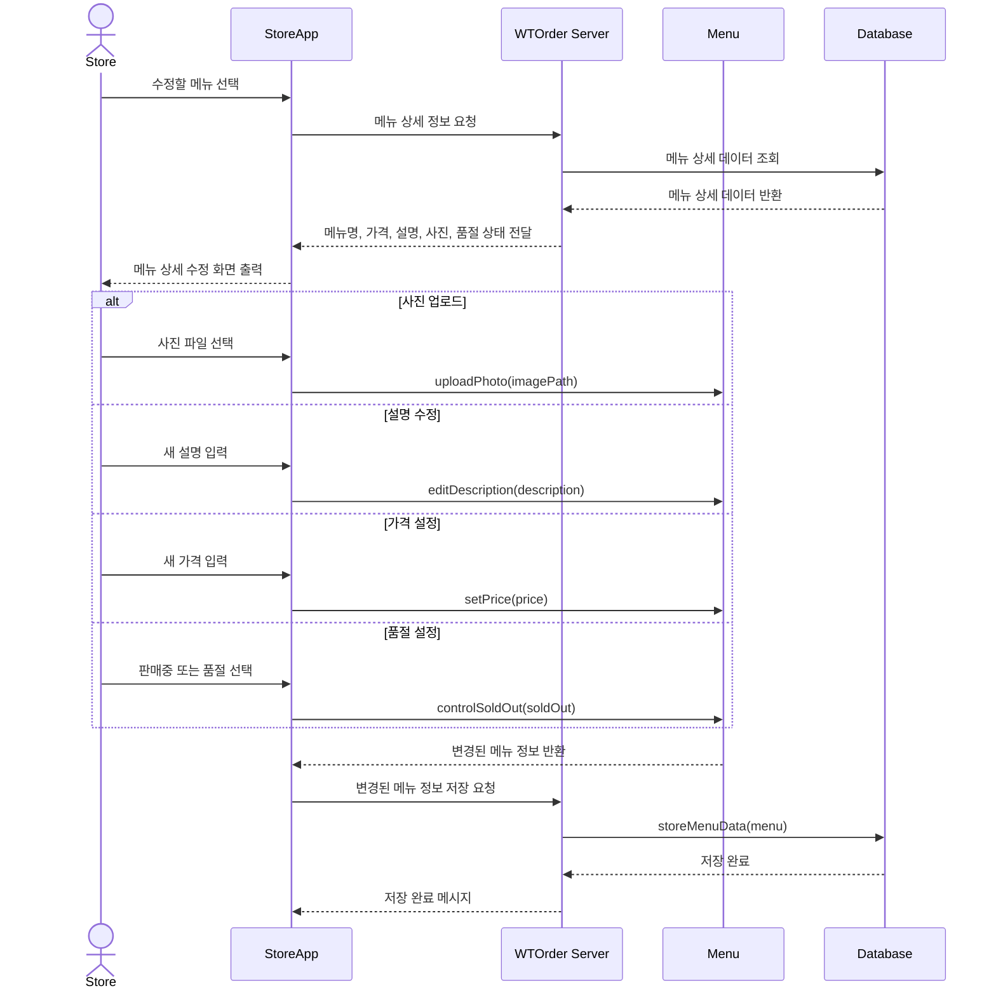
```mermaid
sequenceDiagram
    actor Store
    participant StoreApp
    participant Server as WTOrder Server
    participant Menu
    participant DB as Database

    Store->>StoreApp: 수정할 메뉴 선택
    StoreApp->>Server: 메뉴 상세 정보 요청
    Server->>DB: 메뉴 상세 데이터 조회
    DB-->>Server: 메뉴 상세 데이터 반환
    Server-->>StoreApp: 메뉴명, 가격, 설명, 사진, 품절 상태 전달
    StoreApp-->>Store: 메뉴 상세 수정 화면 출력

    alt 사진 업로드
        Store->>StoreApp: 사진 파일 선택
        StoreApp->>Menu: uploadPhoto(imagePath)
    else 설명 수정
        Store->>StoreApp: 새 설명 입력
        StoreApp->>Menu: editDescription(description)
    else 가격 설정
        Store->>StoreApp: 새 가격 입력
        StoreApp->>Menu: setPrice(price)
    else 품절 설정
        Store->>StoreApp: 판매중 또는 품절 선택
        StoreApp->>Menu: controlSoldOut(soldOut)
    end

    Menu-->>StoreApp: 변경된 메뉴 정보 반환
    StoreApp->>Server: 변경된 메뉴 정보 저장 요청
    Server->>DB: storeMenuData(menu)
    DB-->>Server: 저장 완료
    Server-->>StoreApp: 저장 완료 메시지
```

위의 그림은 Store App에서 메뉴 상세 정보를 수정하는 흐름이다.  
기존 기능인 사진 업로드, 설명 수정, 가격 설정, 품절 설정을 하나의 메뉴 상세 수정 화면 안에서 처리하도록 설계한다.  
이 방식은 매장 직원이 여러 화면을 이동하지 않고 한 화면에서 메뉴 정보를 관리할 수 있게 한다.

---

## 3.7. Monitor Orders

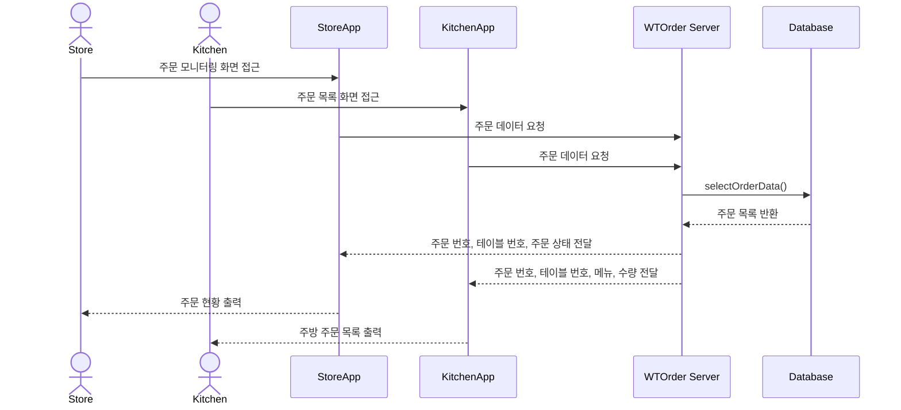
```mermaid
sequenceDiagram
    actor Store
    actor Kitchen
    participant StoreApp
    participant KitchenApp
    participant Server as WTOrder Server
    participant DB as Database

    Store->>StoreApp: 주문 모니터링 화면 접근
    Kitchen->>KitchenApp: 주문 목록 화면 접근
    StoreApp->>Server: 주문 데이터 요청
    KitchenApp->>Server: 주문 데이터 요청
    Server->>DB: selectOrderData()
    DB-->>Server: 주문 목록 반환
    Server-->>StoreApp: 주문 번호, 테이블 번호, 주문 상태 전달
    Server-->>KitchenApp: 주문 번호, 테이블 번호, 메뉴, 수량 전달
    StoreApp-->>Store: 주문 현황 출력
    KitchenApp-->>Kitchen: 주방 주문 목록 출력
```

위의 그림은 Store App과 Kitchen App에서 주문 현황을 확인하는 흐름이다.  
Store App은 매장 운영 관점에서 주문 번호, 테이블 번호, 주문 상태를 확인하고, Kitchen App은 조리를 위한 메뉴명과 수량을 중심으로 주문을 확인한다.

---

## 3.8. Store PC Table Management

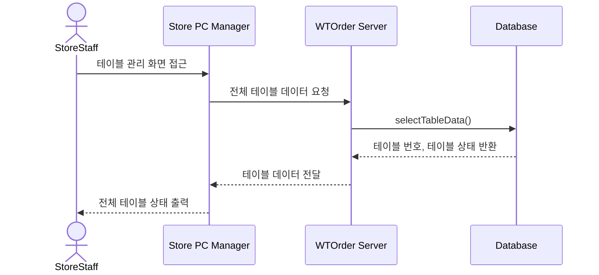
```mermaid
sequenceDiagram
    actor StoreStaff
    participant StorePC as Store PC Manager
    participant Server as WTOrder Server
    participant DB as Database

    StoreStaff->>StorePC: 테이블 관리 화면 접근
    StorePC->>Server: 전체 테이블 데이터 요청
    Server->>DB: selectTableData()
    DB-->>Server: 테이블 번호, 테이블 상태 반환
    Server-->>StorePC: 테이블 데이터 전달
    StorePC-->>StoreStaff: 전체 테이블 상태 출력
```

위의 그림은 Store PC Manager에서 전체 테이블을 조회하는 흐름이다.  
매장 직원은 카운터 PC에서 빈 테이블과 주문이 들어온 테이블을 한눈에 확인할 수 있다.

---

## 3.9. View Table Orders

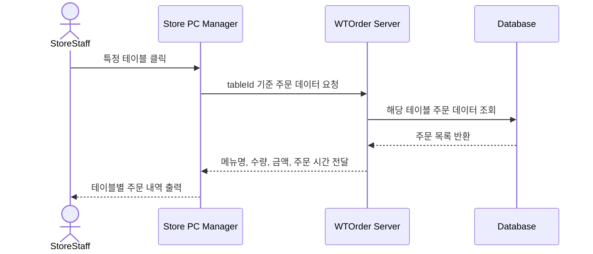
```mermaid
sequenceDiagram
    actor StoreStaff
    participant StorePC as Store PC Manager
    participant Server as WTOrder Server
    participant DB as Database

    StoreStaff->>StorePC: 특정 테이블 클릭
    StorePC->>Server: tableId 기준 주문 데이터 요청
    Server->>DB: 해당 테이블 주문 데이터 조회
    DB-->>Server: 주문 목록 반환
    Server-->>StorePC: 메뉴명, 수량, 금액, 주문 시간 전달
    StorePC-->>StoreStaff: 테이블별 주문 내역 출력
```

위의 그림은 매장 직원이 Store PC Manager에서 특정 테이블을 클릭하여 현재 주문 내역을 확인하는 흐름이다.  
이 기능은 테이블별 주문 확인을 위해 사용된다.

---

## 3.10. Add Table Order from PC

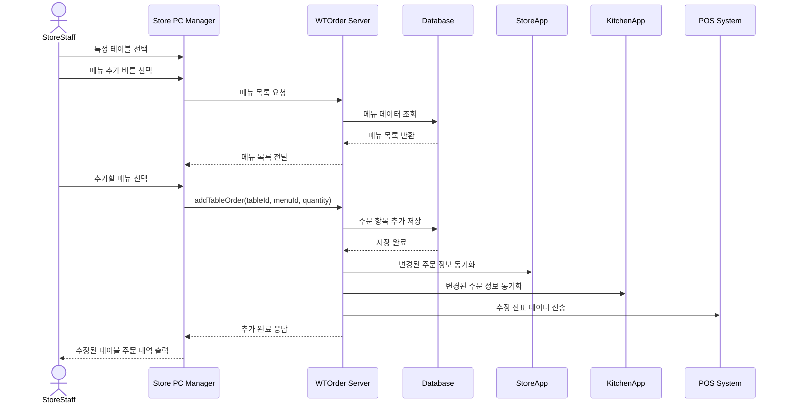
```mermaid
sequenceDiagram
    actor StoreStaff
    participant StorePC as Store PC Manager
    participant Server as WTOrder Server
    participant DB as Database
    participant StoreApp
    participant KitchenApp
    participant POS as POS System

    StoreStaff->>StorePC: 특정 테이블 선택
    StoreStaff->>StorePC: 메뉴 추가 버튼 선택
    StorePC->>Server: 메뉴 목록 요청
    Server->>DB: 메뉴 데이터 조회
    DB-->>Server: 메뉴 목록 반환
    Server-->>StorePC: 메뉴 목록 전달
    StoreStaff->>StorePC: 추가할 메뉴 선택
    StorePC->>Server: addTableOrder(tableId, menuId, quantity)
    Server->>DB: 주문 항목 추가 저장
    DB-->>Server: 저장 완료
    Server->>StoreApp: 변경된 주문 정보 동기화
    Server->>KitchenApp: 변경된 주문 정보 동기화
    Server->>POS: 수정 전표 데이터 전송
    Server-->>StorePC: 추가 완료 응답
    StorePC-->>StoreStaff: 수정된 테이블 주문 내역 출력
```

위의 그림은 Store PC Manager에서 특정 테이블에 메뉴를 추가하는 흐름이다.  
고객이 직원에게 직접 추가 주문을 요청한 경우, 매장 직원은 PC에서 해당 테이블에 메뉴를 추가할 수 있다.  
추가된 주문 항목은 Database에 저장되고 Store App, Kitchen App, POS System에 동기화된다.

---

## 3.11. Delete Table Order from PC

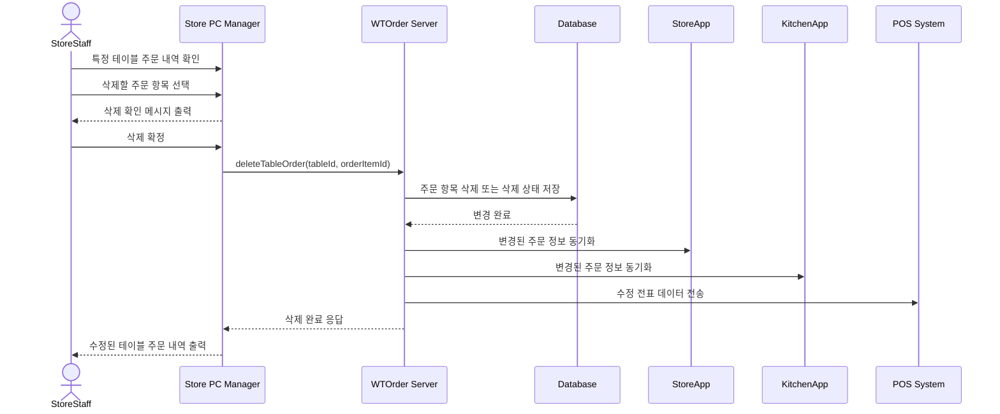
```mermaid
sequenceDiagram
    actor StoreStaff
    participant StorePC as Store PC Manager
    participant Server as WTOrder Server
    participant DB as Database
    participant StoreApp
    participant KitchenApp
    participant POS as POS System

    StoreStaff->>StorePC: 특정 테이블 주문 내역 확인
    StoreStaff->>StorePC: 삭제할 주문 항목 선택
    StorePC-->>StoreStaff: 삭제 확인 메시지 출력
    StoreStaff->>StorePC: 삭제 확정
    StorePC->>Server: deleteTableOrder(tableId, orderItemId)
    Server->>DB: 주문 항목 삭제 또는 삭제 상태 저장
    DB-->>Server: 변경 완료
    Server->>StoreApp: 변경된 주문 정보 동기화
    Server->>KitchenApp: 변경된 주문 정보 동기화
    Server->>POS: 수정 전표 데이터 전송
    Server-->>StorePC: 삭제 완료 응답
    StorePC-->>StoreStaff: 수정된 테이블 주문 내역 출력
```

위의 그림은 Store PC Manager에서 잘못 입력된 주문 항목을 삭제하는 흐름이다.  
삭제된 주문 항목은 Database에 반영되고, 관련 앱과 POS System에 수정 정보가 전달된다.  
이를 통해 주방과 매장 직원이 변경된 주문 내역을 확인할 수 있다.

---

## 3.12. Manage Store Information

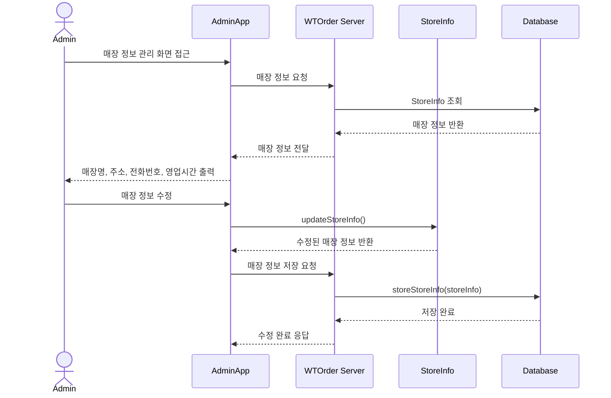
```mermaid
sequenceDiagram
    actor Admin
    participant AdminApp
    participant Server as WTOrder Server
    participant StoreInfo
    participant DB as Database

    Admin->>AdminApp: 매장 정보 관리 화면 접근
    AdminApp->>Server: 매장 정보 요청
    Server->>DB: StoreInfo 조회
    DB-->>Server: 매장 정보 반환
    Server-->>AdminApp: 매장 정보 전달
    AdminApp-->>Admin: 매장명, 주소, 전화번호, 영업시간 출력
    Admin->>AdminApp: 매장 정보 수정
    AdminApp->>StoreInfo: updateStoreInfo()
    StoreInfo-->>AdminApp: 수정된 매장 정보 반환
    AdminApp->>Server: 매장 정보 저장 요청
    Server->>DB: storeStoreInfo(storeInfo)
    DB-->>Server: 저장 완료
    Server-->>AdminApp: 수정 완료 응답
```

위의 그림은 관리자가 Admin App에서 매장 정보를 수정하는 흐름이다.  
매장명, 주소, 전화번호, 영업시간 등의 정보가 Database에 저장된다.

---

## 3.13. Monitor Store Data

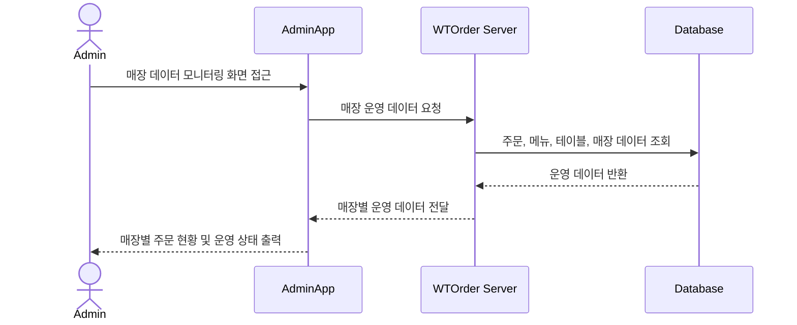
```mermaid
sequenceDiagram
    actor Admin
    participant AdminApp
    participant Server as WTOrder Server
    participant DB as Database

    Admin->>AdminApp: 매장 데이터 모니터링 화면 접근
    AdminApp->>Server: 매장 운영 데이터 요청
    Server->>DB: 주문, 메뉴, 테이블, 매장 데이터 조회
    DB-->>Server: 운영 데이터 반환
    Server-->>AdminApp: 매장별 운영 데이터 전달
    AdminApp-->>Admin: 매장별 주문 현황 및 운영 상태 출력
```

위의 그림은 관리자가 Admin App에서 매장 운영 데이터를 확인하는 흐름이다.  
관리자는 주문 현황, 테이블 상태, 메뉴 데이터, 매장 정보를 통합적으로 확인할 수 있다.

---

# 4. State machine diagram

아래의 그림은 수정된 WTOrder System의 State Machine Diagram을 표현한 것이다.  
본 설계에서는 Customer App, Kitchen App, Store App, Store PC Manager, Admin App, WTOrder Server의 상태를 구분하여 작성한다.

---

## 4.1. Customer App State Machine Diagram

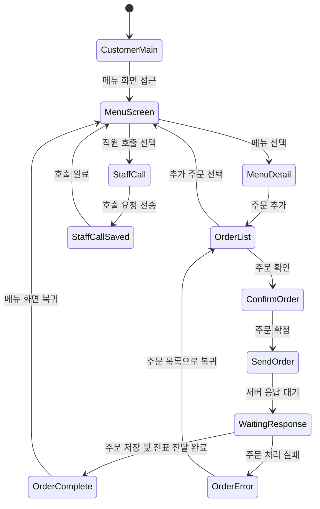
```mermaid
stateDiagram-v2
    [*] --> CustomerMain
    CustomerMain --> MenuScreen : 메뉴 화면 접근
    MenuScreen --> MenuDetail : 메뉴 선택
    MenuDetail --> OrderList : 주문 추가
    OrderList --> MenuScreen : 추가 주문 선택
    OrderList --> ConfirmOrder : 주문 확인
    ConfirmOrder --> SendOrder : 주문 확정
    SendOrder --> WaitingResponse : 서버 응답 대기
    WaitingResponse --> OrderComplete : 주문 저장 및 전표 전달 완료
    WaitingResponse --> OrderError : 주문 처리 실패
    OrderComplete --> MenuScreen : 메뉴 화면 복귀
    OrderError --> OrderList : 주문 목록으로 복귀

    MenuScreen --> StaffCall : 직원 호출 선택
    StaffCall --> StaffCallSaved : 호출 요청 전송
    StaffCallSaved --> MenuScreen : 호출 완료
```

Customer App은 고객의 주문 과정을 중심으로 상태가 전이된다.  
고객은 메뉴 화면에서 메뉴를 선택하고 주문 목록에 추가한 뒤 주문을 확정한다.  
주문 확정 후에는 서버 응답을 기다리고, 주문 처리에 성공하면 주문 완료 상태가 된다.  
직원 호출 기능은 메뉴 화면에서 별도로 실행되며, 호출 요청이 저장되면 다시 메뉴 화면으로 돌아간다.

---

## 4.2. Kitchen App State Machine Diagram

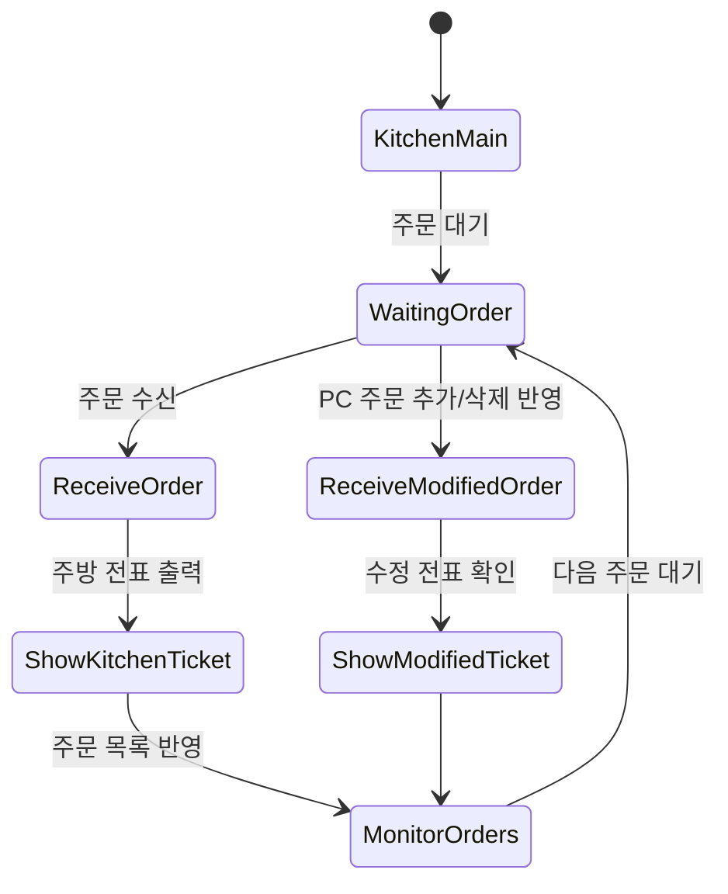
```mermaid
stateDiagram-v2
    [*] --> KitchenMain
    KitchenMain --> WaitingOrder : 주문 대기
    WaitingOrder --> ReceiveOrder : 주문 수신
    ReceiveOrder --> ShowKitchenTicket : 주방 전표 출력
    ShowKitchenTicket --> MonitorOrders : 주문 목록 반영
    MonitorOrders --> WaitingOrder : 다음 주문 대기

    WaitingOrder --> ReceiveModifiedOrder : PC 주문 추가/삭제 반영
    ReceiveModifiedOrder --> ShowModifiedTicket : 수정 전표 확인
    ShowModifiedTicket --> MonitorOrders
```

Kitchen App은 주문 수신과 전표 확인을 중심으로 동작한다.  
고객 주문이 발생하면 주문 정보를 수신하고 주방 전표를 표시한다.  
Store PC Manager에서 메뉴가 추가되거나 주문 항목이 삭제된 경우에는 수정된 주문 정보가 Kitchen App에 반영된다.

---

## 4.3. Store App State Machine Diagram

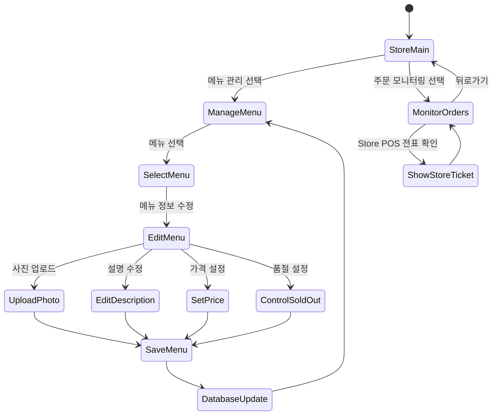
```mermaid
stateDiagram-v2
    [*] --> StoreMain
    StoreMain --> ManageMenu : 메뉴 관리 선택
    ManageMenu --> SelectMenu : 메뉴 선택
    SelectMenu --> EditMenu : 메뉴 정보 수정
    EditMenu --> UploadPhoto : 사진 업로드
    EditMenu --> EditDescription : 설명 수정
    EditMenu --> SetPrice : 가격 설정
    EditMenu --> ControlSoldOut : 품절 설정
    UploadPhoto --> SaveMenu
    EditDescription --> SaveMenu
    SetPrice --> SaveMenu
    ControlSoldOut --> SaveMenu
    SaveMenu --> DatabaseUpdate
    DatabaseUpdate --> ManageMenu

    StoreMain --> MonitorOrders : 주문 모니터링 선택
    MonitorOrders --> ShowStoreTicket : Store POS 전표 확인
    ShowStoreTicket --> MonitorOrders
    MonitorOrders --> StoreMain : 뒤로가기
```

Store App은 메뉴 관리와 주문 모니터링으로 기능이 나뉜다.  
메뉴 관리에서는 메뉴 선택 후 사진 업로드, 설명 수정, 가격 설정, 품절 설정을 수행하고 Database를 갱신한다.  
주문 모니터링에서는 현재 주문 목록과 Store POS 전표를 확인한다.

---

## 4.4. Store PC Manager State Machine Diagram

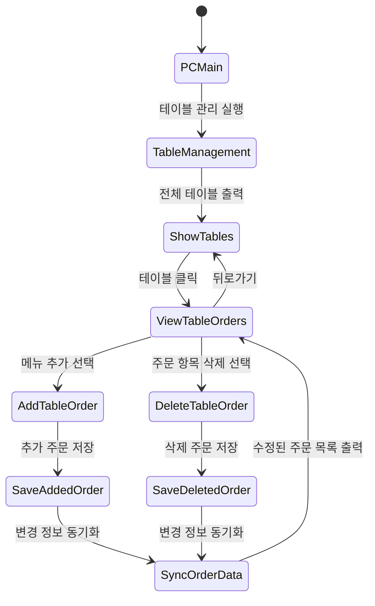
```mermaid
stateDiagram-v2
    [*] --> PCMain
    PCMain --> TableManagement : 테이블 관리 실행
    TableManagement --> ShowTables : 전체 테이블 출력
    ShowTables --> ViewTableOrders : 테이블 클릭
    ViewTableOrders --> AddTableOrder : 메뉴 추가 선택
    ViewTableOrders --> DeleteTableOrder : 주문 항목 삭제 선택
    AddTableOrder --> SaveAddedOrder : 추가 주문 저장
    DeleteTableOrder --> SaveDeletedOrder : 삭제 주문 저장
    SaveAddedOrder --> SyncOrderData : 변경 정보 동기화
    SaveDeletedOrder --> SyncOrderData : 변경 정보 동기화
    SyncOrderData --> ViewTableOrders : 수정된 주문 목록 출력
    ViewTableOrders --> ShowTables : 뒤로가기
```

Store PC Manager는 전체 테이블 관리와 테이블별 주문 관리에 집중한다.  
매장 직원은 전체 테이블을 확인하고 특정 테이블을 클릭하여 주문 내역을 조회한다.  
이후 메뉴 추가 또는 주문 항목 삭제를 수행하면 변경된 주문 정보가 서버를 통해 Store App, Kitchen App, POS System에 동기화된다.  
본 설계에서는 수량 변경, 결제 대기 상태 변경, 테이블 종료 기능은 포함하지 않는다.

---

## 4.5. Admin App State Machine Diagram

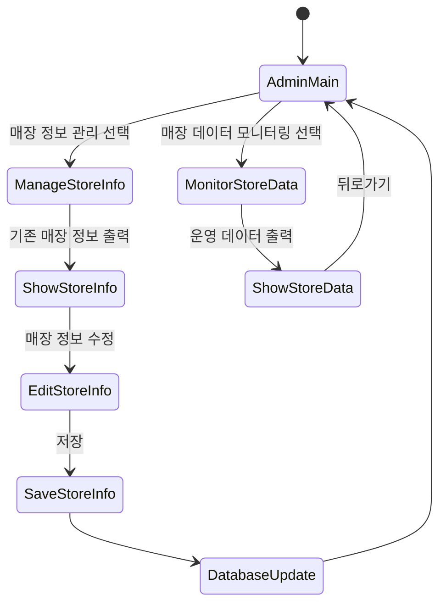
```mermaid
stateDiagram-v2
    [*] --> AdminMain
    AdminMain --> ManageStoreInfo : 매장 정보 관리 선택
    ManageStoreInfo --> ShowStoreInfo : 기존 매장 정보 출력
    ShowStoreInfo --> EditStoreInfo : 매장 정보 수정
    EditStoreInfo --> SaveStoreInfo : 저장
    SaveStoreInfo --> DatabaseUpdate
    DatabaseUpdate --> AdminMain

    AdminMain --> MonitorStoreData : 매장 데이터 모니터링 선택
    MonitorStoreData --> ShowStoreData : 운영 데이터 출력
    ShowStoreData --> AdminMain : 뒤로가기
```

Admin App은 매장 정보 관리와 운영 데이터 모니터링 기능을 제공한다.  
관리자는 기존 매장 정보를 확인하고 수정할 수 있으며, 매장별 주문 현황과 운영 상태를 확인할 수 있다.

---

## 4.6. WTOrder Server State Machine Diagram

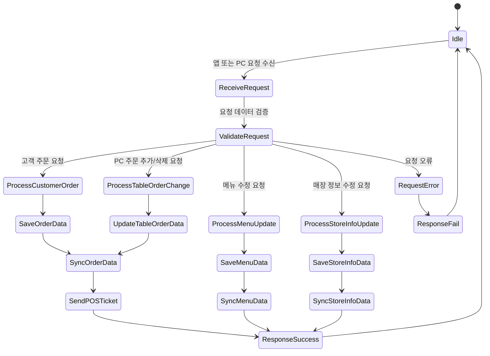
```mermaid
stateDiagram-v2
    [*] --> Idle
    Idle --> ReceiveRequest : 앱 또는 PC 요청 수신
    ReceiveRequest --> ValidateRequest : 요청 데이터 검증

    ValidateRequest --> ProcessCustomerOrder : 고객 주문 요청
    ValidateRequest --> ProcessTableOrderChange : PC 주문 추가/삭제 요청
    ValidateRequest --> ProcessMenuUpdate : 메뉴 수정 요청
    ValidateRequest --> ProcessStoreInfoUpdate : 매장 정보 수정 요청
    ValidateRequest --> RequestError : 요청 오류

    ProcessCustomerOrder --> SaveOrderData
    ProcessTableOrderChange --> UpdateTableOrderData
    ProcessMenuUpdate --> SaveMenuData
    ProcessStoreInfoUpdate --> SaveStoreInfoData

    SaveOrderData --> SyncOrderData
    UpdateTableOrderData --> SyncOrderData
    SaveMenuData --> SyncMenuData
    SaveStoreInfoData --> SyncStoreInfoData

    SyncOrderData --> SendPOSTicket
    SendPOSTicket --> ResponseSuccess
    SyncMenuData --> ResponseSuccess
    SyncStoreInfoData --> ResponseSuccess
    RequestError --> ResponseFail

    ResponseSuccess --> Idle
    ResponseFail --> Idle
```

WTOrder Server는 시스템의 중심 상태를 가진다.  
앱 또는 PC Manager에서 요청이 들어오면 요청 데이터를 검증하고, 요청 종류에 따라 주문 처리, 테이블 주문 변경, 메뉴 수정, 매장 정보 수정으로 나누어 처리한다.  
주문 관련 요청은 Database 저장 후 앱 동기화와 POS 전표 전달까지 이어진다.

---

## 4.7. State Description

| State | Explanation |
|------|-------------|
| CustomerMain | Customer App의 기본 상태이다. |
| MenuScreen | 고객이 메뉴 목록을 확인하는 상태이다. |
| MenuDetail | 고객이 특정 메뉴의 상세 정보를 확인하는 상태이다. |
| OrderList | 고객이 현재 주문 목록을 확인하는 상태이다. |
| ConfirmOrder | 고객이 주문 확정 전 주문 목록을 최종 확인하는 상태이다. |
| SendOrder | Customer App이 주문 데이터를 서버로 전송하는 상태이다. |
| WaitingResponse | 서버의 주문 처리 결과를 기다리는 상태이다. |
| OrderComplete | 주문 저장과 전표 전달이 완료된 상태이다. |
| OrderError | 주문 처리에 실패한 상태이다. |
| StaffCall | 고객이 직원 호출을 요청하는 상태이다. |
| KitchenMain | Kitchen App의 기본 상태이다. |
| WaitingOrder | 주방이 새 주문을 기다리는 상태이다. |
| ReceiveOrder | 주방이 고객 주문을 수신한 상태이다. |
| ShowKitchenTicket | 주방 전표를 화면에 표시하는 상태이다. |
| ReceiveModifiedOrder | PC에서 추가 또는 삭제된 주문 정보가 반영되는 상태이다. |
| StoreMain | Store App의 기본 상태이다. |
| ManageMenu | 매장 직원이 메뉴를 관리하는 상태이다. |
| SelectMenu | 수정할 메뉴를 선택하는 상태이다. |
| EditMenu | 메뉴 상세 정보를 수정하는 상태이다. |
| UploadPhoto | 메뉴 사진을 업로드하는 상태이다. |
| EditDescription | 메뉴 설명을 수정하는 상태이다. |
| SetPrice | 메뉴 가격을 변경하는 상태이다. |
| ControlSoldOut | 메뉴 품절 여부를 설정하는 상태이다. |
| MonitorOrders | Store App 또는 Kitchen App에서 주문 목록을 확인하는 상태이다. |
| PCMain | Store PC Manager의 기본 상태이다. |
| TableManagement | 전체 테이블을 관리하는 상태이다. |
| ShowTables | 전체 테이블 상태를 출력하는 상태이다. |
| ViewTableOrders | 특정 테이블의 주문 내역을 확인하는 상태이다. |
| AddTableOrder | 특정 테이블에 메뉴를 추가하는 상태이다. |
| DeleteTableOrder | 특정 테이블의 주문 항목을 삭제하는 상태이다. |
| SyncOrderData | 변경된 주문 정보를 관련 앱과 POS에 동기화하는 상태이다. |
| AdminMain | Admin App의 기본 상태이다. |
| ManageStoreInfo | 관리자가 매장 정보를 관리하는 상태이다. |
| MonitorStoreData | 관리자가 운영 데이터를 확인하는 상태이다. |
| Idle | WTOrder Server가 요청을 기다리는 상태이다. |
| ReceiveRequest | 서버가 앱 또는 PC 요청을 수신한 상태이다. |
| ValidateRequest | 서버가 요청 데이터를 검증하는 상태이다. |
| ProcessCustomerOrder | 고객 주문을 처리하는 상태이다. |
| ProcessTableOrderChange | Store PC Manager의 주문 추가 또는 삭제를 처리하는 상태이다. |
| ProcessMenuUpdate | Store App의 메뉴 변경 요청을 처리하는 상태이다. |
| SendPOSTicket | POS System으로 전표 데이터를 전달하는 상태이다. |
| ResponseSuccess | 요청 처리 성공 응답을 반환하는 상태이다. |
| ResponseFail | 요청 처리 실패 응답을 반환하는 상태이다. |

---

# 5. Implementation requirements

WTOrder System을 구현하기 위해 필요한 환경 요구사항은 아래와 같다.

## 5.1. Hardware Requirements

| Item | Requirement |
|------|-------------|
| Customer Device | Android 기반 테이블 태블릿 또는 터치 스크린 장치 |
| Kitchen Device | 주방용 태블릿, 주방 모니터, 또는 POS 연동 화면 |
| Store Device | 매장 직원용 태블릿 |
| Store PC Manager Device | Windows 기반 카운터 PC 또는 매장 관리 PC |
| Admin Device | 관리자용 PC 또는 태블릿 |
| Server | 로컬 서버 PC 또는 클라우드 서버 |
| CPU | Intel Pentium IV 이상 또는 동급 이상의 프로세서 |
| RAM | 1GB 이상, 서버는 4GB 이상 권장 |
| Storage | HDD 또는 SSD 10GB 이상의 여유 공간 |
| Network | 매장 내부 LAN 또는 Wi-Fi 환경 |
| POS Device | Kitchen POS 및 Store POS와 연동 가능한 장치 |

## 5.2. Software Requirements

| Item | Requirement |
|------|-------------|
| Operating System | Windows 10 이상, Android 기반 태블릿 환경 |
| Implementation Language | Java |
| IDE | Android Studio 또는 IntelliJ IDEA |
| Database | SQLite 또는 MySQL |
| Server Environment | Java 기반 서버 또는 간단한 REST API 서버 |
| UI Environment | Android XML Layout, Java GUI, 또는 Web 기반 PC 화면 |
| POS Integration | POS 전표 출력 또는 POS 화면 표시를 위한 연동 모듈 |
| Version Control | Git, GitHub |
| Documentation Format | Markdown, Mermaid Diagram |

## 5.3. Functional Requirements

| Item | Requirement |
|------|-------------|
| Customer App | 메뉴 조회, 주문 추가, 주문 확정, 직원 호출 기능을 제공해야 한다. |
| Kitchen App | 주문 수신, 주방 전표 확인, 주문 목록 확인 기능을 제공해야 한다. |
| Store App | 메뉴 관리, 사진 업로드, 설명 수정, 가격 설정, 품절 처리, 주문 모니터링 기능을 제공해야 한다. |
| Store PC Manager | 전체 테이블 조회, 테이블별 주문 조회, 메뉴 추가, 주문 항목 삭제 기능을 제공해야 한다. |
| Admin App | 매장 정보 관리, 매장 데이터 모니터링 기능을 제공해야 한다. |
| POS System | 고객 주문 확정 또는 PC 주문 변경 시 Kitchen POS와 Store POS에 전표를 표시해야 한다. |
| Database | 메뉴, 주문, 테이블, 매장 정보를 저장하고 조회할 수 있어야 한다. |
| WTOrder Server | 각 앱, PC Manager, POS System, Database 간 데이터 흐름을 처리해야 한다. |

## 5.4. Nonfunctional Requirements

| Item | Requirement |
|------|-------------|
| Usability | 고객용 화면은 버튼과 글씨를 크게 구성하여 고령층 사용자도 쉽게 사용할 수 있어야 한다. |
| Reliability | 주문 확정 후 주문 데이터와 전표 데이터가 누락되지 않아야 한다. |
| Consistency | Customer App, Kitchen App, Store App, Store PC Manager, POS System의 주문 정보가 일관되게 유지되어야 한다. |
| Performance | 주문 확정 후 Kitchen App과 POS 전표 출력까지 빠르게 처리되어야 한다. |
| Maintainability | 앱별 기능과 서버 처리 로직을 분리하여 유지보수가 가능해야 한다. |
| Extensibility | 결제 기능, 주문 상태 변경 기능, 매출 통계 기능을 추후 추가할 수 있어야 한다. |
| Security | Customer, Store, Kitchen, Admin 역할에 따라 접근 가능한 기능을 구분해야 한다. |
| Availability | 매장 운영 중 네트워크 오류나 서버 오류가 발생했을 때 오류 메시지를 표시할 수 있어야 한다. |
| Data Integrity | PC에서 주문 항목을 삭제하거나 추가한 경우 관련 앱과 POS에 동일하게 반영되어야 한다. |

---

# 6. Glossary

| Terms | Description |
|------|-------------|
| WTOrder System | Customer App, Kitchen App, Store App, Admin App, Store PC Manager, POS System을 연결하여 주문과 매장 데이터를 관리하는 통합 테이블 오더 시스템이다. |
| Customer App | 고객 테이블 태블릿에서 실행되는 앱으로 메뉴 조회, 주문 추가, 주문 확정, 직원 호출 기능을 제공한다. |
| Kitchen App | 주방 태블릿 또는 주방 화면에서 실행되는 앱으로 고객 주문 수신과 주문 목록 확인 기능을 제공한다. |
| Store App | 매장 태블릿에서 실행되는 앱으로 메뉴 관리와 주문 모니터링 기능을 제공한다. |
| Admin App | 관리자가 사용하는 앱으로 매장 정보 관리와 매장 데이터 모니터링 기능을 제공한다. |
| Store PC Manager | 카운터 PC에서 실행되는 관리 프로그램으로 전체 테이블 관리, 테이블별 주문 조회, 메뉴 추가, 주문 항목 삭제 기능을 제공한다. |
| WTOrder Server | 각 앱, PC Manager, POS System, Database 사이에서 주문 처리, 데이터 저장, 동기화, 전표 전달을 담당하는 중심 시스템이다. |
| POS System | 주문 데이터를 Kitchen POS와 Store POS에 전표 형태로 출력하거나 표시하는 시스템이다. |
| Kitchen POS | 주방에서 주문 전표를 확인하는 POS 화면 또는 출력 장치이다. |
| Store POS | 매장 측에서 주문 전표를 확인하는 POS 화면 또는 출력 장치이다. |
| Kitchen Ticket | 주방 POS에 표시되는 조리 확인용 메뉴 전표이다. |
| Store Ticket | 매장 POS에 표시되는 매장 확인용 메뉴 전표이다. |
| Database | 메뉴, 주문, 테이블, 매장 정보를 저장하는 저장소이다. |
| Table | 매장 내 좌석 또는 테이블을 의미하며, 테이블 번호와 현재 주문 상태를 가진다. |
| Table Order | 특정 테이블에서 현재까지 들어온 주문 목록이다. |
| Menu | 음식명, 가격, 설명, 사진, 품절 상태 등을 포함하는 정보이다. |
| Order | 고객이 선택한 메뉴와 수량, 테이블 번호를 포함하는 주문 정보이다. |
| OrderItem | 하나의 주문에 포함되는 개별 메뉴 항목이다. |
| Ticket | POS에 출력되거나 표시되는 주문 전표이다. |
| Sold-out | 메뉴가 일시적으로 판매 불가능한 상태이다. |
| Order Sync | 주문 정보가 Customer App, Kitchen App, Store App, Store PC Manager, POS System에 동일하게 반영되는 과정이다. |
| Class Diagram | 객체지향 시스템에서 클래스의 구조, 속성, 메소드, 관계를 표현하는 다이어그램이다. |
| Sequence Diagram | 객체 또는 사용자 간 메시지 전달 순서를 시간 흐름에 따라 표현하는 다이어그램이다. |
| State Machine Diagram | 시스템 또는 객체가 가질 수 있는 상태와 상태 전이를 표현하는 다이어그램이다. |
| Attribute | 객체지향 프로그래밍에서 클래스가 가지는 데이터 값을 의미한다. |
| Method | 클래스 내부에서 특정 동작을 수행하는 함수이다. |
| Functional Requirement | 시스템이 수행해야 하는 기능 요구사항이다. |
| Nonfunctional Requirement | 성능, 신뢰성, 보안, 사용성 등 시스템 품질에 대한 요구사항이다. |
| Mermaid | GitHub Markdown에서 다이어그램을 코드 형태로 작성하고 렌더링할 수 있는 문법이다. |

---

# 7. References

- WTOrder Conceptualization Document  
- WTOrder Analysis Document  
- Open Source Software Design Lecture Notes  
- UML Class Diagram Guide  
- UML Sequence Diagram Guide  
- UML State Machine Diagram Guide  
- Visual Paradigm UML Guide  
- Table Order System related service examples  
- POS integration concept references  
