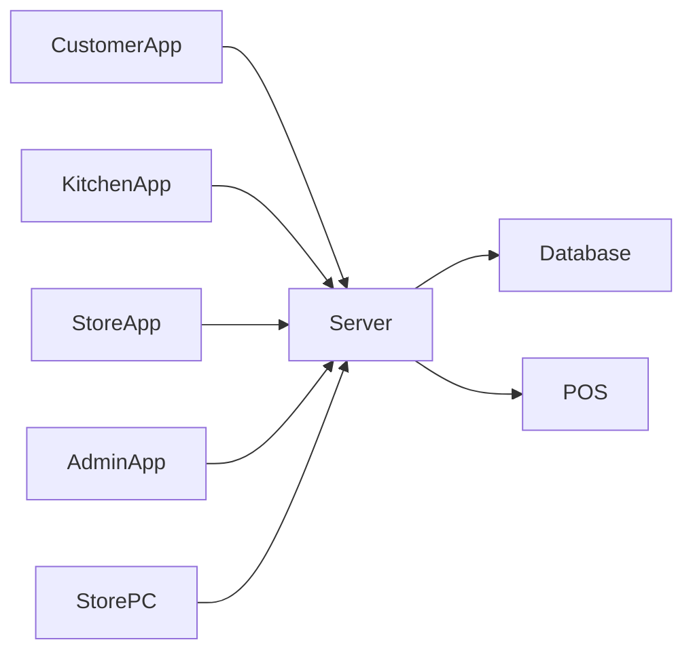

# WTOrder Conceptualization (Revised)
## 주요 변경사항
- Customer App / Kitchen App / Store App / Admin App 분리
- Store PC Manager 추가
- Kitchen POS 및 Store POS 연동
- 테이블 관리 기능 추가

# 1. Business Purpose
WTOrder는 고객용 태블릿, 주방용 태블릿, 매장용 태블릿, 관리자 앱, Store PC Manager를 이용하여 주문을 통합 관리하는 시스템이다.

# 2. System Context Diagram

# 3. Use Case List
View Menu, Add Order, Confirm Order, Call Staff, Receive Order,
Print Kitchen Ticket, Print Store Ticket,
Manage Tables, View Table Orders, Add Table Order, Delete Table Order

# 4. Concept of Operation
주문 확정 → 서버 저장 → Kitchen POS 전표 출력 → Store POS 전표 출력

# 5. Problem Statement
POS 동기화, 다중 디바이스 동기화, 네트워크 장애 대응

# 6. Glossary
Customer App, Kitchen App, Store App, Store PC Manager, POS System

# 7. References
WTOrder Project
